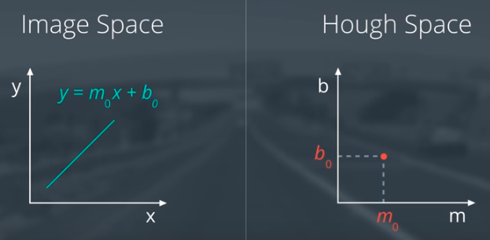
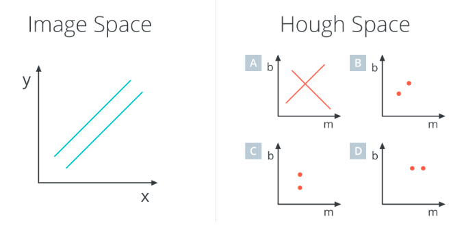
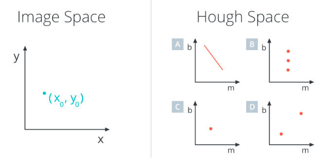
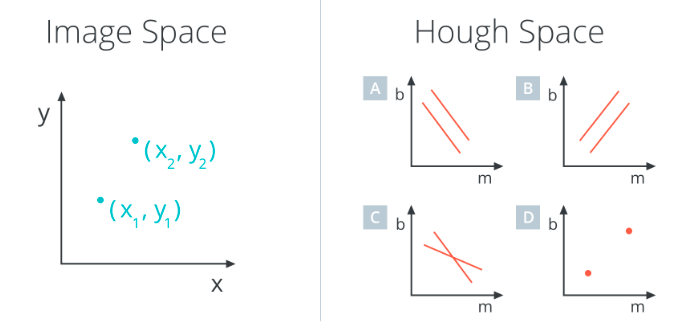
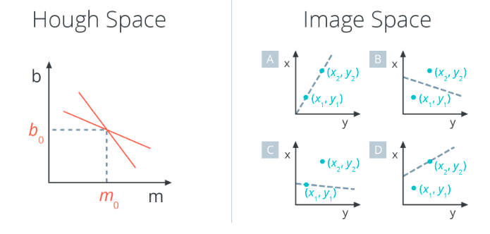
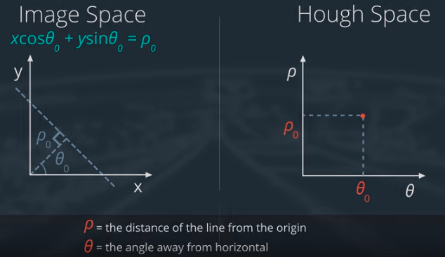
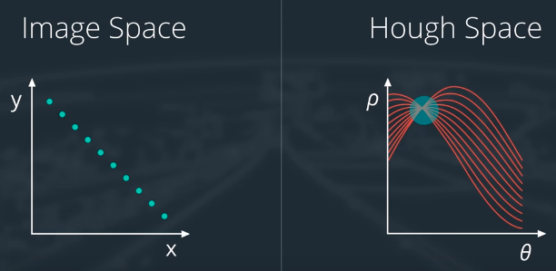
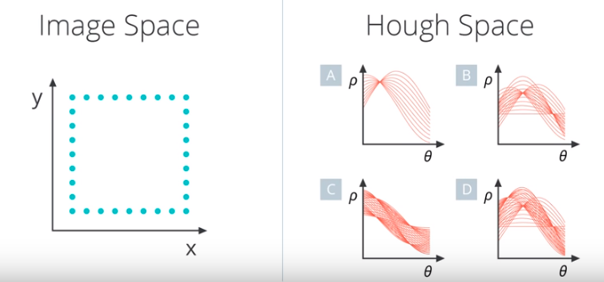

# Identify Lane Lines

find white: 

RGB * 0(dark)-255(bright)

white = [255, 255, 255]

# Coding up a Color Selection

 

```python
import matplotlib.pyplot as plt
import matplotlib.image as mpimg
import numpy as np

# Read in the image
image = mpimg.imread('test.jpg')

# Grab the x and y size and make a copy of the image
ysize = image.shape[0]
xsize = image.shape[1]
color_select = np.copy(image)

# Define color selection criteria
###### MODIFY THESE VARIABLES TO MAKE YOUR COLOR SELECTION
red_threshold = 200
green_threshold = 200
blue_threshold = 200
######

rgb_threshold = [red_threshold, green_threshold, blue_threshold]

# Do a boolean or with the "|" character to identify
# pixels below the thresholds
# Array of (True|False)
thresholds = (image[:,:,0] < rgb_threshold[0]) \
            | (image[:,:,1] < rgb_threshold[1]) \
            | (image[:,:,2] < rgb_threshold[2])

# Color selected pixels white
color_select[thresholds] = [0,0,0]

# Display the image                 
plt.imshow(color_select)

# Uncomment the following code if you are running the code locally and wish to save the image
# mpimg.imsave("test-after.png", color_select)

```

# Coding up a Region of Interest Mask

```python
import matplotlib.pyplot as plt
import matplotlib.image as mpimg
import numpy as np

# Read in the image and print some stats
image = mpimg.imread('test.jpg')
print('This image is: ', type(image), 
         'with dimensions:', image.shape)

# Pull out the x and y sizes and make a copy of the image
ysize = image.shape[0]
xsize = image.shape[1]
region_select = np.copy(image)

# Define a triangle region of interest 
# Keep in mind the origin (x=0, y=0) is in the upper left in image processing
# Note: if you run this code, you'll find these are not sensible values!!
# But you'll get a chance to play with them soon in a quiz 
left_bottom = [0, 539]
right_bottom = [900, 300]
apex = [400, 0]

# Fit lines (y=Ax+B) to identify the  3 sided region of interest
# np.polyfit() returns the coefficients [A, B] of the fit
fit_left = np.polyfit((left_bottom[0], apex[0]), (left_bottom[1], apex[1]), 1)
fit_right = np.polyfit((right_bottom[0], apex[0]), (right_bottom[1], apex[1]), 1)
fit_bottom = np.polyfit((left_bottom[0], right_bottom[0]), (left_bottom[1], right_bottom[1]), 1)

# Find the region inside the lines
XX, YY = np.meshgrid(np.arange(0, xsize), np.arange(0, ysize))
# compare YY to a line, defined by x*A+B
# Array of (True|False)
region_thresholds = (YY > (XX*fit_left[0] + fit_left[1])) & \
                    (YY > (XX*fit_right[0] + fit_right[1])) & \
                    (YY < (XX*fit_bottom[0] + fit_bottom[1]))

# Color pixels red which are inside the region of interest
region_select[region_thresholds] = [255, 0, 0]

# Display the image
plt.imshow(region_select)

# uncomment if plot does not display
# plt.show()
```

# Combining Color and Region Selections

Now you've seen how to mask out a region of interest in an image. Next, let's combine the mask and color selection to pull only the lane lines out of the image.

Check out the code below. Here we’re doing both the color and region selection steps, requiring that a pixel meet both the mask and color selection requirements to be retained.


```python
import matplotlib.pyplot as plt
import matplotlib.image as mpimg
import numpy as np

# Read in the image
image = mpimg.imread('test.jpg')

# Grab the x and y size and make a copy of the image
ysize = image.shape[0]
xsize = image.shape[1]
color_select = np.copy(image)
line_image = np.copy(image)

# Define color selection criteria
# MODIFY THESE VARIABLES TO MAKE YOUR COLOR SELECTION
red_threshold = 200
green_threshold = 200
blue_threshold = 200

rgb_threshold = [red_threshold, green_threshold, blue_threshold]

# Define the vertices of a triangular mask.
# Keep in mind the origin (x=0, y=0) is in the upper left
# MODIFY THESE VALUES TO ISOLATE THE REGION 
# WHERE THE LANE LINES ARE IN THE IMAGE
left_bottom = [100, 540]
right_bottom = [820, 540]
apex = [460, 290]

# Perform a linear fit (y=Ax+B) to each of the three sides of the triangle
# np.polyfit returns the coefficients [A, B] of the fit
fit_left = np.polyfit((left_bottom[0], apex[0]), (left_bottom[1], apex[1]), 1)
fit_right = np.polyfit((right_bottom[0], apex[0]), (right_bottom[1], apex[1]), 1)
fit_bottom = np.polyfit((left_bottom[0], right_bottom[0]), (left_bottom[1], right_bottom[1]), 1)

# Mask pixels below the threshold
color_thresholds = (image[:,:,0] < rgb_threshold[0]) | \
                    (image[:,:,1] < rgb_threshold[1]) | \
                    (image[:,:,2] < rgb_threshold[2])

# Find the region inside the lines
XX, YY = np.meshgrid(np.arange(0, xsize), np.arange(0, ysize))
region_thresholds = (YY > (XX*fit_left[0] + fit_left[1])) & \
                    (YY > (XX*fit_right[0] + fit_right[1])) & \
                    (YY < (XX*fit_bottom[0] + fit_bottom[1]))
                    
# Mask color and region selection
color_select[color_thresholds | ~region_thresholds] = [0, 0, 0]
# Color pixels red where both color and region selections met
line_image[~color_thresholds & region_thresholds] = [255, 0, 0]

# Display the image and show region and color selections
plt.imshow(image)
x = [left_bottom[0], right_bottom[0], apex[0], left_bottom[0]]
y = [left_bottom[1], right_bottom[1], apex[1], left_bottom[1]]
plt.plot(x, y, 'b--', lw=4)
plt.imshow(color_select)
plt.imshow(line_image)

# uncomment if plot does not display
# plt.show()
```

## Terms: Polynom

summiert die Vielfachen von Potenzen einer Variable. a^b=c, wo a = Basis, b = Exponent, c = Potenzwert
$$
\begin{align*}
P(x)=\sum _{i=0}^{n}a_{i}x^{i}\\&=a_{0}+a_{1}x+a_{2}x^{2}+\dotsb +a_{n}x^{n},\quad n\geq 0
\end{align*}
$$
Polynome des Grades

- 0 werden *[konstante Funktionen](https://de.wikipedia.org/wiki/Konstante_Funktion)* genannt (z. B. $ P(x)=-1 $).
- 1 werden *[lineare Funktionen](https://de.wikipedia.org/wiki/Lineare_Funktion)* oder genauer *affin lineare Funktionen* genannt (z. B. $P(x)=3x+5$ ).
- 2 werden *[quadratische Funktionen](https://de.wikipedia.org/wiki/Quadratische_Funktion)* genannt (z. B. $P(x)=-3x^{2}-4x+1$ ).
- 3 werden *[kubische Funktionen](https://de.wikipedia.org/wiki/Kubische_Funktion)* genannt (z. B. $P(x)=4x^{3}-2x^{2}+7x+2$ ).
- 4 werden *[quartische Funktionen](https://de.wikipedia.org/wiki/Polynom_4._Grades)* oder *biquadratische Funktionen* genannt (z. B. $P(x)=6x^{4}-x^{3}+4x^{2}+2x+2$ ).

## Terms: Meshgrid

Return coordinate matrices from coordinate vectors.


# Canny edge detection

John F. Canny in 1986.

Goal: identify boundaries of the object in the image.

Mechanism: 1. Convert to grayscale. 2. Compute gradient.

Output: brightness of each pixel corresponds to the strength of the gradient of that point. Change in brightness is where we find edges.

```python
edges = cv2.Canny(gray, low_threshold, high_threshold)
```

In this case, you are applying `Canny` to the image `gray` and your output will be another image called `edges`. `low_threshold` and `high_threshold` are your thresholds for edge detection.

The algorithm will first detect strong edge (strong gradient) pixels above the `high_threshold`, and reject pixels below the `low_threshold`. Next, pixels with values between the `low_threshold` and `high_threshold` will be included as long as they are connected to strong edges. The output `edges` is a binary image with white pixels tracing out the detected edges and black everywhere else. See the [OpenCV Canny Docs](http://docs.opencv.org/2.4/doc/tutorials/imgproc/imgtrans/canny_detector/canny_detector.html) for more details.

What would make sense as a reasonable range for these parameters? In our case, converting to grayscale has left us with an [8-bit](https://en.wikipedia.org/wiki/8-bit) image, so each pixel can take 2^8 = 256 possible values. Hence, the pixel values range from 0 to 255.

This range implies that derivatives (essentially, the value differences from pixel to pixel) will be on the scale of tens or hundreds. So, **a reasonable range for your threshold parameters would also be in the tens to hundreds**.

As far as a ratio of `low_threshold` to `high_threshold`, [John Canny himself recommended](http://docs.opencv.org/2.4/doc/tutorials/imgproc/imgtrans/canny_detector/canny_detector.html#steps) a low to high ratio of 1:2 or 1:3.

We'll also include Gaussian smoothing, before running `Canny`, which is essentially a way of suppressing noise and spurious gradients by averaging (check out the [OpenCV docs for GaussianBlur](http://docs.opencv.org/2.4/modules/imgproc/doc/filtering.html?highlight=gaussianblur#gaussianblur)). `cv2.Canny()` actually applies Gaussian smoothing internally, but we include it here because you can get a different result by applying further smoothing (and it's not a changeable parameter within `cv2.Canny()`!).

You can choose the `kernel_size` for Gaussian smoothing to be any odd number. A larger `kernel_size` implies averaging, or smoothing, over a larger area. The example in the previous lesson was `kernel_size = 3`.


```python
#doing all the relevant imports
import matplotlib.pyplot as plt
import matplotlib.image as mpimg
import numpy as np
import cv2

# Read in the image and convert to grayscale
image = mpimg.imread('exit-ramp.jpg')
gray = cv2.cvtColor(image, cv2.COLOR_RGB2GRAY)

# Define a kernel size for Gaussian smoothing / blurring
# Note: this step is optional as cv2.Canny() applies a 5x5 Gaussian internally
kernel_size = 3
blur_gray = cv2.GaussianBlur(gray,(kernel_size, kernel_size), 0)

# Define parameters for Canny and run it
# NOTE: if you try running this code you might want to change these!
low_threshold = 50
high_threshold = 150
edges = cv2.Canny(blur_gray, low_threshold, high_threshold)

# Display the image
plt.imshow(edges, cmap='Greys_r')
```

 

## Terms: Derivative

$\dfrac{df}{dx} = \Delta (pixel value)$ measure of change of this function (image(x, y) == function) (small derivative == small change)

# Hough Transform

Hough space = parameter space. Hough transform = transform from image space to hough space





Answer: C



Answer: A



Answer: C (Two points in image space correspond to two lines in Hough Space. Not only that, but these lines must intersect… why?)



Answer: A (because there's only 1 line in the image space that passes through both (x1, y1) and (x2, y2) )


Problem: vertical lines have infinite slope in (m, b) representation.

Solution: new parametrization: Polar coordinates:



Result: line in Image space corresponds to bunch of sin curves in Hough space, where intersection of the sin-curves gives the paramerization of the line:





Answer: C

Detailed information on Hough Transform: https://alyssaq.github.io/2014/understanding-hough-transform/


# Hough Transform to Find Lane Lines

```python
lines = cv2.HoughLinesP(masked_edges, rho, theta, threshold, np.array([]),
                                             min_line_length, max_line_gap)
```

In this case, we are operating on the image `masked_edges` (the output from `Canny`) and the output from `HoughLinesP` will be `lines`, which will simply be an array containing the endpoints (x1, y1, x2, y2) of all line segments detected by the transform operation. The other parameters define just what kind of line segments we're looking for.

First off, `rho` and `theta` are the distance and angular resolution of our grid in Hough space. Remember that, in Hough space, we have a grid laid out along the (Θ, ρ) axis. You need to specify `rho` in units of pixels and `theta` in units of radians.

So, what are reasonable values? Well, rho takes a minimum value of 1, and a reasonable starting place for theta is 1 degree (pi/180 in radians). Scale these values up to be more flexible in your definition of what constitutes a line.

The `threshold` parameter specifies the minimum number of votes (intersections in a given grid cell) a candidate line needs to have to make it into the output. The empty `np.array([])` is just a placeholder, no need to change it. `min_line_length` is the minimum length of a line (in pixels) that you will accept in the output, and `max_line_gap` is the maximum distance (again, in pixels) between segments that you will allow to be connected into a single line. You can then iterate through your output `lines` and draw them onto the image to see what you got!

```python
import matplotlib.pyplot as plt
import matplotlib.image as mpimg
import numpy as np
import cv2


# Read in and grayscale the image
image = mpimg.imread('exit-ramp.jpg')
gray = cv2.cvtColor(image,cv2.COLOR_RGB2GRAY)

# Define a kernel size and apply Gaussian smoothing
kernel_size = 5
blur_gray = cv2.GaussianBlur(gray,(kernel_size, kernel_size),0)

# Define our parameters for Canny and apply
low_threshold = 50
high_threshold = 150
edges = cv2.Canny(blur_gray, low_threshold, high_threshold)

# Next we'll create a masked edges image using cv2.fillPoly()
mask = np.zeros_like(edges)   
ignore_mask_color = 255   


# MY POSSIBLE SOLUTION
# This time we are defining a four sided polygon to mask
# imshape = image.shape
# vertices = np.array([[(0,imshape[0]),(0, 0), (imshape[1], 0), (imshape[1],imshape[0])]], # dtype=np.int32)
# cv2.fillPoly(mask, vertices, ignore_mask_color)
# masked_edges = cv2.bitwise_and(edges, mask)

# Define the Hough transform parameters
# Make a blank the same size as our image to draw on
# rho = 1 # distance resolution in pixels of the Hough grid
# theta = 5*(np.pi/180) # angular resolution in radians of the Hough grid
# threshold = 200     # minimum number of votes (intersections in Hough grid cell)
# min_line_length = 10 #minimum number of pixels making up a line
# max_line_gap = 10    # maximum gap in pixels between connectable line segments
# line_image = np.copy(image)*0 # creating a blank to draw lines on

# POSSIBLE SOLUTION OF UDACITY
# This time we are defining a four sided polygon to mask
imshape = image.shape
vertices = np.array([[(0,imshape[0]), (450, 290), (490,290), (imshape[1],imshape[0])]], dtype=np.int32)
cv2.fillPoly(mask, vertices, ignore_mask_color)
masked_edges = cv2.bitwise_and(edges, mask)

# Define the Hough transform parameters
# Make a blank the same size as our image to draw on
rho = 2 # distance resolution in pixels of the Hough grid
theta = np.pi/180 # angular resolution in radians of the Hough grid
threshold = 15     # minimum number of votes (intersections in Hough grid cell)
min_line_length = 40 #minimum number of pixels making up a line
max_line_gap = 20    # maximum gap in pixels between connectable line segments
line_image = np.copy(image)*0 # creating a blank to draw lines on

# Run Hough on edge detected image
# Output "lines" is an array containing endpoints of detected line segments
lines = cv2.HoughLinesP(masked_edges, rho, theta, threshold, np.array([]),
                            min_line_length, max_line_gap)

# Iterate over the output "lines" and draw lines on a blank image
for line in lines:
    for x1,y1,x2,y2 in line:
        cv2.line(line_image,(x1,y1),(x2,y2),(255,0,0),10)

# Create a "color" binary image to combine with line image
color_edges = np.dstack((edges, edges, edges)) 

# Draw the lines on the edge image
lines_edges = cv2.addWeighted(color_edges, 0.8, line_image, 1, 0) 
plt.imshow(lines_edges)
```

# Starter Kit Installation

There are two ways to get up and running:

1. Anaconda. Get started [here](https://github.com/udacity/CarND-Term1-Starter-Kit/blob/master/doc/configure_via_anaconda.md). More info [here](http://conda.pydata.org/docs/).
2. Docker. Get started [here](https://github.com/udacity/CarND-Term1-Starter-Kit/blob/master/doc/configure_via_docker.md). More info [here](http://docker.com/).

We recommend you first try setting up your environment with Anaconda. It's faster to get up and running and has fewer moving parts.

Follow the instructions in [this README](https://github.com/udacity/CarND-Term1-Starter-Kit/blob/master/README.md).

Here is a great link for learning more about [Anaconda and Jupyter Notebooks](https://classroom.udacity.com/courses/ud1111).


### My steps

https://github.com/udacity/CarND-Term1-Starter-Kit/pull/117

https://github.com/udacity/CarND-Term1-Starter-Kit/pull/118

### Start env

`source activate carnd-term1`

### Mardown cheatsheet

https://github.com/adam-p/markdown-here/wiki/Markdown-Cheatsheet

# Project instructions

GitHub link https://github.com/udacity/CarND-LaneLines-P1

Project Rubric https://review.udacity.com/#!/rubrics/1967/view