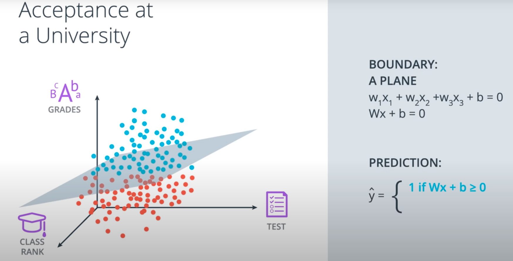
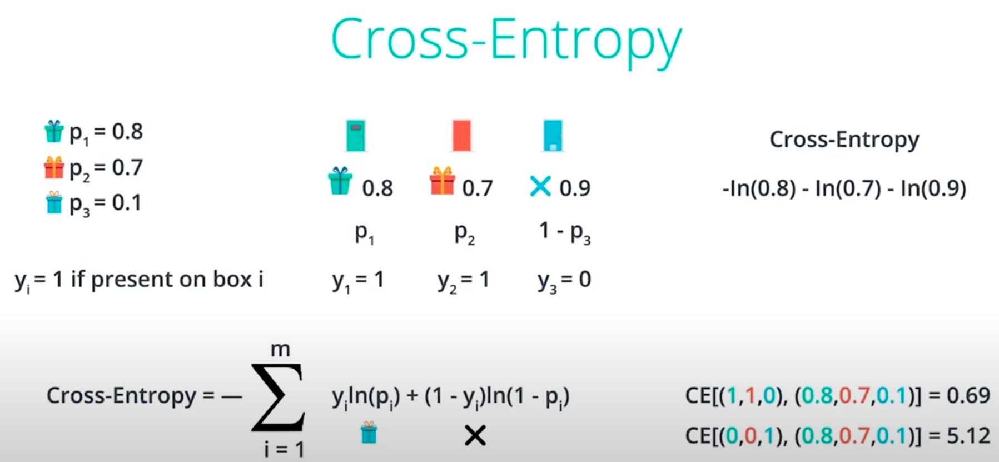
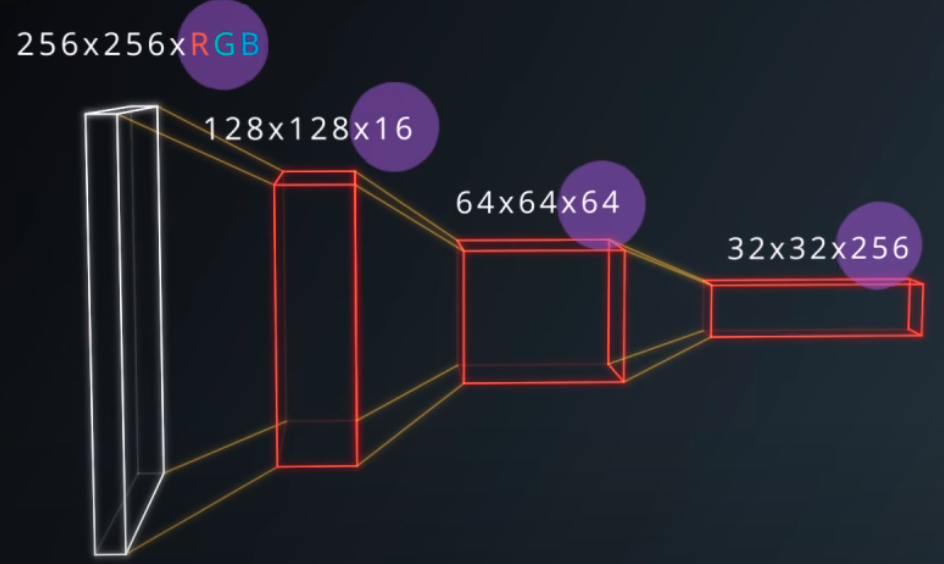

### Start env

source activate carnd-term1

cd /home/q426889/priv_repo_mboiko/self_driving_car_nanodegree/CarND-LeNet-Lab

jupyter-notebook LeNet-Lab.ipynb

# Introduction to Neuronal Networks

## Linear to Logistic Regression

A neural network is a graph of mathematical functions such as [linear combinations](https://en.wikipedia.org/wiki/Linear_combination) and activation functions. The graph consists of **nodes**, and **edges**.

Linear regression helps predict values on a continuous spectrum, like predicting what the price of a house will be.

How about classifying data among discrete classes?

Here are examples of classification tasks:

- Determining whether a patient has cancer
- Identifying the species of a fish
- Figuring out who's talking on a conference call

Linear regression leads to logistic regression and ultimately neural networks, a more advanced classification tool.

Logistic Regression example





where input features (x), the weights (W), and the bias (b) to satisfy (Wx + b) with ```y Head``` as Prediciton

### Perceptron

In [machine learning](https://en.wikipedia.org/wiki/Machine_learning), the **perceptron** is an algorithm for [supervised learning](https://en.wikipedia.org/wiki/Supervised_classification) of [binary classifiers](https://en.wikipedia.org/wiki/Binary_classification). A binary classifier is a function which can decide whether or not an input, represented by a vector of numbers, belongs to some specific class.[[1\]](https://en.wikipedia.org/wiki/Perceptron#cite_note-largemargin-1) It is a type of [linear classifier](https://en.wikipedia.org/wiki/Linear_classifier), i.e. a classification algorithm that makes its predictions based on a [linear predictor function](https://en.wikipedia.org/wiki/Linear_predictor_function) combining a set of weights with the [feature vector](https://en.wikipedia.org/wiki/Feature_vector).

The perceptron applies these weights to the inputs and sums them in a process known as **linear combination**. In our case, this looks like 
$$
w_{grades} \cdot x_{grades} + w_{test} \cdot x_{test} = -1 \cdot x_{grades} - 0.2 \cdot x_{test}
$$
[Perceptron Formula](https://classroom.udacity.com/nanodegrees/nd013-ent/parts/61c19655-24c2-4aba-add3-d6b5667483cc/modules/4b3a9b11-5477-4322-8396-617c832cb74a/lessons/322b1cb5-5c0f-43d5-b6d9-9eca8ade032f/concepts/94a2cc6d-3dfb-4ab5-9524-c55c0c9a2565#)

Initially, the weights ( $w_i$ ) and bias ( $b$ ) are assigned a random value, and then they are updated using a learning algorithm like gradient descent. The weights and biases change so that the next training example is more accurately categorized, and patterns in data are "learned" by the neural network.

#### Variables in equations

When writing equations related to neural networks, the weights will always be represented by some type of the letter **w**. It will usually look like a *W* when it represents a **matrix** of weights or a *w* when it represents an **individual** weight, and it may include some additional information in the form of a subscript to specify *which* weights.

$\Sigma_{i=1}^m w_{i} \cdot x_{i}$


Here, the Greek letter Sigma $\Sigma$ is used to represent **summation**.

#### False positive


#### False negative


#### Perceptron code

```python
import numpy as np
# Setting the random seed, feel free to change it and see different solutions.
np.random.seed(42)

def stepFunction(t):
    if t >= 0:
        return 1
    return 0

def prediction(X, W, b):
    return stepFunction((np.matmul(X,W)+b)[0])

# TODO: Fill in the code below to implement the perceptron trick.
# The function should receive as inputs the data X, the labels y,
# the weights W (as an array), and the bias b,
# update the weights and bias W, b, according to the perceptron algorithm,
# and return W and b.
def perceptronStep(X, y, W, b, learn_rate = 0.01):
    # Fill in code
    for pos, msrmnt in enumerate(X):
        # classify point by the line w1*x1 + w2*x2 + b = 0
        classif_res = W[0]*msrmnt[0] + W[1]*msrmnt[1] + b
        # correct if false positive
        if (classif_res > 0 and y[pos] == 0):
            W[0] = W[0] - (learn_rate*msrmnt[0])
            W[1] = W[1] - (learn_rate*msrmnt[1])
            b = b - (learn_rate*1)
        # correct if false negative
        elif (classif_res <= 0 and y[pos] == 1):
            W[0] = W[0] + (learn_rate*msrmnt[0])
            W[1] = W[1] + (learn_rate*msrmnt[1])
            b = b + (learn_rate*1)
    return W, b
    
# This function runs the perceptron algorithm repeatedly on the dataset,
# and returns a few of the boundary lines obtained in the iterations,
# for plotting purposes.
# Feel free to play with the learning rate and the num_epochs,
# and see your results plotted below.
def trainPerceptronAlgorithm(X, y, learn_rate = 0.05, num_epochs = 50):
    x_min, x_max = min(X.T[0]), max(X.T[0])
    y_min, y_max = min(X.T[1]), max(X.T[1])
    W = np.array(np.random.rand(2,1))
    b = np.random.rand(1)[0] + x_max
    # These are the solution lines that get plotted below.
    boundary_lines = []
    for i in range(num_epochs):
        # In each epoch, we apply the perceptron step.
        W, b = perceptronStep(X, y, W, b, learn_rate)
        boundary_lines.append((-W[0]/W[1], -b/W[1]))
    return boundary_lines
```

#### Data set

```python

0.78051,-0.063669,1
0.28774,0.29139,1
0.40714,0.17878,1
0.2923,0.4217,1
0.50922,0.35256,1
0.27785,0.10802,1
0.27527,0.33223,1
0.43999,0.31245,1
0.33557,0.42984,1
0.23448,0.24986,1
0.0084492,0.13658,1
0.12419,0.33595,1
0.25644,0.42624,1
0.4591,0.40426,1
0.44547,0.45117,1
0.42218,0.20118,1
0.49563,0.21445,1
0.30848,0.24306,1
0.39707,0.44438,1
0.32945,0.39217,1
0.40739,0.40271,1
0.3106,0.50702,1
0.49638,0.45384,1
0.10073,0.32053,1
0.69907,0.37307,1
0.29767,0.69648,1
0.15099,0.57341,1
0.16427,0.27759,1
0.33259,0.055964,1
0.53741,0.28637,1
0.19503,0.36879,1
0.40278,0.035148,1
0.21296,0.55169,1
0.48447,0.56991,1
0.25476,0.34596,1
0.21726,0.28641,1
0.67078,0.46538,1
0.3815,0.4622,1
0.53838,0.32774,1
0.4849,0.26071,1
0.37095,0.38809,1
0.54527,0.63911,1
0.32149,0.12007,1
0.42216,0.61666,1
0.10194,0.060408,1
0.15254,0.2168,1
0.45558,0.43769,1
0.28488,0.52142,1
0.27633,0.21264,1
0.39748,0.31902,1
0.5533,1,0
0.44274,0.59205,0
0.85176,0.6612,0
0.60436,0.86605,0
0.68243,0.48301,0
1,0.76815,0
0.72989,0.8107,0
0.67377,0.77975,0
0.78761,0.58177,0
0.71442,0.7668,0
0.49379,0.54226,0
0.78974,0.74233,0
0.67905,0.60921,0
0.6642,0.72519,0
0.79396,0.56789,0
0.70758,0.76022,0
0.59421,0.61857,0
0.49364,0.56224,0
0.77707,0.35025,0
0.79785,0.76921,0
0.70876,0.96764,0
0.69176,0.60865,0
0.66408,0.92075,0
0.65973,0.66666,0
0.64574,0.56845,0
0.89639,0.7085,0
0.85476,0.63167,0
0.62091,0.80424,0
0.79057,0.56108,0
0.58935,0.71582,0
0.56846,0.7406,0
0.65912,0.71548,0
0.70938,0.74041,0
0.59154,0.62927,0
0.45829,0.4641,0
0.79982,0.74847,0
0.60974,0.54757,0
0.68127,0.86985,0
0.76694,0.64736,0
0.69048,0.83058,0
0.68122,0.96541,0
0.73229,0.64245,0
0.76145,0.60138,0
0.58985,0.86955,0
0.73145,0.74516,0
0.77029,0.7014,0
0.73156,0.71782,0
0.44556,0.57991,0
0.85275,0.85987,0
0.51912,0.62359,0
```

#### Exemplary solution

```python
def perceptronStep(X, y, W, b, learn_rate = 0.01):
    for i in range(len(X)):
        y_hat = prediction(X[i],W,b)
        if y[i]-y_hat == 1:
            W[0] += X[i][0]*learn_rate
            W[1] += X[i][1]*learn_rate
            b += learn_rate
        elif y[i]-y_hat == -1:
            W[0] -= X[i][0]*learn_rate
            W[1] -= X[i][1]*learn_rate
            b -= learn_rate
    return W, b
```

## Error function

Error function tells us how far are we from the solution. Here, the error is the distance from the target.

Error tells us how badly we are doing at the moment and how far we are from the solution.

Amount of falsely classified points (errors, it equals to 2 in the picture) is a discrete function (left image, where step function is used as an Activation function), whereas we need a differential(continuous space) function (right image, where sigmoid function is used as an Activation function):


Error function assigns large penalties to the two incorrectly classified points and small penalties to correctly classified points. Penalty is ~ distance to the boundary, when the point is misclassified.


Once we are able to build the error function, we can use gradient descent to solve the problem of minimizing the error.

## From discrete to continuous space

Solution: Sigmoid Function. 

This function will give us:

* values very close to 1 for large positive numbers
* values very close to 0 for large negative numbers
* values very close to 0.5 for numbers that a close to 0


With step function we said: Student will get accepted or not.

With Sigmoid function we say how high is the probability that the student will get accepted (80% vs. 20%)


sigmoid function is defined as $sigmoid(x) = 1/(1+e^{-x})$. If the score is defined by 4x1 + 5x2 - 9 = score, then Excel formula would look like:

```vbscript
=1/(1+POWER(2.71828, -(4*L18+5*L19-9))), 
where L18 is x1 and L19 is x2
```


## Multi-class classification and Softmax

softmax function is the equivalent of the sigmoid activation function, but when the problem has 3 or more classes.

Exponential function is used to handle negative values.

This is how we turn scores (e.g. 1 for Class 1, 2 for Class 2, 3 for Class 3) to the probabilities:


### Softmax code

```python
import numpy as np

# Write a function that takes as input a list of numbers, and returns
# the list of values given by the softmax function.
def softmax(L):
    V = []
    denominator = 0
    for i in range(len(L)):
        denominator +=np.exp(L[i])
    for i in range(len(L)):
        V.append(np.exp(L[i])/denominator)
    return V
```

## One-Hot encoding

Solves the problem of which numeric value to get to a class name


## Maximum Likelihood

This method answers the question, which model performs better.

It is a product of all probabilities of the points (incl. false positives/negatives):


Problem:

products are bad once we get a very small number (e.g. 0.0001).

Solution: Cross entrophy

## Cross entrophy

While maximizing the likelihood, use sums instead of products.

But how to achieve the same result?
Use log() function:
log(ab) = log(a) + log(b):


## From Maximum Likelihood, using cross entropy as an Error function


### Example: Probability of a gift (or no gift) behind a door




### Cross entropy code

My solution:

```python
import numpy as np

# Write a function that takes as input two lists Y, P,
# and returns the float corresponding to their cross-entropy.
def cross_entropy(Y, P):
    cross_entrophy = 0.0
    # calculate Sigma (sum) over all cathegories with their probabilites
    for pos, cathegory in enumerate(Y):
                        # case true positive    |       case false positive
        cross_entrophy -= cathegory * np.log(P[pos]) + (1-cathegory) * np.log(1- P[pos])
    return float(cross_entrophy)
```

Udacity solution:

```python
import numpy as np

def cross_entropy(Y, P):
    Y = np.float_(Y)
    P = np.float_(P)
    return -np.sum(Y * np.log(P) + (1 - Y) * np.log(1 - P))
```

### Multi-class Cross entropy


## Error function

Basically 1/m multiplied by the (overall) cross-entropy:

$$E(W, b)= − \frac{1}{m} \cdot ∑_{i=1}^m (1−y_i) \cdot ln(1− \hat{y}_i) + (y_i \cdot ln(\hat{y}_i))$$

, where the prediction is given by $\hat{y_i} = \sigma(Wx^{(i)} + b).$

or more verbose:


## Gradient Descent

Imagine a point on a surface in three dimensional space. In real-life, a ball sitting on the slope of a valley makes a nice analogy. In this case, the height of the point represents the difference between the current output of the network and the correct output given the current parameter values (hence why you need data with known outputs). Each dimension of the plane represents another parameter to the network. A network with *m* parameters would be a hypersurface of *m* dimensions.

(Imagining more than three dimensions [is tricky](http://mathoverflow.net/questions/25983/intuitive-crutches-for-higher-dimensional-thinking). The good news is that the ball and valley example describes the behavior of gradient descent well, the only difference between three dimensional and *n* dimensional situations being the number of parameters in the calculations.)

In the ideal situation, the ball rests at the bottom of the valley, indicating the minimum difference between the output of the network and the known correct output.

The learning process starts with random weights and biases. In the ball analogy, the ball starts at a random point near the valley.

Gradient descent works by first calculating the slope of the plane at the current point, which includes calculating the partial derivatives of the loss with respect to all of the weights. This set of partial derivatives is called the **gradient**. Then it uses the gradient to modify the weights such that the next forward pass through the network moves the output lower in the hypersurface. Physically, this would be the same as measuring the slope of the valley at the location of the ball, and then moving the ball a small amount in the direction of the slope. Over time, it's possible to find the bottom of the valley with many small movements.


[

While gradient descent works remarkably well, the technique isn't **guaranteed** to find the absolute minimum difference between the network's output and the known output.


The next thing to consider is how much force should be applied to the *push*. This is known as the *learning rate*, which is an apt name since this value determines how quickly or slowly the neural network learns.

You might be tempted to set a really big learning rate, so the network learns really fast, right?

Be careful! If the value is too large you could overshoot the target and eventually diverge. Yikes!


[**Convergence**. This is the ideal behaviour.](https://classroom.udacity.com/nanodegrees/nd013-ent/parts/61c19655-24c2-4aba-add3-d6b5667483cc/modules/4b3a9b11-5477-4322-8396-617c832cb74a/lessons/81e66ee1-e03a-4a1e-840f-4d81b65e31f1/concepts/99439f44-a36b-42d4-9174-35de5e01e5aa#)


[**Divergence**. This can happen when the learning rate is too large.](https://classroom.udacity.com/nanodegrees/nd013-ent/parts/61c19655-24c2-4aba-add3-d6b5667483cc/modules/4b3a9b11-5477-4322-8396-617c832cb74a/lessons/81e66ee1-e03a-4a1e-840f-4d81b65e31f1/concepts/99439f44-a36b-42d4-9174-35de5e01e5aa#)


So what is a good learning rate, then?

This is more of a guessing game than anything else but empirically values in the range 0.1 to 0.0001 work well. The range 0.001 to 0.0001 is popular, as 0.1 and 0.01 are sometimes too large.

Here's the formula for gradient descent (pseudocode):

```
x = x - learning_rate * gradient_of_x
```

`x` is a parameter used by the neural network (i.e. a single weight or bias).

We multiply `gradient_of_x` (the uphill direction) by `learning_rate` (the force of the push) and then subtract that from `x` to make the push go downhill.


Derivative of the sigmoid function:

*σ*′(*x*)=*σ*(*x*)(1−*σ*(*x*))

The reason for this is the following, we can calculate it using the quotient formula:


[](https://classroom.udacity.com/nanodegrees/nd013-ent/parts/61c19655-24c2-4aba-add3-d6b5667483cc/modules/4b3a9b11-5477-4322-8396-617c832cb74a/lessons/322b1cb5-5c0f-43d5-b6d9-9eca8ade032f/concepts/0d92455b-2fa0-4eb8-ae5d-07c7834b8a56#)

In order to calculate the derivative of this error with respect to the weights, we'll first calculate $\frac{\partial}{\partial w_j} \hat{y}$ :

[](https://classroom.udacity.com/nanodegrees/nd013-ent/parts/61c19655-24c2-4aba-add3-d6b5667483cc/modules/4b3a9b11-5477-4322-8396-617c832cb74a/lessons/322b1cb5-5c0f-43d5-b6d9-9eca8ade032f/concepts/0d92455b-2fa0-4eb8-ae5d-07c7834b8a56#)

Now, we can go ahead and calculate the derivative of the error *E* at a point *x*, with respect to the weight $w_j$.


[](https://classroom.udacity.com/nanodegrees/nd013-ent/parts/61c19655-24c2-4aba-add3-d6b5667483cc/modules/4b3a9b11-5477-4322-8396-617c832cb74a/lessons/322b1cb5-5c0f-43d5-b6d9-9eca8ade032f/concepts/0d92455b-2fa0-4eb8-ae5d-07c7834b8a56#)

A similar calculation will show us that

[](https://classroom.udacity.com/nanodegrees/nd013-ent/parts/61c19655-24c2-4aba-add3-d6b5667483cc/modules/4b3a9b11-5477-4322-8396-617c832cb74a/lessons/322b1cb5-5c0f-43d5-b6d9-9eca8ade032f/concepts/0d92455b-2fa0-4eb8-ae5d-07c7834b8a56#)


This actually tells us something very important. For a point with coordinates $x_1, \ldots, x_n$, label *y*, and prediction $\hat{y}$, the gradient of the error function at that point is:

$∇E=−(y − \hat{y})(x_1,…,x_n,1)$.

The gradient is actually a scalar times the coordinates of the point! And what is the scalar? Nothing less than a multiple of the difference between the label and the prediction.


So, a small gradient means we'll change our coordinates by a little bit, and a large gradient means we'll change our coordinates by a lot.

### Gradient Descent Step

Therefore, since the gradient descent step simply consists in subtracting a multiple of the gradient of the error function at every point, then this updates the weights in the following way:

$w_i' \leftarrow w_i + \alpha (y - \hat{y}) x_i$

Similarly, it updates the bias in the following way:

$$b' \leftarrow b + \alpha (y - \hat{y})$$,

*Note:* Since we've taken the average of the errors, the term we are adding should be $\frac{1}{m} \cdot \alpha$ instead of $\alpha$, but as $\alpha$ is a constant, then in order to simplify calculations, we'll just take $\frac{1}{m} \cdot \alpha$ to be our learning rate, and abuse the notation by just calling it $\alpha$.


My code:

```python
import numpy as np

def sigmoid(x):
    # Calculate sigmoid
    return 1/(1+np.exp(-x))

learnrate = 0.5
X = np.array([1, 2])
y = np.array(0.5)

# Initial weights
W = np.array([0.5, -0.5])

# Calculate one gradient descent step for each weight
nn_output = sigmoid(W[0]*X[0] + W[1]*X[1])

# TODO: Calculate error of neural network
error = y - nn_output

# TODO: Calculate change in weights
del_w = learnrate * error * nn_output * (1 - nn_output) * X

print('Neural Network output:')
print(nn_output)
print('Amount of Error:')
print(error)
print('Change in Weights:')
print(del_w)
```

Exemplary solution:

```python
import numpy as np

def sigmoid(x):
    """
    Calculate sigmoid
    """
    return 1/(1+np.exp(-x))

learnrate = 0.5
x = np.array([1, 2])
y = np.array(0.5)

# Initial weights
w = np.array([0.5, -0.5])

# Calculate one gradient descent step for each weight
# TODO: Calculate output of neural network
nn_output = sigmoid(np.dot(x, w))

# TODO: Calculate error of neural network
error = y - nn_output

# TODO: Calculate change in weights
del_w = learnrate * error * nn_output * (1 - nn_output) * x

print('Neural Network output:')
print(nn_output)
print('Amount of Error:')
print(error)
print('Change in Weights:')
print(del_w)
```


## Feedforward

Feedforward is the process neural networks use to turn the input into an output. 


## Error Function based on Feedforward


## Vector


## Multilayer Perceptrons

Now, the weights need to be stored in a **matrix**, indexed as $w_{ij}$. Each **row** in the matrix will correspond to the weights **leading out** of a **single input unit**, and each **column** will correspond to the weights **leading in** to a **single hidden unit**. For our three input units and two hidden units, the weights matrix looks like this:


To initialize these weights in Numpy:

```python
# Number of records and input units
n_records, n_inputs = features.shape
# Number of hidden units
n_hidden = 2
weights_input_to_hidden = np.random.normal(0, n_inputs**-0.5, size=(n_inputs, n_hidden))
```

Remember how the input to a hidden unit is the sum of all the inputs multiplied by the hidden unit's weights. So for each hidden layer unit, $h_j$, we need to calculate the following:

[](https://classroom.udacity.com/nanodegrees/nd013-ent/parts/61c19655-24c2-4aba-add3-d6b5667483cc/modules/4b3a9b11-5477-4322-8396-617c832cb74a/lessons/322b1cb5-5c0f-43d5-b6d9-9eca8ade032f/concepts/ef9ec0f3-69f5-4afc-9e33-653a279debb4#)

For example, to calculate the input to the first hidden unit, $j = 1$, you'd take the dot product of the inputs with the first column of the weights matrix, like so:


Calculating the input to the first hidden unit with the first column of the weights matrix.


[](https://classroom.udacity.com/nanodegrees/nd013-ent/parts/61c19655-24c2-4aba-add3-d6b5667483cc/modules/4b3a9b11-5477-4322-8396-617c832cb74a/lessons/322b1cb5-5c0f-43d5-b6d9-9eca8ade032f/concepts/ef9ec0f3-69f5-4afc-9e33-653a279debb4#)

in NumPy:

```python
hidden_inputs = np.dot(inputs, weights_input_to_hidden)
```


Note: in matrix notation, the row index always precedes the column index.


[](https://classroom.udacity.com/nanodegrees/nd013-ent/parts/61c19655-24c2-4aba-add3-d6b5667483cc/modules/4b3a9b11-5477-4322-8396-617c832cb74a/lessons/322b1cb5-5c0f-43d5-b6d9-9eca8ade032f/concepts/ef9ec0f3-69f5-4afc-9e33-653a279debb4#)


The rule is that if you're multiplying an **array from the left**, the array must have the same number of elements as there are rows in the matrix. And if you're multiplying the **matrix from the left**, the number of columns in the matrix must equal the number of elements in the array on the right.

### Making a column vector

You see above that sometimes you'll want a column vector, even though by default Numpy arrays work like row vectors. It's possible to get the transpose of an array like so `arr.T`, but for a 1D array, the transpose will return a row vector. Instead, use `arr[:,None]` to create a column vector:

```python
print(features)
> array([ 0.49671415, -0.1382643 ,  0.64768854])

print(features.T)
> array([ 0.49671415, -0.1382643 ,  0.64768854])

print(features[:, None])
> array([[ 0.49671415],
       [-0.1382643 ],
       [ 0.64768854]])
```

Alternatively, you can create arrays with two dimensions. Then, you can use `arr.T` to get the column vector.

```python
np.array(features, ndmin=2)
> array([[ 0.49671415, -0.1382643 ,  0.64768854]])

np.array(features, ndmin=2).T
> array([[ 0.49671415],
       [-0.1382643 ],
       [ 0.64768854]])
```

### Code

```python
import numpy as np

def sigmoid(x):
    """
    Calculate sigmoid
    """
    return 1/(1+np.exp(-x))

# Network size
N_input = 4
N_hidden = 3
N_output = 2

np.random.seed(42)
# Make some fake data
X = np.random.randn(4)

weights_input_to_hidden = np.random.normal(0, scale=0.1, size=(N_input, N_hidden))
weights_hidden_to_output = np.random.normal(0, scale=0.1, size=(N_hidden, N_output))


# TODO: Make a forward pass through the network

# dot product of 1x4 vector by 4x3 matrix = 1x3 vector of Sum(weights*inputs)
hidden_layer_in = np.dot(X, weights_input_to_hidden)

# for 1x3 vector calculate sigmoid
hidden_layer_out = sigmoid(hidden_layer_in)

print('Hidden-layer Output:')
print(hidden_layer_out)

# dot product of 1x3 vector by 3x2 matrix = 1x2 vector of Sum(weights*inputs)
output_layer_in = np.dot(hidden_layer_out, weights_hidden_to_output)
output_layer_out = sigmoid(output_layer_in)

print('Output-layer Output:')
print(output_layer_out)
```

## Perceptron vs. Multilayered Perceptron


## Backpropagation

#### Derivatives

In calculus, the derivative tells us how something changes with respect to something else. Or, put differently, how *sensitive* something is to something else.

Let's take the function $f(x) = x^2$ as an example. In this case, the derivative of $f(x)$ is $2x$. Another way to state this is, "the derivative of $f(x)$ with respect to $x$ is $2x$".

Using the derivative, we can say *how much* a change in $x$ effects $f(x)$. For example, when $x$ is 4, the derivative is 8 ($2x = 2*4 = 8$). This means that if $x$ is increased or decreased by 1 unit, then $f(x)$ will increase or decrease by 2.

### Further reading

Backpropagation is fundamental to deep learning. TensorFlow and other libraries will perform the backprop for you, but you should really *really* understand the algorithm. We'll be going over backprop again, but here are some extra resources for you:

- From Andrej Karpathy: [Yes, you should understand backprop](https://medium.com/@karpathy/yes-you-should-understand-backprop-e2f06eab496b#.vt3ax2kg9)
- Also from Andrej Karpathy, [a lecture from Stanford's CS231n course](https://www.youtube.com/watch?v=59Hbtz7XgjM)


# MiniFlow

nn.py

```python
"""
Have fun with the number of epochs!

Be warned that if you increase them too much,
the VM will time out :)
"""

import numpy as np
from sklearn.datasets import load_boston
from sklearn.utils import shuffle, resample
from miniflow import *

# Load data
data = load_boston()
X_ = data['data']
y_ = data['target']

# Normalize data
X_ = (X_ - np.mean(X_, axis=0)) / np.std(X_, axis=0)

n_features = X_.shape[1]
n_hidden = 10
W1_ = np.random.randn(n_features, n_hidden)
b1_ = np.zeros(n_hidden)
W2_ = np.random.randn(n_hidden, 1)
b2_ = np.zeros(1)

# Neural network
X, y = Input(), Input()
W1, b1 = Input(), Input()
W2, b2 = Input(), Input()

l1 = Linear(X, W1, b1)
s1 = Sigmoid(l1)
l2 = Linear(s1, W2, b2)
cost = MSE(y, l2)

feed_dict = {
    X: X_,
    y: y_,
    W1: W1_,
    b1: b1_,
    W2: W2_,
    b2: b2_
}

epochs = 10
# Total number of examples
m = X_.shape[0]
batch_size = 11
steps_per_epoch = m // batch_size

graph = topological_sort(feed_dict)
trainables = [W1, b1, W2, b2]

print("Total number of examples = {}".format(m))

# Step 4
for i in range(epochs):
    loss = 0
    for j in range(steps_per_epoch):
        # Step 1
        # Randomly sample a batch of examples
        X_batch, y_batch = resample(X_, y_, n_samples=batch_size)

        # Reset value of X and y Inputs
        X.value = X_batch
        y.value = y_batch

        # Step 2
        forward_and_backward(graph)

        # Step 3
        sgd_update(trainables)

        loss += graph[-1].value

    print("Epoch: {}, Loss: {:.3f}".format(i+1, loss/steps_per_epoch))

```


miniflow.py

```python
import numpy as np

class Node:
    """
    Base class for nodes in the network.

    Arguments:

        `inbound_nodes`: A list of nodes with edges into this node.
    """
    def __init__(self, inbound_nodes=[]):
        """
        Node's constructor (runs when the object is instantiated). Sets
        properties that all nodes need.
        """
        # A list of nodes with edges into this node.
        self.inbound_nodes = inbound_nodes
        # The eventual value of this node. Set by running
        # the forward() method.
        self.value = None
        # A list of nodes that this node outputs to.
        self.outbound_nodes = []
        # New property! Keys are the inputs to this node and
        # their values are the partials of this node with
        # respect to that input.
        self.gradients = {}
        # Sets this node as an outbound node for all of
        # this node's inputs.
        for node in inbound_nodes:
            node.outbound_nodes.append(self)

    def forward(self):
        """
        Every node that uses this class as a base class will
        need to define its own `forward` method.
        """
        raise NotImplementedError

    def backward(self):
        """
        Every node that uses this class as a base class will
        need to define its own `backward` method.
        """
        raise NotImplementedError


class Input(Node):
    """
    A generic input into the network.
    """
    def __init__(self):
        # The base class constructor has to run to set all
        # the properties here.
        #
        # The most important property on an Input is value.
        # self.value is set during `topological_sort` later.
        Node.__init__(self)

    def forward(self):
        # Do nothing because nothing is calculated.
        pass

    def backward(self):
        # An Input node has no inputs so the gradient (derivative)
        # is zero.
        # The key, `self`, is reference to this object.
        self.gradients = {self: 0}
        # Weights and bias may be inputs, so you need to sum
        # the gradient from output gradients.
        for n in self.outbound_nodes:
            self.gradients[self] += n.gradients[self]

class Linear(Node):
    """
    Represents a node that performs a linear transform.
    """
    def __init__(self, X, W, b):
        # The base class (Node) constructor. Weights and bias
        # are treated like inbound nodes.
        Node.__init__(self, [X, W, b])

    def forward(self):
        """
        Performs the math behind a linear transform.
        """
        X = self.inbound_nodes[0].value
        W = self.inbound_nodes[1].value
        b = self.inbound_nodes[2].value
        self.value = np.dot(X, W) + b

    def backward(self):
        """
        Calculates the gradient based on the output values.
        """
        # Initialize a partial for each of the inbound_nodes.
        self.gradients = {n: np.zeros_like(n.value) for n in self.inbound_nodes}
        # Cycle through the outputs. The gradient will change depending
        # on each output, so the gradients are summed over all outputs.
        for n in self.outbound_nodes:
            # Get the partial of the cost with respect to this node.
            grad_cost = n.gradients[self]
            # Set the partial of the loss with respect to this node's inputs.
            self.gradients[self.inbound_nodes[0]] += np.dot(grad_cost, self.inbound_nodes[1].value.T)
            # Set the partial of the loss with respect to this node's weights.
            self.gradients[self.inbound_nodes[1]] += np.dot(self.inbound_nodes[0].value.T, grad_cost)
            # Set the partial of the loss with respect to this node's bias.
            self.gradients[self.inbound_nodes[2]] += np.sum(grad_cost, axis=0, keepdims=False)


class Sigmoid(Node):
    """
    Represents a node that performs the sigmoid activation function.
    """
    def __init__(self, node):
        # The base class constructor.
        Node.__init__(self, [node])

    def _sigmoid(self, x):
        """
        This method is separate from `forward` because it
        will be used with `backward` as well.

        `x`: A numpy array-like object.
        """
        return 1. / (1. + np.exp(-x))

    def forward(self):
        """
        Perform the sigmoid function and set the value.
        """
        input_value = self.inbound_nodes[0].value
        self.value = self._sigmoid(input_value)

    def backward(self):
        """
        Calculates the gradient using the derivative of
        the sigmoid function.
        """
        # Initialize the gradients to 0.
        self.gradients = {n: np.zeros_like(n.value) for n in self.inbound_nodes}
        # Sum the partial with respect to the input over all the outputs.
        for n in self.outbound_nodes:
            grad_cost = n.gradients[self]
            sigmoid = self.value
            self.gradients[self.inbound_nodes[0]] += sigmoid * (1 - sigmoid) * grad_cost


class MSE(Node):
    def __init__(self, y, a):
        """
        The mean squared error cost function.
        Should be used as the last node for a network.
        """
        # Call the base class' constructor.
        Node.__init__(self, [y, a])

    def forward(self):
        """
        Calculates the mean squared error.
        """
        # NOTE: We reshape these to avoid possible matrix/vector broadcast
        # errors.
        #
        # For example, if we subtract an array of shape (3,) from an array of shape
        # (3,1) we get an array of shape(3,3) as the result when we want
        # an array of shape (3,1) instead.
        #
        # Making both arrays (3,1) insures the result is (3,1) and does
        # an elementwise subtraction as expected.
        y = self.inbound_nodes[0].value.reshape(-1, 1)
        a = self.inbound_nodes[1].value.reshape(-1, 1)

        self.m = self.inbound_nodes[0].value.shape[0]
        # Save the computed output for backward.
        self.diff = y - a
        self.value = np.mean(self.diff**2)

    def backward(self):
        """
        Calculates the gradient of the cost.
        """
        self.gradients[self.inbound_nodes[0]] = (2 / self.m) * self.diff
        self.gradients[self.inbound_nodes[1]] = (-2 / self.m) * self.diff


def topological_sort(feed_dict):
    """
    Sort the nodes in topological order using Kahn's Algorithm.

    `feed_dict`: A dictionary where the key is a `Input` Node and the value is the respective value feed to that Node.

    Returns a list of sorted nodes.
    """

    input_nodes = [n for n in feed_dict.keys()]

    G = {}
    nodes = [n for n in input_nodes]
    while len(nodes) > 0:
        n = nodes.pop(0)
        if n not in G:
            G[n] = {'in': set(), 'out': set()}
        for m in n.outbound_nodes:
            if m not in G:
                G[m] = {'in': set(), 'out': set()}
            G[n]['out'].add(m)
            G[m]['in'].add(n)
            nodes.append(m)

    L = []
    S = set(input_nodes)
    while len(S) > 0:
        n = S.pop()

        if isinstance(n, Input):
            n.value = feed_dict[n]

        L.append(n)
        for m in n.outbound_nodes:
            G[n]['out'].remove(m)
            G[m]['in'].remove(n)
            # if no other incoming edges add to S
            if len(G[m]['in']) == 0:
                S.add(m)
    return L


def forward_and_backward(graph):
    """
    Performs a forward pass and a backward pass through a list of sorted Nodes.

    Arguments:

        `graph`: The result of calling `topological_sort`.
    """
    # Forward pass
    for n in graph:
        n.forward()

    # Backward pass
    # see: https://docs.python.org/2.3/whatsnew/section-slices.html
    for n in graph[::-1]:
        n.backward()


def sgd_update(trainables, learning_rate=1e-2):
    """
    Updates the value of each trainable with SGD.

    Arguments:

        `trainables`: A list of `Input` Nodes representing weights/biases.
        `learning_rate`: The learning rate.
    """
    # Performs SGD
    #
    # Loop over the trainables
    for t in trainables:
        # Change the trainable's value by subtracting the learning rate
        # multiplied by the partial of the cost with respect to this
        # trainable.
        partial = t.gradients[t]
        t.value -= learning_rate * partial

```


# Introduction to TensorFlow

```python
source activate carnd-term1
```

```python
import tensorflow as tf

# Create TensorFlow object called hello_constant
x = tf.placeholder(tf.string)
y = tf.placeholder(tf.int32)
z = tf.placeholder(tf.float32)

with tf.Session() as sess:
    output = sess.run(x, feed_dict={x: 'Test String', y: 123, z: 45.67})
    print(output)
```


```python
# Solution is available in the other "solution.py" tab
import tensorflow as tf

# TODO: Convert the following to TensorFlow:
x = tf.constant(10)
y = tf.constant(2)
z = tf.subtract(tf.divide(x, y), tf.cast(tf.constant(1), tf.float64))

# TODO: Print z from a session
with tf.Session() as sess:
        # TODO: Feed the x tensor 123
    output = sess.run(z)
    print(output)
```


## Multinomial logistic classification


Where Cross-Entropy is:


## Numerical stability

Adding very small values to a very large value can introduce a lot of errors.

Only 30% of your training set is statistically significant. That means:


## Momentum

Take the running average of the gradients


## Mini-batching

Mini-batching is a technique for training on subsets of the dataset instead of all the data at one time. This provides the ability to train a model, even if a computer lacks the memory to store the entire dataset.


The idea is to randomly shuffle the data at the start of each epoch, then create the mini-batches. For each mini-batch, you train the network weights with gradient descent. Since these batches are random, you're performing SGD with each batch.


Batch function:

```python
import math
def batches(batch_size, features, labels):
    """
    Create batches of features and labels
    :param batch_size: The batch size
    :param features: List of features
    :param labels: List of labels
    :return: Batches of (Features, Labels)
    """
    assert len(features) == len(labels)
    # Features and Labels
    batches = []

    # fill arrays
    for batch_start_pos in range(0, len(features), batch_size):
        batch_end_pos = batch_start_pos + batch_size
        batch = [features[batch_start_pos : batch_end_pos], labels[batch_start_pos : batch_end_pos]]
        batches.append(batch)
    return batches
```

Let's use mini-batching to feed batches of MNIST features and labels into a linear model:

```python
from tensorflow.examples.tutorials.mnist import input_data
import tensorflow as tf
import numpy as np
from helper import batches  # Helper function created in Mini-batching section


def print_epoch_stats(epoch_i, sess, last_features, last_labels):
    """
    Print cost and validation accuracy of an epoch
    """
    current_cost = sess.run(
        cost,
        feed_dict={features: last_features, labels: last_labels})
    valid_accuracy = sess.run(
        accuracy,
        feed_dict={features: valid_features, labels: valid_labels})
    print('Epoch: {:<4} - Cost: {:<8.3} Valid Accuracy: {:<5.3}'.format(
        epoch_i,
        current_cost,
        valid_accuracy))

n_input = 784  # MNIST data input (img shape: 28*28)
n_classes = 10  # MNIST total classes (0-9 digits)

# Import MNIST data
mnist = input_data.read_data_sets('/datasets/ud730/mnist', one_hot=True)

# The features are already scaled and the data is shuffled
train_features = mnist.train.images
valid_features = mnist.validation.images
test_features = mnist.test.images

train_labels = mnist.train.labels.astype(np.float32)
valid_labels = mnist.validation.labels.astype(np.float32)
test_labels = mnist.test.labels.astype(np.float32)

# Features and Labels
features = tf.placeholder(tf.float32, [None, n_input])
labels = tf.placeholder(tf.float32, [None, n_classes])

# Weights & bias
weights = tf.Variable(tf.random_normal([n_input, n_classes]))
bias = tf.Variable(tf.random_normal([n_classes]))

# Logits - xW + b
logits = tf.add(tf.matmul(features, weights), bias)

# Define loss and optimizer
learning_rate = tf.placeholder(tf.float32)
cost = tf.reduce_mean(tf.nn.softmax_cross_entropy_with_logits(logits=logits, labels=labels))
optimizer = tf.train.GradientDescentOptimizer(learning_rate=learning_rate).minimize(cost)

# Calculate accuracy
correct_prediction = tf.equal(tf.argmax(logits, 1), tf.argmax(labels, 1))
accuracy = tf.reduce_mean(tf.cast(correct_prediction, tf.float32))

init = tf.global_variables_initializer()

batch_size = 128
epochs = 10
learn_rate = 0.001

train_batches = batches(batch_size, train_features, train_labels)

with tf.Session() as sess:
    sess.run(init)

    # Training cycle
    for epoch_i in range(epochs):

        # Loop over all batches
        for batch_features, batch_labels in train_batches:
            train_feed_dict = {
                features: batch_features,
                labels: batch_labels,
                learning_rate: learn_rate}
            sess.run(optimizer, feed_dict=train_feed_dict)

        # Print cost and validation accuracy of an epoch
        print_epoch_stats(epoch_i, sess, batch_features, batch_labels)

    # Calculate accuracy for test dataset
    test_accuracy = sess.run(
        accuracy,
        feed_dict={features: test_features, labels: test_labels})

print('Test Accuracy: {}'.format(test_accuracy))

```

# AWS GPU Instances

**1. Create an AWS Account**

Visit [aws.amazon.com](https://aws.amazon.com/) and click on the "Create an AWS Account" button.


[](https://classroom.udacity.com/nanodegrees/nd013-ent/parts/61c19655-24c2-4aba-add3-d6b5667483cc/modules/4b3a9b11-5477-4322-8396-617c832cb74a/lessons/52f0e3d7-a231-4a5c-bd27-cdf2ddf4ebde/concepts/f6fccba8-0009-4d05-9356-fae428b6efb4#)


If you have an AWS account already, sign in.

If you do not have an AWS account, sign up.

When you sign up, you will need to provide a credit card. But don’t worry, you won’t be charged for anything yet.

Furthermore, when you sign up, you will also need to choose a support plan. You can choose the free Basic Support Plan.

Once you finish signing up, wait a few minutes to receive your AWS account confirmation email. Then return to [aws.amazon.com](https://aws.amazon.com/) and sign in.


**2. View Your Limit**

View your EC2 Service Limit report at: https://console.aws.amazon.com/ec2/v2/home?#Limits

Find your "Current Limit" for the g2.2xlarge instance type.

Note: Not every AWS region supports GPU instances. If the region you've chosen does not support GPU instances, but you would like to use a GPU instance, then change your AWS region.


[](https://classroom.udacity.com/nanodegrees/nd013-ent/parts/61c19655-24c2-4aba-add3-d6b5667483cc/modules/4b3a9b11-5477-4322-8396-617c832cb74a/lessons/52f0e3d7-a231-4a5c-bd27-cdf2ddf4ebde/concepts/f6fccba8-0009-4d05-9356-fae428b6efb4#)


Amazon Web Services has a service called [Elastic Compute Cloud (EC2)](https://aws.amazon.com/ec2), which allows you to launch virtual servers (or “instances”), including instances with attached GPUs. The specific type of GPU instance you should launch for this tutorial is called “g2.2xlarge”.

By default, however, AWS sets a limit of 0 on the number of g2.2xlarge instances a user can run, which effectively prevents you from launching this instance.


**3. Submit a Limit Increase Request**

From the EC2 Service Limits page, click on “Request limit increase” next to “g2.2xlarge”.

You will not be charged for requesting a limit increase. You will only be charged once you actually launch an instance.


[](https://classroom.udacity.com/nanodegrees/nd013-ent/parts/61c19655-24c2-4aba-add3-d6b5667483cc/modules/4b3a9b11-5477-4322-8396-617c832cb74a/lessons/52f0e3d7-a231-4a5c-bd27-cdf2ddf4ebde/concepts/f6fccba8-0009-4d05-9356-fae428b6efb4#)


On the service request form, you will need to complete several fields.

For the “Region” field, select the region closest to you.

For the “New limit value”, enter a value of 1 (or more, if you wish).

For the “Use Case Description”, you can simply state: “I would like to use GPU instances for deep learning.”

**Note:** If you have never launched an instance of any type on AWS, you might receive an email from AWS Support asking you to initialize your account by creating an instance before they approve the limit increase. To do so, launch one EC2 instance (of those for which you are already allowed an instance) in your region to initialize the account - you can immediately close the instance once it is shown as *Running* to avoid any charges.


[](https://classroom.udacity.com/nanodegrees/nd013-ent/parts/61c19655-24c2-4aba-add3-d6b5667483cc/modules/4b3a9b11-5477-4322-8396-617c832cb74a/lessons/52f0e3d7-a231-4a5c-bd27-cdf2ddf4ebde/concepts/f6fccba8-0009-4d05-9356-fae428b6efb4#)


**4. Wait for Approval**

You must wait until AWS approves your Limit Increase Request. AWS typically approves these requests within 48 hours.


**5. AWS Credits**

We provide all Self-Driving Car Engineer Nanodegree Program students with **$100 in AWS credits** for use on their work on program project(s).

To access your AWS credits, go to the 'Resources' tab on the left side of the classroom; there will be an 'AWS Credits' link to click on there. Click on the 'Go to AWS' button to request your credits. Fill in the data for this page. In your AWS account, your AWS Account ID can be found under 'My Account.'

After you've gone through all the steps, you'll receive an email with your code at the email address you entered on the AWS credits application. It may take up to 48 hours to receive this email. Click on the link provided in the email to apply the credits to your account.


**6. Launch an Instance**

Once AWS approves your Limit Increase Request, you can start the process of launching your instance.

Visit the EC2 Management Console: https://console.aws.amazon.com/ec2/v2/home

Click on the “Launch Instance” button.


[](https://classroom.udacity.com/nanodegrees/nd013-ent/parts/61c19655-24c2-4aba-add3-d6b5667483cc/modules/4b3a9b11-5477-4322-8396-617c832cb74a/lessons/52f0e3d7-a231-4a5c-bd27-cdf2ddf4ebde/concepts/f6fccba8-0009-4d05-9356-fae428b6efb4#)


Before launching an instance, you must first choose an AMI (Amazon Machine Image) which defines the operating system for your instance, as well as any configurations and pre-installed software.

We’ve created an AMI for you!

Search for the “udacity-carnd” AMI.


[](https://classroom.udacity.com/nanodegrees/nd013-ent/parts/61c19655-24c2-4aba-add3-d6b5667483cc/modules/4b3a9b11-5477-4322-8396-617c832cb74a/lessons/52f0e3d7-a231-4a5c-bd27-cdf2ddf4ebde/concepts/f6fccba8-0009-4d05-9356-fae428b6efb4#)


Click on the “Select” button.


**7. Select the Instance Type**

You must next choose an instance type, which is the hardware on which the AMI will run.

Filter the instance list to only show “GPU instances”:


[](https://classroom.udacity.com/nanodegrees/nd013-ent/parts/61c19655-24c2-4aba-add3-d6b5667483cc/modules/4b3a9b11-5477-4322-8396-617c832cb74a/lessons/52f0e3d7-a231-4a5c-bd27-cdf2ddf4ebde/concepts/f6fccba8-0009-4d05-9356-fae428b6efb4#)


Select the g2.2xlarge instance type:


[](https://classroom.udacity.com/nanodegrees/nd013-ent/parts/61c19655-24c2-4aba-add3-d6b5667483cc/modules/4b3a9b11-5477-4322-8396-617c832cb74a/lessons/52f0e3d7-a231-4a5c-bd27-cdf2ddf4ebde/concepts/f6fccba8-0009-4d05-9356-fae428b6efb4#)


There is an optional request called a **Spot Instance** that you can select as an option, which can save you up to 90% on the rate of a regular GPU instance. An important thing to note is that Spot Instances **can be terminated at any time**, so be careful in using this type of instance - the normal instance request method will not be terminated until you tell AWS to do so. You will want to code your network outside of AWS and just utilize the instance for training (although to conserve on costs, this is good practice with a regular instance as well). See below for how to select this instance option.


[](https://classroom.udacity.com/nanodegrees/nd013-ent/parts/61c19655-24c2-4aba-add3-d6b5667483cc/modules/4b3a9b11-5477-4322-8396-617c832cb74a/lessons/52f0e3d7-a231-4a5c-bd27-cdf2ddf4ebde/concepts/f6fccba8-0009-4d05-9356-fae428b6efb4#)


Finally, click on the “Review and Launch” button:


[](https://classroom.udacity.com/nanodegrees/nd013-ent/parts/61c19655-24c2-4aba-add3-d6b5667483cc/modules/4b3a9b11-5477-4322-8396-617c832cb74a/lessons/52f0e3d7-a231-4a5c-bd27-cdf2ddf4ebde/concepts/f6fccba8-0009-4d05-9356-fae428b6efb4#)


[](https://classroom.udacity.com/nanodegrees/nd013-ent/parts/61c19655-24c2-4aba-add3-d6b5667483cc/modules/4b3a9b11-5477-4322-8396-617c832cb74a/lessons/52f0e3d7-a231-4a5c-bd27-cdf2ddf4ebde/concepts/f6fccba8-0009-4d05-9356-fae428b6efb4#)


Increase the storage size to 16 GB (or more, if necessary):


[](https://classroom.udacity.com/nanodegrees/nd013-ent/parts/61c19655-24c2-4aba-add3-d6b5667483cc/modules/4b3a9b11-5477-4322-8396-617c832cb74a/lessons/52f0e3d7-a231-4a5c-bd27-cdf2ddf4ebde/concepts/f6fccba8-0009-4d05-9356-fae428b6efb4#)


Click on the “Review and Launch” button again.


**8. Configure the Security Group**

Running and accessing a Jupyter notebook from AWS requires special configurations.

Most of these configurations are already set up on the `udacity-carnd` AMI. However, you must also configure the security group correctly when you launch the instance.

By default, AWS restricts access to most ports on an EC2 instance. In order to access the Jupyter notebook, you must configure the AWS Security Group to allow access to port 8888.

Click on "Edit security groups".


[](https://classroom.udacity.com/nanodegrees/nd013-ent/parts/61c19655-24c2-4aba-add3-d6b5667483cc/modules/4b3a9b11-5477-4322-8396-617c832cb74a/lessons/52f0e3d7-a231-4a5c-bd27-cdf2ddf4ebde/concepts/f6fccba8-0009-4d05-9356-fae428b6efb4#)


On the "Configure Security Group" page:

1. Select "Create a **new** security group"
2. Set the "Security group name" (i.e. "Jupyter")
3. Click "Add Rule"
4. Set a "Custom TCP Rule"
   1. Set the "Port Range" to "8888"
   2. Select "Anywhere" as the "Source"
5. Click "Review and Launch" (again)


[](https://classroom.udacity.com/nanodegrees/nd013-ent/parts/61c19655-24c2-4aba-add3-d6b5667483cc/modules/4b3a9b11-5477-4322-8396-617c832cb74a/lessons/52f0e3d7-a231-4a5c-bd27-cdf2ddf4ebde/concepts/f6fccba8-0009-4d05-9356-fae428b6efb4#)


**9. Launch the Instance**

Click on the “Launch” button to launch your GPU instance!


[](https://classroom.udacity.com/nanodegrees/nd013-ent/parts/61c19655-24c2-4aba-add3-d6b5667483cc/modules/4b3a9b11-5477-4322-8396-617c832cb74a/lessons/52f0e3d7-a231-4a5c-bd27-cdf2ddf4ebde/concepts/f6fccba8-0009-4d05-9356-fae428b6efb4#)


**10. Proceed Without a Key Pair**

Oops. Before you can launch, AWS will ask if you’d like to specify an authentication key pair.

Please note that some students may prefer to proceed with a keypair. In that case in the instruction in the Amazon resource below, may be helpful for generating a key, logging in, and launching Jupyter Notebook.

- https://aws.amazon.com/blogs/ai/get-started-with-deep-learning-using-the-aws-deep-learning-ami/


[](https://classroom.udacity.com/nanodegrees/nd013-ent/parts/61c19655-24c2-4aba-add3-d6b5667483cc/modules/4b3a9b11-5477-4322-8396-617c832cb74a/lessons/52f0e3d7-a231-4a5c-bd27-cdf2ddf4ebde/concepts/f6fccba8-0009-4d05-9356-fae428b6efb4#)


In this case the AMI has a pre-configured user account and password, so you can select “Proceed without a key pair” and click the “Launch Instances” button (for real this time!).

Next, click the “View Instances” button to go to the EC2 Management Console and watch your instance boot.


**11. Be Careful!**

From this point on, AWS will charge you for a running an EC2 instance. You can find the details on the [EC2 On-Demand Pricing page](https://aws.amazon.com/ec2/pricing/on-demand/).

Most importantly, remember to “stop” (i.e. shutdown) your instances when you are not using them. Otherwise, your instances might run for a day or a week or a month without you remembering, and you’ll wind up with a large bill!

AWS charges primarily for running instances, so most of the charges will cease once you stop the instance. However, there are smaller storage charges that continue to accrue until you “terminate” (i.e. delete) the instance.


[](https://classroom.udacity.com/nanodegrees/nd013-ent/parts/61c19655-24c2-4aba-add3-d6b5667483cc/modules/4b3a9b11-5477-4322-8396-617c832cb74a/lessons/52f0e3d7-a231-4a5c-bd27-cdf2ddf4ebde/concepts/f6fccba8-0009-4d05-9356-fae428b6efb4#)


There is no way to limit AWS to only a certain budget and have it auto-shutdown when it hits that threshold. However, you can set [AWS Billing Alarms](http://docs.aws.amazon.com/awsaccountbilling/latest/aboutv2/free-tier-alarms.html).


**12. Log In**

After launch, your instance may take a few minutes to initialize.

Once you see “2/2 checks passed” on the EC2 Management Console, your instance is ready for you to log in.


[](https://classroom.udacity.com/nanodegrees/nd013-ent/parts/61c19655-24c2-4aba-add3-d6b5667483cc/modules/4b3a9b11-5477-4322-8396-617c832cb74a/lessons/52f0e3d7-a231-4a5c-bd27-cdf2ddf4ebde/concepts/f6fccba8-0009-4d05-9356-fae428b6efb4#)


Note the "Public IP" address (in the format of “X.X.X.X”) on the EC2 Dashboard.

From a terminal, SSH to that address as user “carnd”:

```
ssh carnd@X.X.X.X
```

Authenticate with the password: carnd

### SSH Clients for Windows Users

A good option for a Windows shell client is to use Git BASH, which installs as part of [Git for Windows](https://git-for-windows.github.io/). Other options include [tera-term](https://ttssh2.osdn.jp/index.html.en) and [putty](http://www.putty.org/).

If login issues regarding setting up a private key are encountered:

- make sure step 9 has been followed
- try switching clients, many students have been successful with git-bash and putty


**13. Launch a Jupyter Notebook**

Congratulations! You now have a GPU-enabled server on which to train your neural networks.

Make sure everything is working properly by verifying that the instance can run the [LeNet-5 lab solution](https://github.com/udacity/CarND-LeNet-Lab/blob/master/LeNet-Lab-Solution.ipynb).

On the EC2 instance:

1. Clone the LeNet Lab repo: `git clone https://github.com/udacity/CarND-LeNet-Lab.git`
2. Enter the repo directory: `cd CarND-LeNet-Lab`
3. Activate the new environment: `source activate carnd-term1`
4. Run the notebook: `jupyter notebook LeNet-Lab-Solution.ipynb`

### Alternative Instructions

The instruction for launching and connecting to Jupyter Notebook may not work for all users. If these instruction do not work for you, please try this (differences start at step 3):

1. Clone the LeNet Lab repo: `git clone https://github.com/udacity/CarND-LeNet-Lab.git`
2. Enter the repo directory: `cd CarND-LeNet-Lab`
3. Activate the new environment: `source activate carnd-term1`
4. Start Jupyter: `jupyter notebook --ip=0.0.0.0 --no-browser`
5. Look at the output in the window, and find the line that looks like the following:`Copy/paste this URL into your browser when you connect for the first time to login with a token: http://0.0.0.0:8888/?token=3156e...`
6. Copy and paste the complete URL into the address bar of a web browser (Firefox, Safari, Chrome, etc). Before navigating to the URL, replace `0.0.0.0` in the URL with the "IPv4 Public IP" address from the EC2 Dashboard. Press Enter.
7. Your browser should display a list of the folders in the repository. Select the target notebook and happy coding.


**13. Run the Jupyter Notebook**

From your local machine:

1. Access the Jupyter notebook index from your web browser by visiting: `X.X.X.X:8888` (where X.X.X.X is the IP address of your EC2 instance)
2. Click on the "LeNet-Lab-Solution.ipynb" link to launch the LeNet Lab Solution notebook
3. Run each cell in the notebook

It took me 7.5 minutes to train LeNet-5 for ten epochs on my local CPU, but only 1 minute on an AWS GPU instance!


## Troubleshooting

### Missing Modules

Some students have reported missing dependencies. These include tdqm and libgtk

- **tdqm** To install, execute `conda install -c anaconda tqdm`

- libgtk

   

  The command

   

  ```
  import cv2
  ```

   

  may result in the following error.

   

  ```
  ImportError: libgtk-x11-2.0.so.0: cannot open shared object file: No such file or directory
  ```

  . To address make sure you are switched into the correct environment and try:

  ```python
  source activate carnd-term
  conda install opencv
  ```

  If that is unsuccessful, please try:

  ```python
  apt-get update
  apt-get install libgtk2.0-0
  ```

  You may need to call

   

  ```
  sudo
  ```

   

  before the two above statements.

### Importing Tensorflow

Some students have reported errors when importing Tensorflow. If this occurs, first double-check you have activated the anaconda environment, and then please try `pip install tensorflow-gpu==1.3.0`.

### Nvidia CUDA/driver issues

Students may encounter an error message related to a mismatch between driver versions for the Nvidia GPU used in the instance. In order to correct the error, run the below commands to remove the installed Nvidia driver and install version 367.57:

1. `sudo apt-get remove nvidia-*`
2. `wget http://us.download.nvidia.com/XFree86/Linux-x86_64/367.57/NVIDIA-Linux-x86_64-367.57.run`
3. `sudo bash ./NVIDIA-Linux-x86_64-367.57.run --dkms`


# Deep Neuronal Networks

## Linear Model complexity

weights == numOfClasses == numOfBiases


if you have N inputs and K outputs:


Advantages of linear models:

* if 2 inputs interact in an additive way -> model represents well as a matrix multiply
* efficient and fast due to big matrix multiplies
* numerically stable: small changes in the input can never yield big changes in the output
* derivatives are nice too (constant)


Disadvantages:

- if 2 parameters interact in a way, that the outcome depends on the product of two - difficult to model it efficiently


Solution:
non-linearities


## Rectified linear units (RELU)

simpliest non-linear function

A Rectified linear unit (ReLU) is type of [activation function](https://en.wikipedia.org/wiki/Activation_function) that is defined as `f(x) = max(0, x)`. The function returns 0 if `x` is negative, otherwise it returns `x`. TensorFlow provides the ReLU function as [`tf.nn.relu()`](https://www.tensorflow.org/api_docs/python/tf/nn/relu), as shown below.

The derivative of the segment to the left would be zero, as the value remains constant (x=0), and to the right would be a constant (=1) since it grows linearly (y=x):


Depicted above is a "2-layer" neural network:

1. The first layer effectively consists of the set of weights and biases applied to X and passed through ReLUs. The output of this layer is fed to the next one, but is not observable outside the network, hence it is known as a *hidden layer*.
2. The second layer consists of the weights and biases applied to these intermediate outputs, followed by the softmax function to generate probabilities.

```python
# Solution is available in the other "solution.py" tab
import tensorflow as tf

output = None
hidden_layer_weights = [
    [0.1, 0.2, 0.4],
    [0.4, 0.6, 0.6],
    [0.5, 0.9, 0.1],
    [0.8, 0.2, 0.8]]
out_weights = [
    [0.1, 0.6],
    [0.2, 0.1],
    [0.7, 0.9]]

# Weights and biases
weights = [
    tf.Variable(hidden_layer_weights),
    tf.Variable(out_weights)]
biases = [
    tf.Variable(tf.zeros(3)),
    tf.Variable(tf.zeros(2))]

# Input
features = tf.Variable([[1.0, 2.0, 3.0, 4.0], [-1.0, -2.0, -3.0, -4.0], [11.0, 12.0, 13.0, 14.0]])

# TODO: Create Model
# 1. Calculate logistical regression
hidden_layer_linear = tf.add(tf.matmul(features, weights[0]), biases[0])

# 2. Apply rectified linear units
hidden_layer_relu = tf.nn.relu(hidden_layer_linear)

# 3. Compute output of relu * related logistical regression
hidden_layer_output = tf.add(tf.matmul(hidden_layer_relu, weights[1]), biases[1])

# TODO: Print session results
init = tf.global_variables_initializer()

with tf.Session() as sess:
    sess.run(init)
    
    output = sess.run(hidden_layer_output)
    
print(output)
```

## Saving weights and bias

```python
import tensorflow as tf

tf.reset_default_graph()

save_file = 'model.ckpt'

# Two Tensor Variables: weights and bias
weights = tf.Variable(tf.truncated_normal([2, 3]), name='weights_0')
bias = tf.Variable(tf.truncated_normal([3]), name='bias_0')

saver = tf.train.Saver()

# Print the name of Weights and Bias
print('Save Weights: {}'.format(weights.name))
print('Save Bias: {}'.format(bias.name))

with tf.Session() as sess:
    sess.run(tf.global_variables_initializer())
    saver.save(sess, save_file)

# Remove the previous weights and bias
tf.reset_default_graph()

# Two Variables: weights and bias
bias = tf.Variable(tf.truncated_normal([3]), name='bias_0')
weights = tf.Variable(tf.truncated_normal([2, 3]) ,name='weights_0')

saver = tf.train.Saver()

# Print the name of Weights and Bias
print('Load Weights: {}'.format(weights.name))
print('Load Bias: {}'.format(bias.name))

with tf.Session() as sess:
    # Load the weights and bias - No Error
    saver.restore(sess, save_file)

print('Loaded Weights and Bias successfully.')
```

## Prevent overfitting

Look at the performance of the validation set:


 Another approach: regularization == applying artificial constrains on your network that implicitly reduce the number of free parameters, while not making it more difficult to optimize.

### L2 Regularization

Add another term to the loss, which penalizes large weights.

L2 norm stands for: Sum of the squares of the individual elements in the vector:


### Dropout

Dropout is a regularization technique for reducing overfitting. The technique temporarily drops units ([artificial neurons](https://en.wikipedia.org/wiki/Artificial_neuron)) from the network, along with all of those units' incoming and outgoing connections.

Advantage: model is forced to learn redundant representation for everything to make sure that at least some of the information remains.


If dropout doesn't work for you - try using bigger network.


$~E(y_t)$ is an average over all $y_t$ , which is common in the evaluation. Trick: Not only do the drop-outs, but also to scale the remaining weights by the factor of 2 (this will give you a usable average afterwards).

`keep_prob` allows you to adjust the number of units to drop. In order to compensate for dropped units, [`tf.nn.dropout()`](https://www.tensorflow.org/api_docs/python/tf/nn/dropout) multiplies all units that are kept (i.e. *not* dropped) by `1/keep_prob`.

During training, a good starting value for `keep_prob` is `0.5`.

During testing, use a `keep_prob` value of `1.0` to keep all units and maximize the power of the model.

```python
# Quiz Solution
# Note: You can't run code in this tab
import tensorflow as tf

hidden_layer_weights = [
    [0.1, 0.2, 0.4],
    [0.4, 0.6, 0.6],
    [0.5, 0.9, 0.1],
    [0.8, 0.2, 0.8]]
out_weights = [
    [0.1, 0.6],
    [0.2, 0.1],
    [0.7, 0.9]]

# Weights and biases
weights = [
    tf.Variable(hidden_layer_weights),
    tf.Variable(out_weights)]
biases = [
    tf.Variable(tf.zeros(3)),
    tf.Variable(tf.zeros(2))]

# Input
features = tf.Variable([[0.0, 2.0, 3.0, 4.0], [0.1, 0.2, 0.3, 0.4], [11.0, 12.0, 13.0, 14.0]])

# TODO: Create Model with Dropout
keep_prob = tf.placeholder(tf.float32)
hidden_layer = tf.add(tf.matmul(features, weights[0]), biases[0])
hidden_layer = tf.nn.relu(hidden_layer)
hidden_layer = tf.nn.dropout(hidden_layer, keep_prob)

logits = tf.add(tf.matmul(hidden_layer, weights[1]), biases[1])

# TODO: Print logits from a session
with tf.Session() as sess:
    sess.run(tf.global_variables_initializer())
    print(sess.run(logits, feed_dict={keep_prob: 0.5}))


```


#  Convolutional networks (ConvNets)

Convnets are NN, that share their parameters across space. 

Image has width, height and depth.

Imagine taking a small patch(kernel) of this image and running a tiny NN on it, e.g. k-outputs. The outputs are represented in a tiny column:


We then simply slide this filter horizontally or vertically to focus on a different piece of the image without changing the weights. 

The amount by which the filter slides is referred to as the 'stride'. 

We then move the square over to the right by a given stride to get another patch.

What's important here is that we are **grouping together adjacent pixels** and treating them as a collective.

In a normal, non-convolutional neural network, we would have ignored this adjacency. In a normal network, we would have connected every pixel in the input image to a neuron in the next layer. In doing so, we would not have taken advantage of the fact that pixels in an image are close together for a reason and have special meaning.

That’s dependent on our filter depth. If we have a depth of `k`, we connect each patch of pixels to `k` neurons in the next layer. This gives us the height of `k` in the next layer, as shown below. In practice, `k` is a hyperparameter we tune, and most CNNs tend to pick the same starting values.

But why connect a single patch to multiple neurons in the next layer? Isn’t one neuron good enough?

Multiple neurons can be useful because a patch can have multiple interesting characteristics that we want to capture.

For example, one patch might include some white teeth, some blonde whiskers, and part of a red tongue. In that case, we might want a filter depth of at least three - one for each of teeth, whiskers, and tongue.

On the output we've drown another image with different width, height and more importantly: it's got a different depth: k-color channels. This is what called convolution. 

Due to small patch we have many fewer weights, that are shared cross the space. Convnet is a deep network where instead of having stacks of matrix multiply layers we are going to have stacks of convolutions. 

General Idea is to form a pyramid and you increase the depth by applying convolutions:



On the top you can put a classifier. You have the representation, where all the special information have been squeezed there out. 


CNN learns to recognize basic lines and curves, then shapes and blobs, and then increasingly complex objects within the image. Finally, the CNN classifies the image by combining the larger, more complex objects.

With deep learning, we don't actually program the CNN to recognize these specific features. Rather, the CNN learns on its own to recognize such objects through forward propagation and backpropagation.


A CNN might have several layers, and each layer might capture a different level in the hierarchy of objects. The first layer is the lowest level in the hierarchy, where the CNN generally classifies small parts of the image into simple shapes like horizontal and vertical lines and simple blobs of colors. The subsequent layers tend to be higher levels in the hierarchy and generally classify more complex ideas like shapes (combinations of lines), and eventually full objects like dogs.

Once again, the CNN *learns all of this on its own*. We don't ever have to tell the CNN to go looking for lines or curves or noses or fur. The CNN just learns from the training set and discovers which characteristics of a Golden Retriever are worth looking for.

#### Image depth

Since the image typically has 3 Channels (R, G, B) - the depth is 3.

####  Grayscale

Grayscale = (R +G+ B) /3

#### Translation invariance

Translation invariance:  objects in images are largerly the same, whether they're on the left or on the right of the image. Different positions, but still same object.

#### Weight sharing

Weight sharing: If you know that to inputs can contain the same kind of information - you share the weights and train the weights jointly for those inputs.

#### Statistical invariance

Statistical invariance: things that don't change across time and space. 

#### Filter Depth

It's common to have more than one filter. Different filters pick up different qualities of a patch. For example, one filter might look for a particular color, while another might look for a kind of object of a specific shape. The amount of filters in a convolutional layer is called the *filter depth*.

#### Feature map

each layer in the stack (e.g. depth) is called feature map. In convnet you map 3 feature maps (R, G, B) to k-feature maps (256 in the example above).

#### Stride

The number of pixels that you're shifting each time you move your filter.

 Stride of 1 make the output roughly the same size as the input. Stride of 2 means the output is about half the size. 


The stride is a hyperparameter which you, the engineer, can tune. Increasing the stride reduces the size of your model by reducing the number of total patches each layer observes. However, this usually comes with a reduction in accuracy.

#### Valid padding

If you don't go pass the edge.

#### Same padding

You go off the edge of your image and pad with zeros.  Then the output map size is exactly the same size as the input map. 


#### Dimensionality

From what we've learned so far, how can we calculate the number of neurons of each layer in our CNN?

Given:

- our input layer has a width of `W` and a height of `H`
- our convolutional layer has a filter size `F` (actually FxF)
- we have a stride of `S`
- a padding of `P`
- and the number of filters `K`,

the following formula gives us the width of the next layer: `W_out =[ (W−F+2P)/S] + 1`.

The output height would be `H_out = [(H-F+2P)/S] + 1`.

And the output depth would be equal to the number of filters `D_out = K`.

The output volume would be `W_out * H_out * D_out`.

Understanding dimensions will help you make accurate tradeoffs between model size and performance.

```python
input = tf.placeholder(tf.float32, (None, 32, 32, 3))
filter_weights = tf.Variable(tf.truncated_normal((8, 8, 3, 20))) # (height, width, input_depth, output_depth)
filter_bias = tf.Variable(tf.zeros(20))
strides = [1, 2, 2, 1] # (batch, height, width, depth)
padding = 'SAME'
conv = tf.nn.conv2d(input, filter_weights, strides, padding) + filter_bias
```

Note the output shape of `conv` will be [1, 16, 16, 20]. It's 4D to account for batch size, but more importantly, it's not [1, 14, 14, 20]. This is because the padding algorithm TensorFlow uses is not exactly the same as the one above. An alternative algorithm is to switch `padding` from `'SAME'` to `'VALID'` which would result in an output shape of [1, 13, 13, 20]. 

In summary TensorFlow uses the following equation for 'SAME' vs 'VALID'

**SAME Padding**, the output height and width are computed as:

`out_height` = ceil(float(in_height) / float(strides[1]))

`out_width` = ceil(float(in_width) / float(strides[2]))

**VALID Padding**, the output height and width are computed as:

`out_height` = ceil(float(in_height - filter_height + 1) / float(strides[1]))

`out_width` = ceil(float(in_width - filter_width + 1) / float(strides[2]))


## CNN in TensorFlow

```python
# Output depth
k_output = 64

# Image Properties
image_width = 10
image_height = 10
color_channels = 3

# Convolution filter
filter_size_width = 5
filter_size_height = 5

# Input/Image
input = tf.placeholder(
    tf.float32,
    shape=[None, image_height, image_width, color_channels])

# Weight and bias
weight = tf.Variable(tf.truncated_normal(
    [filter_size_height, filter_size_width, color_channels, k_output]))
bias = tf.Variable(tf.zeros(k_output))

# Apply Convolution
conv_layer = tf.nn.conv2d(input, weight, strides=[1, 2, 2, 1], padding='SAME')
# Add bias
conv_layer = tf.nn.bias_add(conv_layer, bias)
# Apply activation function
conv_layer = tf.nn.relu(conv_layer)
```

The code above uses the [`tf.nn.conv2d()`](https://www.tensorflow.org/api_docs/python/tf/nn/conv2d) function to compute the convolution with `weight` as the filter and `[1, 2, 2, 1]` for the strides. TensorFlow uses a stride for each `input` dimension, `[batch, input_height, input_width, input_channels]`. We are generally always going to set the stride for `batch` and `input_channels` (i.e. the first and fourth element in the `strides` array) to be `1`.

The [`tf.nn.bias_add()`](https://www.tensorflow.org/api_docs/python/tf/nn/bias_add) function adds a 1-d bias to the last dimension in a matrix.

### Max Pooling


The image above is an example of [max pooling](https://en.wikipedia.org/wiki/Convolutional_neural_network#Pooling_layer) with a 2x2 filter and stride of 2. The four 2x2 colors represent each time the filter was applied to find the maximum value.

For example, `[[1, 0], [4, 6]]` becomes `6`, because `6` is the maximum value in this set. Similarly, `[[2, 3], [6, 8]]` becomes `8`.

Conceptually, the benefit of the max pooling operation is to reduce the size of the input, and allow the neural network to focus on only the most important elements. Max pooling does this by only retaining the maximum value for each filtered area, and removing the remaining values.


```python
...
conv_layer = tf.nn.conv2d(input, weight, strides=[1, 2, 2, 1], padding='SAME')
conv_layer = tf.nn.bias_add(conv_layer, bias)
conv_layer = tf.nn.relu(conv_layer)
# Apply Max Pooling
conv_layer = tf.nn.max_pool(
    conv_layer,
    ksize=[1, 2, 2, 1],
    strides=[1, 2, 2, 1],
    padding='SAME')
```

The [`tf.nn.max_pool()`](https://www.tensorflow.org/api_docs/python/tf/nn/max_pool) function performs max pooling with the `ksize` parameter as the size of the filter and the `strides` parameter as the length of the stride. 2x2 filters with a stride of 2x2 are common in practice.

The `ksize` and `strides` parameters are structured as 4-element lists, with each element corresponding to a dimension of the input tensor (`[batch, height, width, channels]`). For both `ksize` and `strides`, the batch and channel dimensions are typically set to `1`.

A pooling layer is generally used to **decrease the size of the output** and **prevent overfitting**. Reducing overfitting is a consequence of the reducing the output size, which in turn, reduces the number of parameters in future layers.

Recently, pooling layers have fallen out of favor. Some reasons are:

- Recent datasets are so big and complex we're more concerned about underfitting.
- Dropout is a much better regularizer.
- Pooling results in a loss of information. Think about the max pooling operation as an example. We only keep the largest of *n* numbers, thereby disregarding *n-1* numbers completely.


### Complete code

In the code below, we're creating 3 layers alternating between convolutions and max pooling followed by a fully connected and output layer. The transformation of each layer to new dimensions are shown in the comments. For example, the first layer shapes the images from 28x28x1 to 28x28x32 in the convolution step. Then next step applies max pooling, turning each sample into 14x14x32. All the layers are applied from conv1 to output, producing 10 class predictions.

```python

def conv_net(x, weights, biases, dropout):
    # Layer 1 - 28*28*1 to 14*14*32
    conv1 = conv2d(x, weights['wc1'], biases['bc1'])
    conv1 = maxpool2d(conv1, k=2)

    # Layer 2 - 14*14*32 to 7*7*64
    conv2 = conv2d(conv1, weights['wc2'], biases['bc2'])
    conv2 = maxpool2d(conv2, k=2)

    # Fully connected layer - 7*7*64 to 1024
    fc1 = tf.reshape(conv2, [-1, weights['wd1'].get_shape().as_list()[0]])
    fc1 = tf.add(tf.matmul(fc1, weights['wd1']), biases['bd1'])
    fc1 = tf.nn.relu(fc1)
    fc1 = tf.nn.dropout(fc1, dropout)

    # Output Layer - class prediction - 1024 to 10
    out = tf.add(tf.matmul(fc1, weights['out']), biases['out'])
    return out
```

Now let's run it!

```python
# tf Graph input
x = tf.placeholder(tf.float32, [None, 28, 28, 1])
y = tf.placeholder(tf.float32, [None, n_classes])
keep_prob = tf.placeholder(tf.float32)

# Model
logits = conv_net(x, weights, biases, keep_prob)

# Define loss and optimizer
cost = tf.reduce_mean(\
    tf.nn.softmax_cross_entropy_with_logits(logits=logits, labels=y))
optimizer = tf.train.GradientDescentOptimizer(learning_rate=learning_rate)\
    .minimize(cost)

# Accuracy
correct_pred = tf.equal(tf.argmax(logits, 1), tf.argmax(y, 1))
accuracy = tf.reduce_mean(tf.cast(correct_pred, tf.float32))

# Initializing the variables
init = tf. global_variables_initializer()

# Launch the graph
with tf.Session() as sess:
    sess.run(init)

    for epoch in range(epochs):
        for batch in range(mnist.train.num_examples//batch_size):
            batch_x, batch_y = mnist.train.next_batch(batch_size)
            sess.run(optimizer, feed_dict={
                x: batch_x,
                y: batch_y,
                keep_prob: dropout})

            # Calculate batch loss and accuracy
            loss = sess.run(cost, feed_dict={
                x: batch_x,
                y: batch_y,
                keep_prob: 1.})
            valid_acc = sess.run(accuracy, feed_dict={
                x: mnist.validation.images[:test_valid_size],
                y: mnist.validation.labels[:test_valid_size],
                keep_prob: 1.})

            print('Epoch {:>2}, Batch {:>3} -'
                  'Loss: {:>10.4f} Validation Accuracy: {:.6f}'.format(
                epoch + 1,
                batch + 1,
                loss,
                valid_acc))

    # Calculate Test Accuracy
    test_acc = sess.run(accuracy, feed_dict={
        x: mnist.test.images[:test_valid_size],
        y: mnist.test.labels[:test_valid_size],
        keep_prob: 1.})
    print('Testing Accuracy: {}'.format(test_acc))
```

#### Quiz Convolution Layer

```
"""
Setup the strides, padding and filter weight/bias such that
the output shape is (1, 2, 2, 3).
"""
import tensorflow as tf
import numpy as np

# `tf.nn.conv2d` requires the input be 4D (batch_size, height, width, depth)
# (1, 4, 4, 1)
x = np.array([
    [0, 1, 0.5, 10],
    [2, 2.5, 1, -8],
    [4, 0, 5, 6],
    [15, 1, 2, 3]], dtype=np.float32).reshape((1, 4, 4, 1))
X = tf.constant(x)


def conv2d(input):
    # Filter (weights and bias)
    # The shape of the filter weight is (height, width, input_depth, output_depth)
    # The shape of the filter bias is (output_depth,)
    # TODO: Define the filter weights `F_W` and filter bias `F_b`.
    # NOTE: Remember to wrap them in `tf.Variable`, they are trainable parameters after all.
    F_W = tf.Variable(tf.truncated_normal((2, 2, 1, 3)))
    F_b = tf.Variable(tf.zeros(3))
    # TODO: Set the stride for each dimension (batch_size, height, width, depth)
    strides = [1, 2, 2, 1]
    # TODO: set the padding, either 'VALID' or 'SAME'.
    padding = 'VALID'
    # https://www.tensorflow.org/versions/r0.11/api_docs/python/nn.html#conv2d
    # `tf.nn.conv2d` does not include the bias computation so we have to add it ourselves after.
    return tf.nn.conv2d(input, F_W, strides, padding) + F_b

out = conv2d(X)


```

#### Quiz Max Pooling

```
"""
Set the values to `strides` and `ksize` such that
the output shape after pooling is (1, 2, 2, 1).
"""
import tensorflow as tf
import numpy as np

# `tf.nn.max_pool` requires the input be 4D (batch_size, height, width, depth)
# (1, 4, 4, 1)
x = np.array([
    [0, 1, 0.5, 10],
    [2, 2.5, 1, -8],
    [4, 0, 5, 6],
    [15, 1, 2, 3]], dtype=np.float32).reshape((1, 4, 4, 1))
X = tf.constant(x)

def maxpool(input):
    # TODO: Set the ksize (filter size) for each dimension (batch_size, height, width, depth)
    ksize = [1, 2, 2, 1]
    # TODO: Set the stride for each dimension (batch_size, height, width, depth)
    strides = [1, 2, 2, 1]
    # TODO: set the padding, either 'VALID' or 'SAME'.
    padding = 'VALID'
    # https://www.tensorflow.org/versions/r0.11/api_docs/python/nn.html#max_pool
    return tf.nn.max_pool(input, ksize, strides, padding)
    
out = maxpool(X)
```

## Resources

These are the resources we recommend in particular:

- Andrej Karpathy's [CS231n Stanford course](http://cs231n.github.io/) on Convolutional Neural Networks.
- Michael Nielsen's [free book](http://neuralnetworksanddeeplearning.com/) on Deep Learning.
- Goodfellow, Bengio, and Courville's more advanced [free book](http://deeplearningbook.org/) on Deep Learning.


# Traffic sigh classifier project

## ToDos:

1. Experiment with different network architectures
2. Change dimentions of LeNet Layers
3. Add regularization, e.g. dropout or L2 to make sure the network doesn't overfit the training data
4. Tune hyperparameters
5. Improve pre-processing, with steps like normalization and setting a zero mean.
6. Augment the data by rotating or shifting images or by changing colors.

## Env Problems

``` python
AttributeError                            Traceback (most recent call last)
<ipython-input-10-843eb094c895> in <module>
----> 1 from tensorflow.contrib.layers import flatten
...
AttributeError: module 'tensorflow.python.framework.ops' has no attribute 'RegisterShape'
    
conda list | grep tensorflow
conda remove tensorflow
pip uninstall tensorflow
conda install tensorflow=1.3.0
conda install tensorflow-gpu=1.3.0

conda list | grep tensorflow
tensorflow                1.3.0                    py36_0    conda-forge
tensorflow-gpu            1.3.0                         0  
tensorflow-gpu-base       1.3.0           py36cuda8.0cudnn6.0_1  
tensorflow-tensorboard    0.1.5                    py36_0  
tensorflow-tensorboard    0.4.0                     <pip>
```

## Monitor Nvidia GPU

https://github.com/Syllo/nvtop

## Inspiration sources

https://campushippo.com/lessons/build-a-tensorflow-traffic-sign-classifier-at-95-accuracy-214727f24