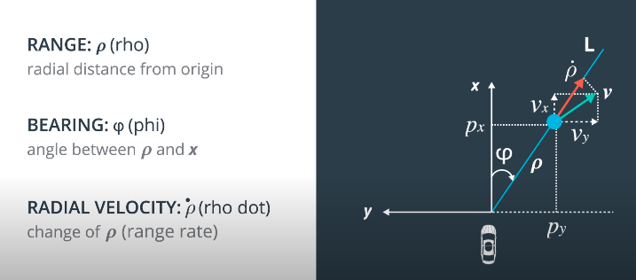

#  Environment setup

https://github.com/udacity/self-driving-car-sim/releases/

Build from source code: https://github.com/udacity/CarND-Extended-Kalman-Filter-Project

Optional resources:

some extra resources that you can use to develop your solution:

- A [Sensor Fusion utilities repo](https://github.com/udacity/CarND-Mercedes-SF-Utilities) containing Matlab scripts that will generate more sample data (generating your own sample data is completely optional)
- A visualization package that you can also find within [the Sensor Fusion utilities repo](https://github.com/udacity/CarND-Mercedes-SF-Utilities)

# VS Code

```bash
cd /home/q426889/priv_repo_mboiko/self_driving_car_ND/term2/p2/CarND-Unscented-Kalman-Filter-Project

./install-ubuntu.sh

```

## Build / Debug

GCC 8.4.0 Compiler


# Radar

Radio detection and ranging.

Radar uses radio waves.

Radars are used in:

- Adaptive Cruise Control

- Blind spot warning

- Collision warning

- Collision avoidance

  

  Other sensors measure velocity by calculating the diff between two readings.

  Radar uses doppler effect to measure speed directly.

  Doppler effect measures the change in frequency of the radar waves based on whether the object moves away from you or toward you.

  

  Upon the other sensors in the car, radar is the least affected by the rain or fog.


Radar clutter: object have high reflectivity even if they're comparatively small.


# LiDAR

Light detection and ranging.

Lidar uses infra-red laser beams to determine the distance between the sensor and the nearby object.


900 nano-meter wavelength.


# Tracking algorithms


Unimodal: one single peak (See Gaussian below)

Bi-modal: two peaks (non-gaussian result)

## Monte-Carlo vs. Gaussian


## Gaussian: mean, variance


```python
from math import *

def f(mu, sigma2, x):
    return 1/sqrt(2.*pi*sigma2) * exp(-.5*(x-mu)**2 / sigma2)

print f(10.,4.,8.)

```

### Adding Gaussians


# Sigma square

Sigma square $\sigma^2$ covariance is the measure of uncertainty. 

The larger $\sigma^2$, the larger is the uncertainty about the current mean.


# More on Kalman Filter

## The first cycle is the **Measurement Update**.

- Requires a [product](https://classroom.udacity.com/courses/cs373/lessons/48739381/concepts/487235990923#)
- Uses [Bayes rule](https://classroom.udacity.com/courses/cs373/lessons/48739381/concepts/487221690923#).

## The second cycle is the **Motion Update** (Prediction).

- Involves a convolution
- Uses [total probability](https://classroom.udacity.com/courses/cs373/lessons/48739381/concepts/486736290923#).


## Further readings

http://www.ilectureonline.com/lectures/subject/SPECIAL%20TOPICS/26/190


#  Two-Dimensional Robot Motion and Trigonometry


### SOH - CAH - TOA

The **sine**, **cosine**, and **tangent** are all trigonometric ratios. A helpful mnemonic for remembering which sides each of these ratios compare is **SOH - CAH - TOA**

**SOH** - **s**ine is **o**pposite over **h**ypotenuse

$\sin(\theta) = \frac{\text{opposite}}{\text{hypotenuse}}$

**CAH** - **c**osine is **a**djacent over **h**ypotenuse

$\cos(\theta) = \frac{\text{adjacent}}{\text{hypotenuse}}$


**TOA** - **t**angent is **o**pposite over **a**djacent

$\tan(\theta) = \frac{\text{opposite}}{\text{adjacent}}$


# Kalman filter algorithm

## 1-D Motion case


### Definition of Variables

- $x$ is the mean state vector. For an extended Kalman filter, the mean state vector contains information about the object's position and velocity that you are tracking. It is called the "mean" state vector because position and velocity are represented by a gaussian distribution with mean x.
- $P$ is the state covariance matrix, which contains information about the uncertainty of the object's position and velocity. You can think of it as containing standard deviations.
- $k$ represents time steps. So $x_k$ refers to the object's position and velocity vector at time $k$.
- The notation $k+1|k$ refers to the prediction step. At time $k+1$, you receive a sensor measurement. Before taking into account the sensor measurement to update your belief about the object's position and velocity, you predict where you think the object will be at time k+1. You can predict the position of the object at $k+1$ based on its position and velocity at time k. Hence $x_{k+1|k}$ means that you have predicted where the object will be at $k+1$ but have not yet taken the sensor measurement into account.
- $x_{k+1}$ means that you have now predicted where the object will be at time $k+1 $ and then used the sensor measurement to update the object's position and velocity.


### linear model + matrix repr.


### Equations in C++

Now, let's do a quick refresher of the Kalman Filter for a simple 1D motion case. Let's say that your goal is to track a pedestrian with state $x$ that is described by a position and velocity.

$x = \begin{pmatrix} p \\ v \end{pmatrix}$

##### Prediction Step

When designing the Kalman filter, we have to define the two linear functions: the state transition function and the measurement function. The state transition function is

$x' = F*x + noise$

where,

$F = \begin{pmatrix} 1 & \Delta t \\ 0 & 1 \end{pmatrix}$

and $x'$ is where we predict the object to be after time $\Delta t$.

$F$ is a matrix that, when multiplied with $x$, predicts where the object will be after time $\Delta t$.

By using the linear motion model with a constant velocity, the new location, $p'$ is calculated as

$p' = p + v * \Delta t$,

where $p$ is the old location and $v$, the velocity, will be the same as the new velocity ($v' = v$) because the velocity is constant.

We can express this in a matrix form as follows:

$\begin{pmatrix} p' \\ v' \end{pmatrix} = \begin{pmatrix}1 & \Delta t \\ 0 & 1 \end{pmatrix} \begin{pmatrix} p \\ v \end{pmatrix}$


Remember we are representing the object location and velocity as gaussian distributions with mean $x$. When working with the equation $x' = F*x + noise$ , we are calculating the mean value of the state vector. The noise is also represented by a gaussian distribution but with mean zero; hence, noise = 0 is saying that the mean noise is zero. The equation then becomes $x' = F*x$

But the noise does have uncertainty. The uncertainty shows up in the $Q$ matrix as acceleration noise.

##### Update Step

For the update step, we use the measurement function to map the state vector into the measurement space of the sensor. To give a concrete example, lidar only measures an object's position. But the extended Kalman filter models an object's position and velocity. So multiplying by the measurement function H matrix will drop the velocity information from the state vector x. Then the lidar measurement position and our belief about the object's position can be compared.

$z = H*x + w$

where $w$ represents sensor measurement noise.

So for lidar, the measurement function looks like this:

$z = p'$.

It also can be represented in a matrix form:

$z=\begin{pmatrix} 1 & 0 \end{pmatrix} \begin{pmatrix} p' \\ v' \end{pmatrix}$.

As we already know, the general algorithm is composed of a prediction step where I predict the new state and covariance, $P$.

And we also have a measurement update (or also called many times a correction step) where we use the latest measurements to update our estimate and our uncertainty.


#### Code Quiz 

```c++
/** 
 * Write a function 'filter()' that implements a multi-
 *   dimensional Kalman Filter for the example given
 */

#include <iostream>
#include <vector>
#include "Dense"

using std::cout;
using std::endl;
using std::vector;
using Eigen::VectorXd;
using Eigen::MatrixXd;

// Kalman Filter variables
VectorXd x;	// object state
MatrixXd P;	// object covariance matrix
VectorXd u;	// external motion
MatrixXd F; // state transition matrix
MatrixXd H;	// measurement matrix
MatrixXd R;	// measurement covariance matrix
MatrixXd I; // Identity matrix
MatrixXd Q;	// process covariance matrix

vector<VectorXd> measurements;
void filter(VectorXd &x, MatrixXd &P);


int main() {
  /**
   * Code used as example to work with Eigen matrices
   */
  // design the KF with 1D motion
  x = VectorXd(2);
  x << 0, 0;

  P = MatrixXd(2, 2);
  P << 1000, 0, 0, 1000;

  u = VectorXd(2);
  u << 0, 0;

  F = MatrixXd(2, 2);
  F << 1, 1, 0, 1;

  H = MatrixXd(1, 2);
  H << 1, 0;

  R = MatrixXd(1, 1);
  R << 1;

  I = MatrixXd::Identity(2, 2);

  Q = MatrixXd(2, 2);
  Q << 0, 0, 0, 0;

  // create a list of measurements
  VectorXd single_meas(1);
  single_meas << 1;
  measurements.push_back(single_meas);
  single_meas << 2;
  measurements.push_back(single_meas);
  single_meas << 3;
  measurements.push_back(single_meas);

  // call Kalman filter algorithm
  filter(x, P);

  return 0;
}


void filter(VectorXd &x, MatrixXd &P) {

  for (unsigned int n = 0; n < measurements.size(); ++n) {

    VectorXd z = measurements[n];
    // TODO: YOUR CODE HERE
    /**
     * KF Measurement update step
     */
    VectorXd y = z - H * x;
    MatrixXd Ht = H.transpose();
    MatrixXd S = H * P * Ht + R;
    MatrixXd Si = S.inverse();
    MatrixXd K =  P * Ht * Si;

    // new state
    x = x + (K * y);
    P = (I - K * H) * P;

    /**
     * KF Prediction step
     */
    x = F * x + u;
    MatrixXd Ft = F.transpose();
    P = F * P * Ft + Q;

    cout << "x=" << endl <<  x << endl;
    cout << "P=" << endl <<  P << endl;
  }
}
```


## 2-D Tracking problem

In **Prediction** step $F$ is a state transition matrix and $Q$ is a process covariance matrix.


### Motion: linear model + matrix repr.


#### The State Transition Matrix

$\begin{pmatrix} p_x' \\\ p_y' \\\ v_x' \\\ v_y' \\\ \end{pmatrix} = \begin{pmatrix} 1 & 0 & \Delta t & 0 \\\ 0 & 1 & 0 & \Delta t \\\ 0 & 0 & 1 & 0 \\\ 0 & 0 & 0 & 1 \end{pmatrix} \begin{pmatrix} p_x \\\ p_y \\\ v_x \\\ v_y \end{pmatrix} + \begin{pmatrix} \nu_{px} \\\\ \nu_{py} \\\\ \nu_{vx} \\\\ \nu_{vy} \end{pmatrix}$


As a reminder, the above equation is $x' = Fx + noise$

### including noise vector a.k.a. random acceleration vector

because the acceleration is unknown, which is described by a zero mean and a covariance matrix $Q$, so $\nu \sim N(0,Q)$


## Derive process covariance matrix


We put vector $G$ outside the expectation calculation, since it doesn't contain any random variable .

The result is shown in the 4x4 Matrix below.

### Process Covariance Matrix Q - Intuition

As a reminder, here are the state covariance matrix update equation and the equation for Q.

$P' = FPF^T + Q$

$Q = \begin{pmatrix} \frac{\Delta t^4}{{4}}\sigma_{ax}^2 & 0 & \frac{\Delta t^3}{{2}}\sigma_{ax}^2 & 0 \\ 0 & \frac{\Delta t^4}{{4}}\sigma_{ay}^2 & 0 & \frac{\Delta t^3}{{2}}\sigma_{ay}^2 \\ \frac{\Delta t^3}{{2}}\sigma_{ax}^2 & 0 & \Delta t^2\sigma_{ax}^2 & 0 \\ 0 & \frac{\Delta t^3}{{2}}\sigma_{ay}^2 & 0 & \Delta t^2\sigma_{ay}^2 \end{pmatrix}$

Because our state vector only tracks position and velocity, we are modeling acceleration as a random noise. The Q matrix includes time $\Delta t$ to account for the fact that as more time passes, we become more uncertain about our position and velocity. So as $\Delta t$ increases, we add more uncertainty to the state covariance matrix  $P$.


Combining both 2D position and 2D velocity equations previously deducted formulas we have:

$\begin{cases} p_x' = p_x + v_x \Delta t + \frac{a_x \Delta t^2}{{2}}\\ p_y' = p_y + v_y \Delta t + \frac{a_y \Delta t^2}{{2}}\\ v_x' = v_x + a_x \Delta t\\ v_y' = v_y + a_y \Delta t \end{cases}$


Since the acceleration is unknown we can add it to the noise component, and this random noise would be expressed analytically as the last terms in the equation derived above. So, we have a random acceleration vector $\nu$ in this form:

$\nu = \begin{pmatrix} \nu_{px} \\ \nu_{py} \\ \nu_{vx} \\ \nu_{vy} \end{pmatrix} = \begin{pmatrix} \frac{a_x \Delta t^2}{{2}} \\ \frac{a_y \Delta t^2}{{2}} \\ a_x \Delta t \\ a_y \Delta t \end{pmatrix}$

which is described by a zero mean and a covariance matrix $Q$, so $\nu \sim N(0,Q).$ (here mean == 0)

The vector $\nu$ can be decomposed into two components a 4 by 2 matrix $G$ which does not contain random variables and a 2 by 1 matrix $a$ which contains the random acceleration components:

$\nu = \begin{pmatrix} \frac{a_x \Delta t^2}{{2}} \\ \frac{a_y \Delta t^2}{{2}} \\ a_x \Delta t \\ a_y \Delta t \end{pmatrix} = \begin{pmatrix} \frac{\Delta t^2}{{2}} & 0 \\ 0 & \frac{\Delta t^2}{{2}} \\ \Delta t & 0 \\ 0 & \Delta t \end{pmatrix} \begin{pmatrix} a_x\\ a_y \end{pmatrix} = Ga$

$\Delta t$ is computed at each Kalman Filter step and the acceleration is a random vector with zero mean and standard deviations $\sigma_{ax_{}}$ and $\sigma_{ay}$.

Based on our noise vector we can define now the new covariance matrix $Q$. The covariance matrix is defined as the expectation value of the noise vector $\nu$ times the noise vector $\nu^T. $So let’s write this down:

$Q = E[\nu \nu^T] = E[Gaa^TG^T]$

As $G$ does not contain random variables, we can put it outside the expectation calculation.

$Q = G E[aa^T] G^T = G \begin{pmatrix} \sigma_{ax}^2 & \sigma_{axy} \\ \sigma_{axy} & \sigma_{ay}^2 \end{pmatrix} G^T = G Q_{\nu} G^T$

This leaves us with three statistical moments:

- the expectation of ax times ax, which is the variance of ax squared: $\sigma_{ax}^2$.
- the expectation of ay times ay, which is the variance of ay squared: $\sigma_{ay}^2$.
- and the expectation of ax times ay, which is the covariance of $ax$ and $ay$: $\sigma_{axy}$.

$a_{x_{}}$ and $a_{y_{}} $are assumed uncorrelated noise processes. This means that the covariance $\sigma_{axy_{}}$in $Q_{\nu}$ is zero:

$Q_{\nu} = \begin{pmatrix} \sigma_{ax}^2 & \sigma_{axy} \\ \sigma_{axy} & \sigma_{ay}^2 \end{pmatrix} = \begin{pmatrix} \sigma_{ax}^2 & 0 \\ 0 & \sigma_{ay}^2 \end{pmatrix}$

So after combining everything in one matrix we obtain our 4 by 4 $Q$ matrix:

$Q = G Q_{\nu} G^T = \begin{pmatrix} \frac{\Delta t^4}{{4}}\sigma_{ax}^2 & 0 & \frac{\Delta t^3}{{2}}\sigma_{ax}^2 & 0 \\ 0 & \frac{\Delta t^4}{{4}}\sigma_{ay}^2 & 0 & \frac{\Delta t^3}{{2}}\sigma_{ay}^2 \\ \frac{\Delta t^3}{{2}}\sigma_{ax}^2 & 0 & \Delta t^2\sigma_{ax}^2 & 0 \\ 0 & \frac{\Delta t^3}{{2}}\sigma_{ay}^2 & 0 & \Delta t^2\sigma_{ay}^2 \end{pmatrix}$


#### Note on Notation

Some authors describe $Q$ as the complete process noise covariance matrix. And some authors describe $Q$ as the covariance matrix of the individual noise processes. In our case, the covariance matrix of the individual noise processes matrix is called $Q_\nu$, which is something to be aware of.


## Laser Measurement


### Definition of Variables

- **z** is the measurement vector. For a lidar sensor, the $z$ vector contains the $position-x$ and $position-y$ measurements.
- **H** is the matrix that projects your belief about the object's current state into the measurement space of the sensor. For lidar, this is a fancy way of saying that we discard velocity information from the state variable since the lidar sensor only measures position: The state vector $x$ contains information about $[p_x, p_y, v_x, v_y]$ whereas the $z$ vector will only contain $[px, py]$. Multiplying Hx allows us to compare x, our belief, with z, the sensor measurement.
- What does the prime notation in the $x$ vector represent? The prime notation like $p_x'$ means you have already done the prediction step but have not done the measurement step yet. In other words, the object was at $p_x$. After time $\Delta{t}$, you calculate where you believe the object will be based on the motion model and get $p_x'$.

### H Matrix

$\begin{pmatrix} p_x \\ p_y \end{pmatrix} = H \begin{pmatrix} p_x' \\ p_y' \\ v_x' \\ v_y' \end{pmatrix}$

$H = \begin{pmatrix} 1 & 0 & 0 & 0 \\ 0 & 1 & 0 & 0 \end{pmatrix}$

### Measurement Noise Covariance Matrix R continued

For laser sensors, we have a 2D measurement vector. Each location component px, py are affected by a random noise. So our noise vector $\omega$ has the same dimension as $z$. And it is a distribution with zero mean and a 2 x 2 covariance matrix which comes from the product of the vertical vector $\omega$ and its transpose.

$R = E[\omega \omega^T] = \begin{pmatrix} \sigma^2_{px} & 0 \\ 0 & \sigma^2_{py} \end{pmatrix}$

where R is the measurement noise covariance matrix; in other words, the matrix R represents the uncertainty in the position measurements we receive from the laser sensor.

Generally, the parameters for the random noise measurement matrix will be provided by the sensor manufacturer. 

Remember that the off-diagonal $0$s in $R$ indicate that the noise processes are uncorrelated.

### Code

main.cpp

```c++
#include <fstream>
#include <iostream>
#include <sstream>
#include <vector>
#include "Dense"
#include "measurement_package.h"
#include "tracking.h"

using Eigen::MatrixXd;
using Eigen::VectorXd;
using std::cout;
using std::endl;
using std::ifstream;
using std::istringstream;
using std::string;
using std::vector;


int main() {

  /**
   * Set Measurements
   */
  vector<MeasurementPackage> measurement_pack_list;

  // hardcoded input file with laser and radar measurements
  string in_file_name_ = "obj_pose-laser-radar-synthetic-input.txt";
  ifstream in_file(in_file_name_.c_str(), ifstream::in);

  if (!in_file.is_open()) {
    cout << "Cannot open input file: " << in_file_name_ << endl;
  }

  string line;
  // set i to get only first 3 measurments
  int i = 0;
  while (getline(in_file, line) && (i<=3)) {

    MeasurementPackage meas_package;

    istringstream iss(line);
    string sensor_type;
    iss >> sensor_type; // reads first element from the current line
    int64_t timestamp;
    if (sensor_type.compare("L") == 0) {  // laser measurement
      // read measurements
      meas_package.sensor_type_ = MeasurementPackage::LASER;
      meas_package.raw_measurements_ = VectorXd(2);
      float x;
      float y;
      iss >> x;
      iss >> y;
      meas_package.raw_measurements_ << x,y;
      iss >> timestamp;
      meas_package.timestamp_ = timestamp;
      measurement_pack_list.push_back(meas_package);

    } else if (sensor_type.compare("R") == 0) {
      // Skip Radar measurements
      continue;
    }
    ++i;
  }

  // Create a Tracking instance
  Tracking tracking;

  // call the ProcessingMeasurement() function for each measurement
  size_t N = measurement_pack_list.size();
  // start filtering from the second frame 
  // (the speed is unknown in the first frame)
  for (size_t k = 0; k < N; ++k) {
    tracking.ProcessMeasurement(measurement_pack_list[k]);
  }

  if (in_file.is_open()) {
    in_file.close();
  }
  return 0;
}
```


tracking.h

```c++
#ifndef TRACKING_H_
#define TRACKING_H_

#include <vector>
#include <string>
#include <fstream>
#include "kalman_filter.h"
#include "measurement_package.h"

class Tracking {
 public:
  Tracking();
  virtual ~Tracking();
  void ProcessMeasurement(const MeasurementPackage &measurement_pack);
  KalmanFilter kf_;

 private:
  bool is_initialized_;
  int64_t previous_timestamp_;

  //acceleration noise components
  float noise_ax;
  float noise_ay;
};

#endif  // TRACKING_H_
```


tracking.cpp

```c++
#include "tracking.h"
#include <iostream>
#include "Dense"

using Eigen::MatrixXd;
using Eigen::VectorXd;
using std::cout;
using std::endl;
using std::vector;

Tracking::Tracking() {
  is_initialized_ = false;
  previous_timestamp_ = 0;

  // create a 4D state vector, we don't know yet the values of the x state
  kf_.x_ = VectorXd(4);

  // state covariance matrix P
  kf_.P_ = MatrixXd(4, 4);
  kf_.P_ << 1, 0, 0, 0,
            0, 1, 0, 0,
            0, 0, 1000, 0,
            0, 0, 0, 1000;


  // measurement covariance
  kf_.R_ = MatrixXd(2, 2);
  kf_.R_ << 0.0225, 0,
            0, 0.0225;

  // measurement matrix
  kf_.H_ = MatrixXd(2, 4);
  kf_.H_ << 1, 0, 0, 0,
            0, 1, 0, 0;

  // the initial transition matrix F_
  kf_.F_ = MatrixXd(4, 4);
  kf_.F_ << 1, 0, 1, 0,
            0, 1, 0, 1,
            0, 0, 1, 0,
            0, 0, 0, 1;

  // set the acceleration noise components
  noise_ax = 5;
  noise_ay = 5;
}

Tracking::~Tracking() {

}

// Process a single measurement
void Tracking::ProcessMeasurement(const MeasurementPackage &measurement_pack) {
  if (!is_initialized_) {
    //cout << "Kalman Filter Initialization " << endl;

    // set the state with the initial location and zero velocity
    kf_.x_ << measurement_pack.raw_measurements_[0], 
              measurement_pack.raw_measurements_[1], 
              0, 
              0;

    previous_timestamp_ = measurement_pack.timestamp_;
    is_initialized_ = true;
    return;
  }

  // compute the time elapsed between the current and previous measurements
  // dt - expressed in seconds
  float dt = (measurement_pack.timestamp_ - previous_timestamp_) / 1000000.0;
  previous_timestamp_ = measurement_pack.timestamp_;
  
    // TODO: YOUR CODE HERE
  float dt_2 = dt * dt;
  float dt_3 = dt_2 * dt;
  float dt_4 = dt_3 * dt;

  // Modify the F matrix so that the time is integrated
  kf_.F_(0, 2) = dt;
  kf_.F_(1, 3) = dt;

  // set the process covariance matrix Q
  kf_.Q_ = MatrixXd(4, 4);
  kf_.Q_ <<  dt_4/4*noise_ax, 0, dt_3/2*noise_ax, 0,
         0, dt_4/4*noise_ay, 0, dt_3/2*noise_ay,
         dt_3/2*noise_ax, 0, dt_2*noise_ax, 0,
         0, dt_3/2*noise_ay, 0, dt_2*noise_ay;

  // predict
  kf_.Predict();

  // measurement update
  kf_.Update(measurement_pack.raw_measurements_);
  
  cout << "x_= " << kf_.x_ << endl;
  cout << "P_= " << kf_.P_ << endl;
}
```


measurement_package.h

```c++
#ifndef MEASUREMENT_PACKAGE_H_
#define MEASUREMENT_PACKAGE_H_

#include "Dense"

class MeasurementPackage {
 public:

  enum SensorType {
    LASER, RADAR
  } sensor_type_;

  Eigen::VectorXd raw_measurements_;
  
  int64_t timestamp_;

};

#endif  // MEASUREMENT_PACKAGE_H_
```


kalman_filter.h

```c++
#ifndef KALMAN_FILTER_H_
#define KALMAN_FILTER_H_
#include "Dense"

using Eigen::MatrixXd;
using Eigen::VectorXd;

class KalmanFilter {
 public:
  /**
   * Constructor
   */
  KalmanFilter();

  /**
   * Destructor
   */
  virtual ~KalmanFilter();

  /**
   * Predict Predicts the state and the state covariance
   *   using the process model
   */
  void Predict();

  /**
   * Updates the state and
   * @param z The measurement at k+1
   */
  void Update(const VectorXd &z);
  
  // state vector
  VectorXd x_;

  // state covariance matrix
  MatrixXd P_;

  // state transistion matrix
  MatrixXd F_;

  // process covariance matrix
  MatrixXd Q_;

  // measurement matrix
  MatrixXd H_;

  // measurement covariance matrix
  MatrixXd R_;
};

#endif  // KALMAN_FILTER_H_
```


kalman_filter.cpp

```c++
#include "kalman_filter.h"

KalmanFilter::KalmanFilter() {
}

KalmanFilter::~KalmanFilter() {
}

void KalmanFilter::Predict() {
  x_ = F_ * x_;
  MatrixXd Ft = F_.transpose();
  P_ = F_ * P_ * Ft + Q_;
}

void KalmanFilter::Update(const VectorXd &z) {
  VectorXd z_pred = H_ * x_;
  VectorXd y = z - z_pred;
  MatrixXd Ht = H_.transpose();
  MatrixXd S = H_ * P_ * Ht + R_;
  MatrixXd Si = S.inverse();
  MatrixXd PHt = P_ * Ht;
  MatrixXd K = PHt * Si;

  //new estimate
  x_ = x_ + (K * y);
  long x_size = x_.size();
  MatrixXd I = MatrixXd::Identity(x_size, x_size);
  P_ = (I - K * H_) * P_;
}
```


## Radar measurement

Here **blue dot** is a pedestrian we want to detect.

X-axis always points into vehicle's direction.





### Definition of Radar Variables

- The range, ($\rho$), is the distance to the pedestrian. The range is basically the magnitude of the position vector $\rho$ which can be defined as $\rho = sqrt(p_x^2 + p_y^2).$
- $\varphi = atan(p_y / p_x)$. Note that $\varphi$ is referenced counter-clockwise from the x-axis, so $\varphi$ from the video clip above in that situation would actually be negative.
- The range rate, $\dot{\rho}$, is the projection of the velocity, $v$, onto the line, $L$.


### H versus h(x)

The $H$ matrix from the lidar lesson and $h(x)$ equations from the radar lesson are actually accomplishing the same thing; they are both needed to solve $y = z - Hx'$ in the update step.

But for radar, there is no $H$ matrix that will map the state vector $x$ into polar coordinates; instead, you need to calculate the mapping manually to convert from cartesian coordinates to polar coordinates.

Here is the $h$ function that specifies how the predicted position and speed get mapped to the polar coordinates of range, bearing and range rate.

$h(x')= \begin{pmatrix} \rho\\ \phi\\ \dot{\rho} \end{pmatrix} = \begin{pmatrix} \sqrt{ p{'}_x^2 + p{'}_y^2 }\\ \arctan(p_y' / p_x')\\ \frac{p_x' v_x' + p_y' v_y'}{\sqrt{p{'}_x^2 + p{'}_{y}^2}} \end{pmatrix}$

Hence for radar $y = z - Hx'$ becomes $y = z - h(x')$.


### Deriving the Radar Measurement Function

The measurement function is composed of three components that show how the predicted state, $x' = (p_x', p_y', v_x', v_y')^T$, is mapped into the measurement space, $z = (\rho, \varphi, \dot{\rho})^T:$

The range, $\rho$, is the distance to the pedestrian which can be defined as:

$\rho = \sqrt[]{p_x^2 + p_y^2}$

$\varphi$ is the angle between $\rho$ and the $x$ direction and can be defined as:

$\varphi = \arctan(p_y/p_x)$

There are two ways to do the range rate $\dot{\rho(t)}$ derivation:

Generally we can explicitly describe the range, $\rho$, as a function of time:

$\rho(t) = \sqrt{p_x(t)^2 + p_y(t)^2}$


The range rate, $\dot{\rho(t)}$, is defined as time rate of change of the range, $\rho$, and it can be described as the time derivative of $\rho$:

$\dot{\rho} = \frac{\partial \rho(t)}{\partial t} = \frac{ \partial}{\partial t}\sqrt{p_x(t)^2 + p_y(t)^2} = \frac{1}{2 \sqrt{p_x(t)^2 + p_y(t)^2}} (\frac{ \partial}{\partial t}p_x(t)^2 + \frac{ \partial}{\partial t}p_y(t)^2)$

$=\frac{1}{2 \sqrt{p_x(t)^2 + p_y(t)^2}} (2 p_x(t) \frac{ \partial}{\partial t} p_x(t) + 2 p_y(t) \frac{ \partial}{\partial t} p_y(t))$

$\frac{ \partial}{\partial t} p_x(t)$ is nothing else than $v_x(t)$, similarly $\frac{ \partial}{\partial t}$ is $v_y(t)$. So we have:

$\dot{\rho} = \frac{\partial \rho(t)}{\partial t} = \frac{1}{2 \sqrt{p_x(t)^2 + p_y(t)^2}} (2 p_x(t) v_x(t) + 2 p_y(t) v_y(t)) = \frac{2( p_x(t) v_x(t) + p_y(t) v_y(t))}{2 \sqrt{p_x(t)^2 + p_y(t)^2}}$

$=\frac{p_x(t) v_x(t) + p_y(t) v_y(t)}{ \sqrt{p_x(t)^2 + p_y(t)^2}}$

For simplicity we just use the following notation:

$\dot{\rho} = \frac{p_x v_x + p_y v_y}{ \sqrt{p_x^2 + p_y^2}}$

The range rate, $\dot{\rho}$, can be seen as a scalar projection of the velocity vector, $\vec{v}$, onto %\vec{\rho}%. Both %\vec{\rho}% and $\vec{v}$ are 2D vectors defined as:

$\vec{\rho}= \begin{pmatrix} p_x\\ p_y \end{pmatrix}, \space \vec{v}=\begin{pmatrix} v_x\\ v_y \end{pmatrix}$

The scalar projection of the velocity vector $\vec{v}$ onto $\vec{\rho}$ is defined as:

$\dot{\rho}= \frac{\vec{v} \vec{\rho}}{\lvert \vec{\rho} \rvert} = \frac{ \begin{pmatrix} v_x & v_y \end{pmatrix} \begin{pmatrix} p_x\\ p_y \end{pmatrix} }{ \sqrt{p_x^2 + p_y^2} } = \frac{p_x v_x + p_y v_y}{ \sqrt{p_x^2 + p_y^2}}$

where $\lvert \vec{\rho} \rvert$ is the length of $\vec{\rho}$. In our case it is actually the range, so $\rho = \lvert \vec{\rho} \rvert$.

### Kalman Filter -> Extended Kalman Filter : Multivariate Taylor Series Expansion

#### Problem


 


#### Solution

Linear approximation:


Let’s say we have a predicted state density described by

$\mu$ = 0 and $\sigma$ = 3.


#### Multivariate Taylor Series

Now that you’ve seen how to do a Taylor series expansion with a one-dimensional equation, we’ll need to look at the Taylor series expansion for multi-dimensional equations. Recall from the *Radar Measurements* lecture that the h function is composed of three equations that show how the predicted state, $x' = (p_x', p_y', v_x', v_y')^T$, is mapped into the measurement space, $z = (\rho, \varphi, \dot{\rho})^T$:

$h(x')= \begin{pmatrix} \sqrt{ p{'}_x^2 + p{'}_y^2 }\\ \arctan(p_y' / p_x')\\ \frac{p_x' v_x' + p_y' v_y'}{\sqrt{p{'}_x^2 + p{'}_{y}^2}} \end{pmatrix}$

These are multi-dimensional equations, so we will need to use a multi-dimensional Taylor series expansion to make a linear approximation of the $h$ function. Here is a general formula for the multi-dimensional Taylor series expansion:

$T(x) = f(a) + (x - a)^TDf(a) + \frac 1{2!}(x-a)^T{D^2f(a)}(x - a) + ...$

where $Df(a)$ is called the Jacobian matrix and $D^2f(a)$ is called the [Hessian matrix](https://www.khanacademy.org/math/multivariable-calculus/applications-of-multivariable-derivatives/quadratic-approximations/a/the-hessian). They represent first order and second order derivatives of multi-dimensional equations.

#### Jacobian Matrix code

```c++
#include <iostream>
#include <vector>
#include "Dense"

using Eigen::MatrixXd;
using Eigen::VectorXd;
using std::cout;
using std::endl;

MatrixXd CalculateJacobian(const VectorXd& x_state);

int main() {
  /**
   * Compute the Jacobian Matrix
   */

  // predicted state example
  // px = 1, py = 2, vx = 0.2, vy = 0.4
  VectorXd x_predicted(4);
  x_predicted << 1, 2, 0.2, 0.4;

  MatrixXd Hj = CalculateJacobian(x_predicted);

  cout << "Hj:" << endl << Hj << endl;

  return 0;
}

MatrixXd CalculateJacobian(const VectorXd& x_state) {

  MatrixXd Hj(3,4);
  // recover state parameters
  float px = x_state(0);
  float py = x_state(1);
  float vx = x_state(2);
  float vy = x_state(3);

  // pre-compute a set of terms to avoid repeated calculation
  float c1 = px*px+py*py;
  float c2 = sqrt(c1);
  float c3 = (c1*c2);

  // check division by zero
  if (fabs(c1) < 0.0001) {
    cout << "CalculateJacobian () - Error - Division by Zero" << endl;
    return Hj;
  }

  // compute the Jacobian matrix
  Hj << (px/c2), (py/c2), 0, 0,
      -(py/c1), (px/c1), 0, 0,
      py*(vx*py - vy*px)/c3, px*(px*vy - py*vx)/c3, px/c2, py/c2;

  return Hj;
}
```


### Extended Kalman Filter Equations

Although the mathematical proof is somewhat complex, it turns out that the Kalman filter equations and extended Kalman filter equations are very similar. The main differences are:

- the $F$ matrix will be replaced by $F_j$ when calculating $P'$.
- the $H$ matrix in the Kalman filter will be replaced by the Jacobian matrix $H_j$ when calculating $S$, $K$, and $P$.
- to calculate $x'$, the prediction update function, $f$, is used instead of the $F$ matrix.
- to calculate $y$, the $h$ function is used instead of the $H$ matrix.


**One important point to reiterate is that the equation $y = z - Hx'$ for the Kalman filter does not become $y = z - H_jx$ for the extended Kalman filter. Instead, for extended Kalman filters, we'll use the h function directly to map predicted locations $x'$ from Cartesian to polar coordinates.**


### More Details About Calculations with Radar Versus Lidar

In the radar update step, the Jacobian matrix $H_j$ is used to calculate $S$, $K$ and $P$. To calculate $y$, we use the equations that map the predicted location $x'$ from Cartesian coordinates to polar coordinates:

$h(x')= \begin{pmatrix} \sqrt{ p{'}_{x}^2 + p{'}_{y}^2 }\\ \arctan(p_y' / p_x')\\ \frac{p_x' v_x' + p_y' v_y'}{\sqrt{p{'}_{x}^2 + p{'}_{y}^2}} \end{pmatrix}$

The predicted measurement vector $x'$ is a vector containing values in the form $\begin{bmatrix} p_x, p_y, v_x, v_y \end{bmatrix}$. The radar sensor will output values in polar coordinates:

$\begin{pmatrix} \rho\\ \phi\\ \dot{\rho} \end{pmatrix}$

In order to calculate $y$ for the radar sensor, we need to convert $x'$ to polar coordinates. In other words, the function $h(x)$ maps values from Cartesian coordinates to polar coordinates. So the equation for radar becomes $y = z_{radar} - h(x')$.

One other important point when calculating $y$ with radar sensor data: the second value in the polar coordinate vector is the angle $\phi$. You'll need to make sure to normalize $\phi$ in the $y$ vector so that its angle is between $-\pi$ and $\pi$; in other words, add or subtract $2\pi$ from $\phi$ until it is between $-\pi$ and $\pi$.

To summarize:

- for measurement updates with lidar, we can use the $H$ matrix for calculating $y$, $S$, $K$ and $P$.
- for radar, $H_j$ is used to calculate $S$, $K$ and $P$.


## Sensor Fusion, General flow

https://youtu.be/dcTY4vRg5vo


## Evaluating the performance


### Code

```c++
#include <iostream>
#include <vector>
#include "Dense"

using Eigen::MatrixXd;
using Eigen::VectorXd;
using std::cout;
using std::endl;
using std::vector;

VectorXd CalculateRMSE(const vector<VectorXd> &estimations,
    const vector<VectorXd> &ground_truth);

int main() {
  /**
   * Compute RMSE
   */
  vector<VectorXd> estimations;
  vector<VectorXd> ground_truth;

  // the input list of estimations
  VectorXd e(4);
  e << 1, 1, 0.2, 0.1;
  estimations.push_back(e);
  e << 2, 2, 0.3, 0.2;
  estimations.push_back(e);
  e << 3, 3, 0.4, 0.3;
  estimations.push_back(e);

  // the corresponding list of ground truth values
  VectorXd g(4);
  g << 1.1, 1.1, 0.3, 0.2;
  ground_truth.push_back(g);
  g << 2.1, 2.1, 0.4, 0.3;
  ground_truth.push_back(g);
  g << 3.1, 3.1, 0.5, 0.4;
  ground_truth.push_back(g);

  // call the CalculateRMSE and print out the result
  cout << CalculateRMSE(estimations, ground_truth) << endl;


  return 0;
}

VectorXd CalculateRMSE(const vector<VectorXd> &estimations,
    const vector<VectorXd> &ground_truth) {

  VectorXd rmse(4);
  rmse << 0,0,0,0;

  // check the validity of the following inputs:
  //  * the estimation vector size should not be zero
  //  * the estimation vector size should equal ground truth vector size
  if (estimations.size() != ground_truth.size()
      || estimations.size() == 0) {
    cout << "Invalid estimation or ground_truth data" << endl;
    return rmse;
  }

  // accumulate squared residuals
  for (unsigned int i=0; i < estimations.size(); ++i) {

    VectorXd residual = estimations[i] - ground_truth[i];

    // coefficient-wise multiplication
    residual = residual.array()*residual.array();
    rmse += residual;
  }

  // calculate the mean
  rmse = rmse/estimations.size();

  // calculate the squared root
  rmse = rmse.array().sqrt();

  // return the result
  return rmse;
}
```


# Notes for using the Eigen Library:

You can create a vertical vector of two elements with a command like this:

```
VectorXd my_vector(2);
```

You can use the so called comma initializer to set all the coefficients to some values:

```
my_vector << 10, 20;
```

and you can use the cout command to print out the vector:

```
cout << my_vector << endl;
```

The matrices can be created in the same way. For example, This is an initialization of a 2 by 2 matrix with the values 1, 2, 3, and 4:

```cpp
MatrixXd my_matrix(2,2);
my_matrix << 1, 2,
             3, 4;
```

You can use the same comma initializer or you can set each matrix value explicitly. For example, that's how we can change the matrix elements in the second row:

```cpp
my_matrix(1,0) = 11;    //second row, first column
my_matrix(1,1) = 12;    //second row, second column
```

Also, you can compute the transpose of a matrix with the following command:

```
MatrixXd my_matrix_t = my_matrix.transpose();
```

And here is how you can get the matrix inverse:

```
MatrixXd my_matrix_i = my_matrix.inverse();
```

For multiplying the matrix m with the vector b you can write this in one line as let’s say matrix c equals m times v:

```cpp
MatrixXd another_matrix;
another_matrix = my_matrix*my_vector;
```

