# VS Code

```bash
cd /home/q426889/priv_repo_mboiko/self_driving_car_ND/term2/p2/CarND-Unscented-Kalman-Filter-Project

./install-ubuntu.sh

```

## Build / Debug

GCC 8.4.0 Compiler

# Unsented Kalman Filter

## Rationale

EKF uses CV Model (Constant Vehicle Model), which is bad in curves.

But there are many other models including:

- constant turn rate and velocity magnitude model (CTRV)
- constant turn rate and acceleration (CTRA)
- constant steering angle and velocity (CSAV)
- constant curvature and acceleration (CCA)

## Constant Turn Rate and Velocity magnitude model (CTRV)


### General State Vector

$x = \begin{bmatrix} p_x\\ p_y\\ v\\ \psi\\ \dot{\psi} \end{bmatrix}$

,where

$v$ = magnitude of the velocity

$\psi$ =  yaw angle is the orientation

$\dot{\psi}$ = yaw rate (psi dot)

Example of the straight path

$x = \begin{bmatrix} 2 \space m\\ 4 \space m\\ 7 \space m/s\\ 0.5 \space rad\\ 0 \space rad/s \end{bmatrix}$


### Process Model

The goal of the Process model is to predict, the state at the time step *k+1*, given the state at time *k* .

It is used in the prediction step.

$x_{k+1} = f(x_k, \nu_k)$, 

where function arguments are:

* $x_k$ - state (deterministic part)

* $\nu_k$ - noise vector (stochastic part)

## Prediction
### Deterministic part
#### Differential Equation

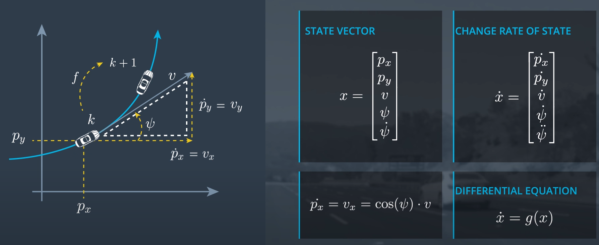

$\dot{p_x}$ is a change rate of the vehicle position along the x-axis. This is the same as the $v_x$.

$\dot{p_y}$ = $sin(\psi) \cdot v$

$\dot{v}$ = 0 (change in rate of the velocity) // because constant velocity is not changing as in the **Constant**TRV Model

$\dot{\psi}$ = $\dot{\psi}$ (change in the yaw) // simply a yaw rate from a state vector

$\ddot{\psi}$ = 0 (rate of change of the yaw rate) // yaw acceleration since it is a constant as in the **Constant**TRV Model


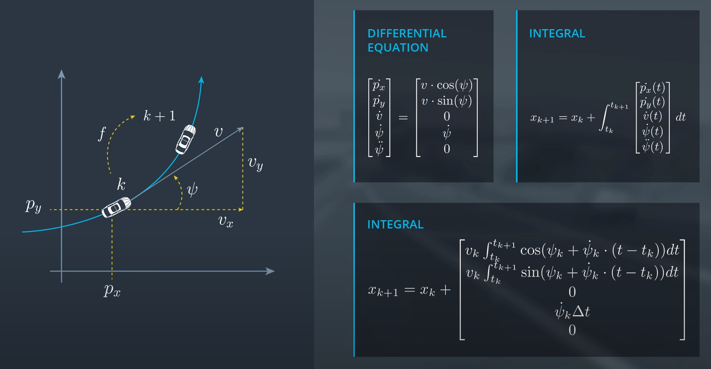

where:

$\Large v_k \int_{t_k}^{t_{k+1}} cos(\psi_k + \dot{\psi_k} \cdot (t - t_k)) \space dt = \frac{v_k}{\dot{\psi_k}}(sin(\psi_k + \dot{\psi_k}\Delta t) - sin(\psi_k))$


$\Large v_k \int_{t_k}^{t_{k+1}} sin(\psi_k + \dot{\psi_k} \cdot (t - t_k)) \space dt = \frac{v_k}{\dot{\psi_k}}(-cos(\psi_k + \dot{\psi_k}\Delta t) + cos(\psi_k))$


#### Differential Equation with solved integrals

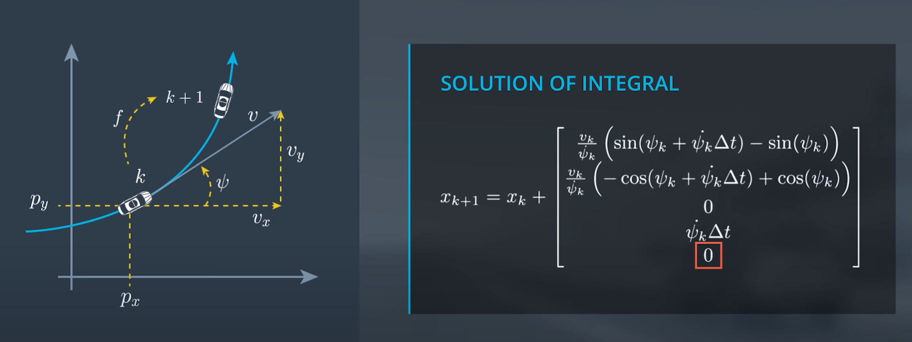

Remaining problem: division by 0 when the yaw rate is 0.

When the $\dot{\psi_k}$ = 0, the change in the X-position = $v_k cos(\psi_k) \Delta t$

When the $\dot{\psi_k}$ = 0, the change in the Y-position = $v_k sin(\psi_k) \Delta t$

### Stochastic part
#### Process noise vector ($\nu_k$)

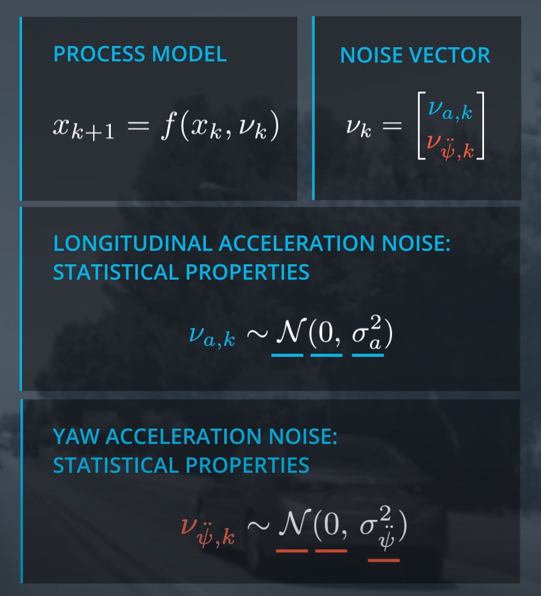

where both $\nu$'s (longitudinal and yaw acceleration noises) are normally distributed, white noise with 0 mean and $\sigma^2$ variance. 

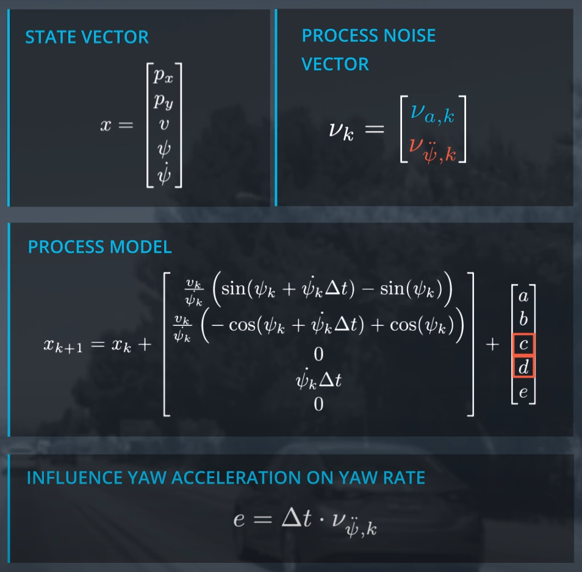

for $a$ and $b$ we ignore the yaw acceleration, because it's affect on the position is relatively small in comparison to other factors

$\Large a = \frac{1}{2}(\Delta t)^2 cos(\psi_k) \cdot \nu_{a,k}$ - is the x acceleration offset if the car were driving perfectly straight

$\Large b = \frac{1}{2}(\Delta t)^2 sin(\psi_k) \cdot \nu_{a,k}$ - is the y acceleration offset if the car were driving perfectly straight

$\Large c = \Delta t \cdot \nu_{a,k}$  - is the influence of $\nu_{a,k_{}}$ and $\nu_{\ddot{\psi},k} $on the velocity

$\Large d = 1/2(\Delta t)^2 \cdot \nu_{\ddot{\psi},k}$ - is the influence of $\nu_{a,k_{}}$ and $\nu_{\ddot{\psi},k}$ on the yaw angle


## Prediction / Update
### Unscented transformation

Is used to deal with non-linear functions.

#### Dealing with linear measurement models of the Prediction Problem

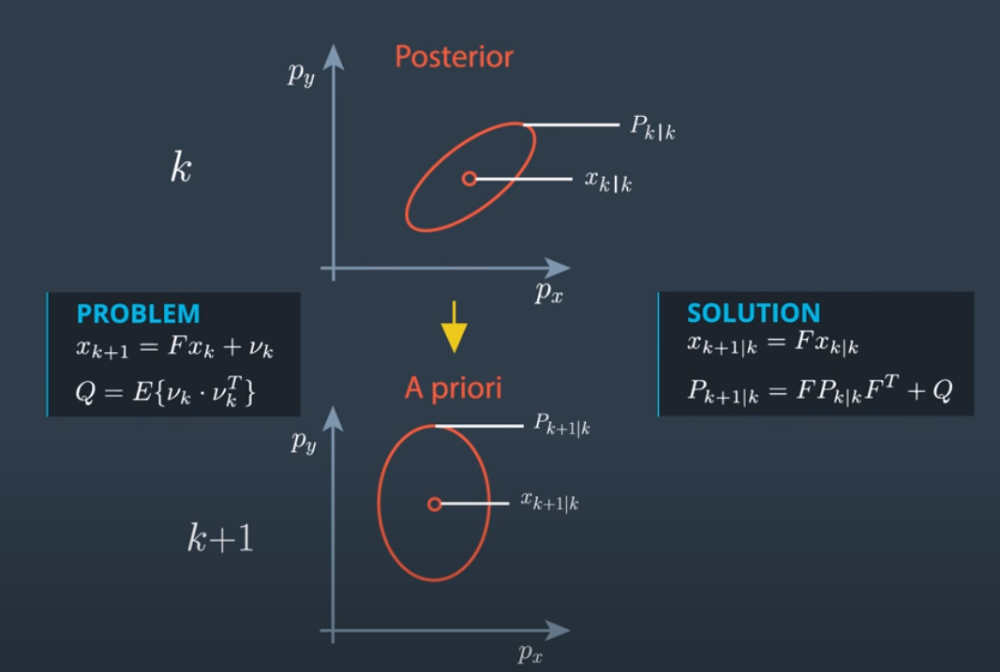

where $Q$ is the covariance matrix of the process noise.


#### Problem with non-linear [ process | measurement ] models of the Prediction Problem

Particle Filter does this kind of numerical calculation. The result is not a normal distribution, as you see below.

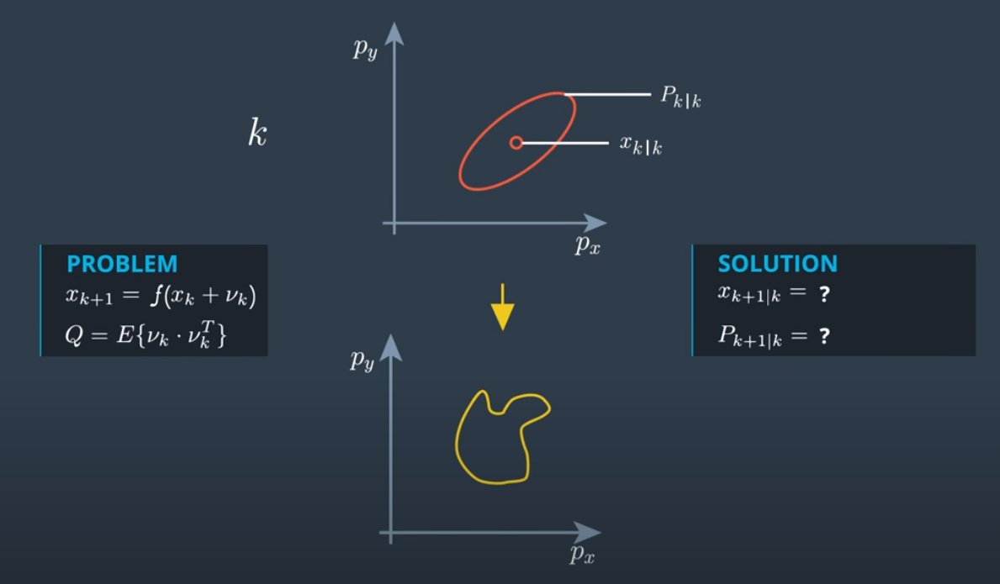

The UKF, though, uses the approximation as if the $P$ were a normal distribution. So what we want to find is a normal distribution, that represents the real predicted distribution as close as possible. What we are looking for is a normal distribution with the same mean value and the same covariance matrix as the real predicted distribution.

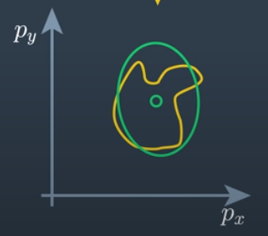

and this is done using sigma points.


## Roadmap

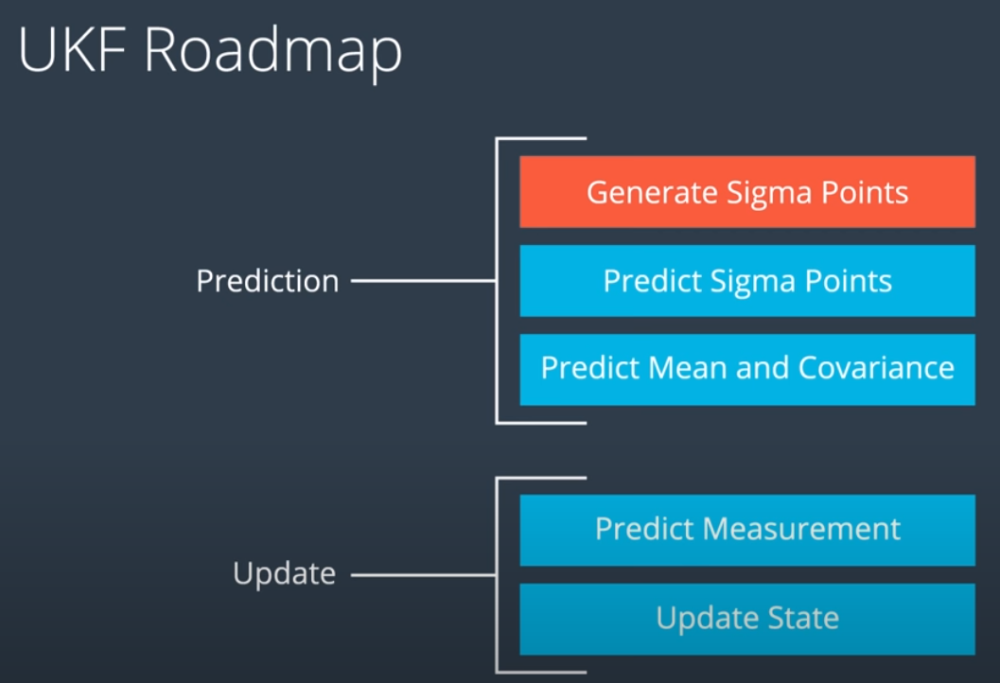

### Predict #1: Generate Sigma Points + Augmentation

We consider an easy case with 2 state dimensions.

Thus we result with 5 sigma points, from which one is for the mean.

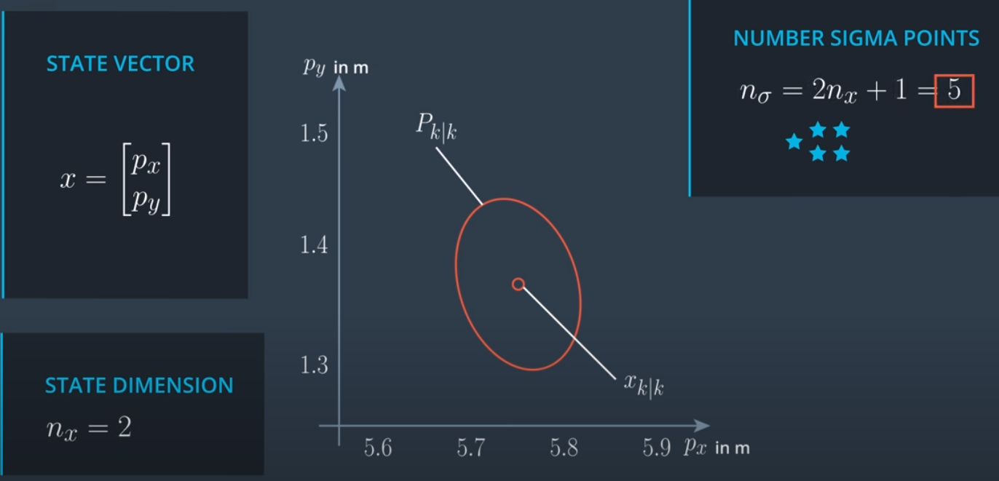


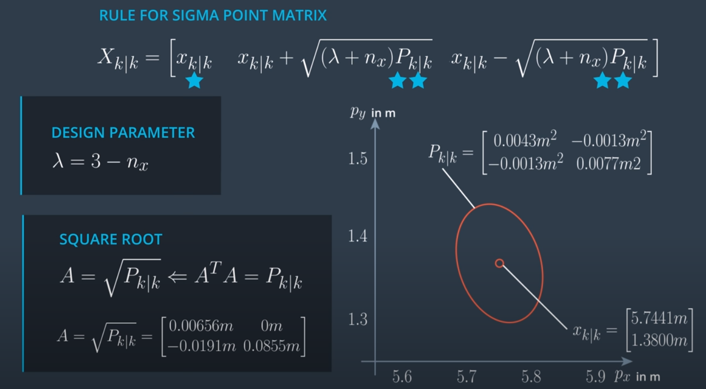

Where $\lambda$ is a design parameter, with which you can choose where in relation to the error elipse you want to put your sigma points.


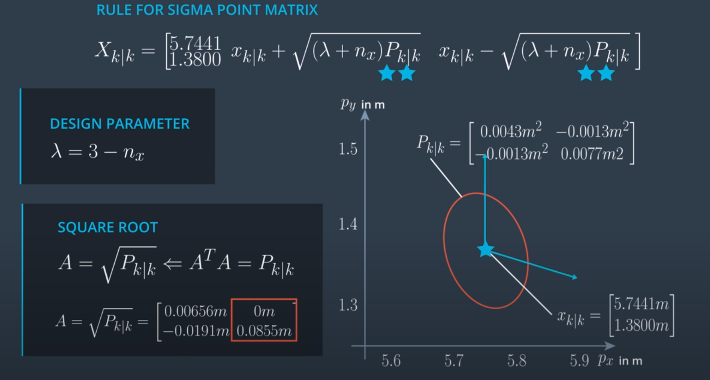


$X_{k|k} = \Bigg [ x_{k|k} \qquad x_{k|k}+\sqrt{(\lambda+n_x)P_{k|k}} \qquad x_{k|k}-\sqrt{(\lambda+n_x)P_{k|k}} \Bigg]$

remember that $\large x_{k|k}$ is the first column of the Sigma matrix.

$\large x_{k|k}+\sqrt{(\lambda+n_x)P_{k|k}}$ is the second through $\large n_x +1$ column.

$\large x_{k|k}-\sqrt{(\lambda+n_x)P_{k|k}}$ is the $\large n_x +2$ column through $\large 2n_x +12$ column.


- [Eigen Quick Reference Guide](https://eigen.tuxfamily.org/dox/group__QuickRefPage.html)
- [Eigen Documentation of Cholesky Decomposition](https://eigen.tuxfamily.org/dox/classEigen_1_1LLT.html)


#### Code

##### main.cpp

```c++
#include <iostream>
#include "Dense"
#include "ukf.h"

using Eigen::MatrixXd;

int main() {

  // Create a UKF instance
  UKF ukf;

  /**
   * Programming assignment calls
   */
  MatrixXd Xsig = MatrixXd(5, 11);
  ukf.GenerateSigmaPoints(&Xsig);

  // print result
  std::cout << "Xsig = " << std::endl << Xsig << std::endl;

  return 0;
}
```

##### ukf.cpp

```c++
#include "ukf.h"
#include <iostream>

using Eigen::MatrixXd;
using Eigen::VectorXd;

UKF::UKF() {
  Init();
}

UKF::~UKF() {

}

void UKF::Init() {

}

/**
 * Programming assignment functions: 
 */
void UKF::GenerateSigmaPoints(MatrixXd* Xsig_out) {

  // set state dimension
  int n_x = 5;

  // define spreading parameter
  double lambda = 3 - n_x;

  // set example state
  VectorXd x = VectorXd(n_x);
  x <<   5.7441,
         1.3800,
         2.2049,
         0.5015,
         0.3528;

  // set example covariance matrix
  MatrixXd P = MatrixXd(n_x, n_x);
  P <<     0.0043,   -0.0013,    0.0030,   -0.0022,   -0.0020,
          -0.0013,    0.0077,    0.0011,    0.0071,    0.0060,
           0.0030,    0.0011,    0.0054,    0.0007,    0.0008,
          -0.0022,    0.0071,    0.0007,    0.0098,    0.0100,
          -0.0020,    0.0060,    0.0008,    0.0100,    0.0123;

  // create sigma point matrix
  MatrixXd Xsig = MatrixXd(n_x, 2 * n_x + 1);

  // calculate square root of P
  MatrixXd A = P.llt().matrixL();

  /**
   * Student part begin
   */
   
  // set first column of sigma point matrix
  Xsig.col(0) = x;

  // set remaining sigma points
  for (int i = 0; i < n_x; ++i) {
    Xsig.col(i+1)     = x + sqrt(lambda+n_x) * A.col(i);
    Xsig.col(i+1+n_x) = x - sqrt(lambda+n_x) * A.col(i);
  }
  
  /**
   * Student part end
   */

  // print result
  // std::cout << "Xsig = " << std::endl << Xsig << std::endl;

  // write result
  *Xsig_out = Xsig;
}

/**
 * expected result:
 * Xsig =
 *  5.7441  5.85768   5.7441   5.7441   5.7441   5.7441  5.63052   5.7441   5.7441   5.7441   5.7441
 *    1.38  1.34566  1.52806     1.38     1.38     1.38  1.41434  1.23194     1.38     1.38     1.38
 *  2.2049  2.28414  2.24557  2.29582   2.2049   2.2049  2.12566  2.16423  2.11398   2.2049   2.2049
 *  0.5015  0.44339 0.631886 0.516923 0.595227   0.5015  0.55961 0.371114 0.486077 0.407773   0.5015
 *  0.3528 0.299973 0.462123 0.376339  0.48417 0.418721 0.405627 0.243477 0.329261  0.22143 0.286879
 */
```


##### ukf.h

```c++
#ifndef UKF_H
#define UKF_H

#include "Dense"

class UKF {
 public:
  /**
   * Constructor
   */
  UKF();

  /**
   * Destructor
   */
  virtual ~UKF();

  /**
   * Init Initializes Unscented Kalman filter
   */
  void Init();

  /**
   * Student assignment functions
   */
  void GenerateSigmaPoints(Eigen::MatrixXd* Xsig_out);
  void AugmentedSigmaPoints(Eigen::MatrixXd* Xsig_out);
  void SigmaPointPrediction(Eigen::MatrixXd* Xsig_out);
  void PredictMeanAndCovariance(Eigen::VectorXd* x_pred, 
                                Eigen::MatrixXd* P_pred);
  void PredictRadarMeasurement(Eigen::VectorXd* z_out, 
                               Eigen::MatrixXd* S_out);
  void UpdateState(Eigen::VectorXd* x_out, 
                   Eigen::MatrixXd* P_out);
};

#endif  // UKF_H
```


Now we need to consider  the process noise vector $\nu_k$, that also has a non-linear effect. 

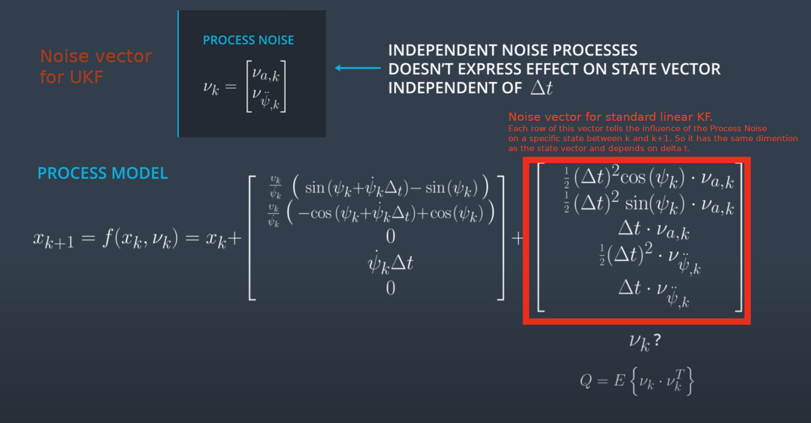

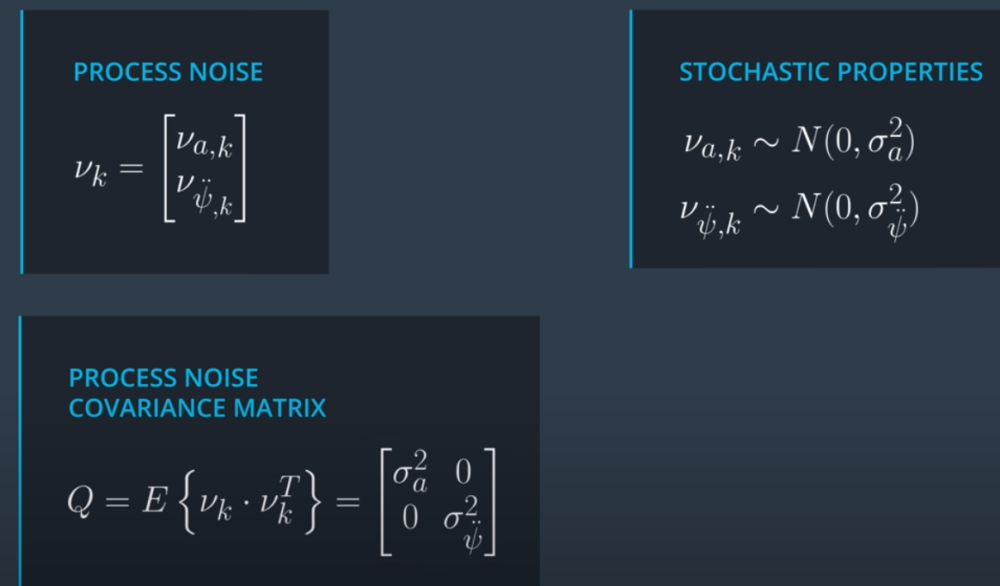

#### Augmentation - Way to represent the uncertainty of the covariance matrix Q with Sigma-Points

We add noise vector to the state vector. The result is Augmented State =$\large x_{a,k} = \begin{bmatrix} p_x\\ p_y\\ v\\ \psi\\ \dot{\psi}\\ \nu_a\\ \nu_{\ddot{\psi}} \end{bmatrix}$

Note: The mean of the process noise is zero.

Augmented Covariance Matrix =$\large P_{a,k|k} = \begin{bmatrix} P_{k|k} \quad 0 \\ 0 \qquad Q \end{bmatrix}$

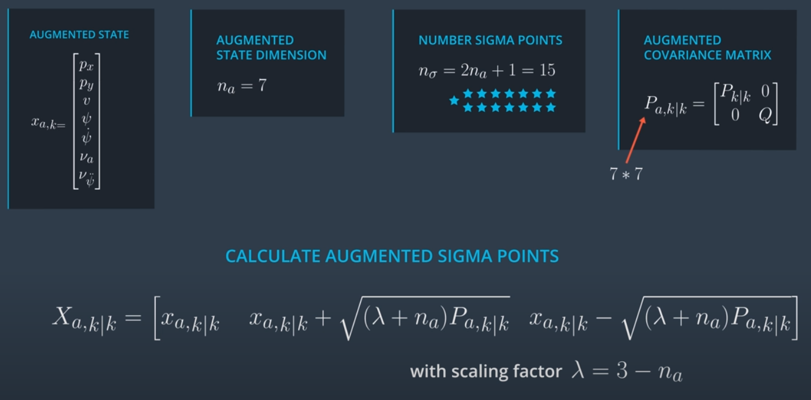

#### Code

###### main.cpp

```c++
#include "Dense"
#include "ukf.h"

using Eigen::MatrixXd;

int main() {

  // Create a UKF instance
  UKF ukf;

  /**
   * Programming assignment calls
   */
  MatrixXd Xsig_aug = MatrixXd(7, 15);
  ukf.AugmentedSigmaPoints(&Xsig_aug);

  return 0;
}
```


###### ukf.cpp
```c++
#include <iostream>
#include "ukf.h"

using Eigen::MatrixXd;
using Eigen::VectorXd;

UKF::UKF() {
  Init();
}

UKF::~UKF() {

}

void UKF::Init() {

}


/**
 * Programming assignment functions: 
 */

void UKF::AugmentedSigmaPoints(MatrixXd* Xsig_out) {

  // set state dimension
  int n_x = 5;

  // set augmented dimension
  int n_aug = 7;

  // Process noise standard deviation longitudinal acceleration in m/s^2
  double std_a = 0.2;

  // Process noise standard deviation yaw acceleration in rad/s^2
  double std_yawdd = 0.2;

  // define spreading parameter
  double lambda = 3 - n_aug;

  // set example state
  VectorXd x = VectorXd(n_x);
  x <<   5.7441,
         1.3800,
         2.2049,
         0.5015,
         0.3528;

  // create example covariance matrix
  MatrixXd P = MatrixXd(n_x, n_x);
  P <<     0.0043,   -0.0013,    0.0030,   -0.0022,   -0.0020,
          -0.0013,    0.0077,    0.0011,    0.0071,    0.0060,
           0.0030,    0.0011,    0.0054,    0.0007,    0.0008,
          -0.0022,    0.0071,    0.0007,    0.0098,    0.0100,
          -0.0020,    0.0060,    0.0008,    0.0100,    0.0123;

  // create augmented mean vector
  VectorXd x_aug = VectorXd(7);

  // create augmented state covariance
  MatrixXd P_aug = MatrixXd(7, 7);

  // create sigma point matrix
  MatrixXd Xsig_aug = MatrixXd(n_aug, 2 * n_aug + 1);

  /**
   * Student part begin
   */
 
  // create augmented mean state
  x_aug.head(5) = x;
  x_aug(5) = 0;
  x_aug(6) = 0;

  // create augmented covariance matrix
  P_aug.fill(0.0);
  P_aug.topLeftCorner(5,5) = P;
  P_aug(5,5) = std_a*std_a;
  P_aug(6,6) = std_yawdd*std_yawdd;

  // create square root matrix
  MatrixXd L = P_aug.llt().matrixL();

  // create augmented sigma points
  Xsig_aug.col(0)  = x_aug;
  for (int i = 0; i< n_aug; ++i) {
    Xsig_aug.col(i+1)       = x_aug + sqrt(lambda+n_aug) * L.col(i);
    Xsig_aug.col(i+1+n_aug) = x_aug - sqrt(lambda+n_aug) * L.col(i);
  }
  
  /**
   * Student part end
   */

  // print result
  std::cout << "Xsig_aug = " << std::endl << Xsig_aug << std::endl;

  // write result
  *Xsig_out = Xsig_aug;
}

/** 
 * expected result:
 *  Xsig_aug =
 * 5.7441  5.85768   5.7441   5.7441   5.7441   5.7441   5.7441   5.7441  5.63052   5.7441   5.7441   5.7441   5.7441   5.7441   5.7441
 *   1.38  1.34566  1.52806     1.38     1.38     1.38     1.38     1.38  1.41434  1.23194     1.38     1.38     1.38     1.38     1.38
 * 2.2049  2.28414  2.24557  2.29582   2.2049   2.2049   2.2049   2.2049  2.12566  2.16423  2.11398   2.2049   2.2049   2.2049   2.2049
 * 0.5015  0.44339 0.631886 0.516923 0.595227   0.5015   0.5015   0.5015  0.55961 0.371114 0.486077 0.407773   0.5015   0.5015   0.5015
 * 0.3528 0.299973 0.462123 0.376339  0.48417 0.418721   0.3528   0.3528 0.405627 0.243477 0.329261  0.22143 0.286879   0.3528   0.3528
 *      0        0        0        0        0        0  0.34641        0        0        0        0        0        0 -0.34641        0
 *      0        0        0        0        0        0        0  0.34641        0        0        0        0        0        0 -0.34641
 */
```

###### ufk.h
```c++
#ifndef UKF_H
#define UKF_H

#include "Dense"

class UKF {
 public:
  /**
   * Constructor
   */
  UKF();

  /**
   * Destructor
   */
  virtual ~UKF();

  /**
   * Init Initializes Unscented Kalman filter
   */
  void Init();

  /**
   * Student assignment functions
   */
  void GenerateSigmaPoints(Eigen::MatrixXd* Xsig_out);
  void AugmentedSigmaPoints(Eigen::MatrixXd* Xsig_out);
  void SigmaPointPrediction(Eigen::MatrixXd* Xsig_out);
  void PredictMeanAndCovariance(Eigen::VectorXd* x_pred, 
                                Eigen::MatrixXd* P_pred);
  void PredictRadarMeasurement(Eigen::VectorXd* z_out, 
                               Eigen::MatrixXd* S_out);
  void UpdateState(Eigen::VectorXd* x_out, 
                   Eigen::MatrixXd* P_out);
};

#endif  // UKF_H
```


### Predict: #2. How to predict the Sigma Points

Insert them into the prediction function:

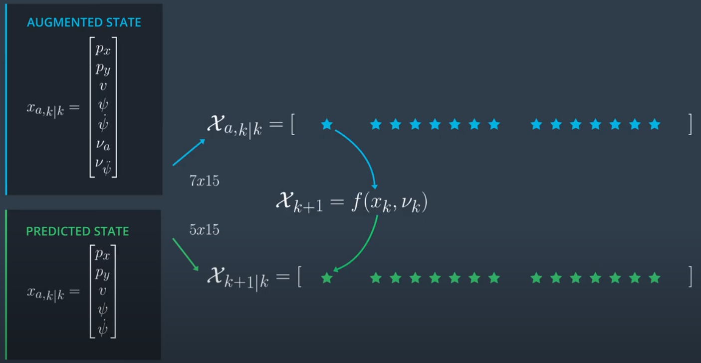

#### Code

##### main.cpp

```c++
#include "Dense"
#include "ukf.h"

using Eigen::MatrixXd;

int main() {

  // Create a UKF instance
  UKF ukf;

  /**
   * Programming assignment calls
   */
  MatrixXd Xsig_pred = MatrixXd(15, 5);
  ukf.SigmaPointPrediction(&Xsig_pred);

  return 0;
}
```

##### ukf.cpp
```c++
#include <iostream>
#include "ukf.h"

using Eigen::MatrixXd;
using Eigen::VectorXd;

UKF::UKF() {
  Init();
}

UKF::~UKF() {

}

void UKF::Init() {

}


/**
 * Programming assignment functions: 
 */

void UKF::SigmaPointPrediction(MatrixXd* Xsig_out) {

  // set state dimension
  int n_x = 5;

  // set augmented dimension
  int n_aug = 7;

  // create example sigma point matrix
  MatrixXd Xsig_aug = MatrixXd(n_aug, 2 * n_aug + 1);
  Xsig_aug <<
    5.7441,  5.85768,   5.7441,   5.7441,   5.7441,   5.7441,   5.7441,   5.7441,   5.63052,   5.7441,   5.7441,   5.7441,   5.7441,   5.7441,   5.7441,
      1.38,  1.34566,  1.52806,     1.38,     1.38,     1.38,     1.38,     1.38,   1.41434,  1.23194,     1.38,     1.38,     1.38,     1.38,     1.38,
    2.2049,  2.28414,  2.24557,  2.29582,   2.2049,   2.2049,   2.2049,   2.2049,   2.12566,  2.16423,  2.11398,   2.2049,   2.2049,   2.2049,   2.2049,
    0.5015,  0.44339, 0.631886, 0.516923, 0.595227,   0.5015,   0.5015,   0.5015,   0.55961, 0.371114, 0.486077, 0.407773,   0.5015,   0.5015,   0.5015,
    0.3528, 0.299973, 0.462123, 0.376339,  0.48417, 0.418721,   0.3528,   0.3528,  0.405627, 0.243477, 0.329261,  0.22143, 0.286879,   0.3528,   0.3528,
         0,        0,        0,        0,        0,        0,  0.34641,        0,         0,        0,        0,        0,        0, -0.34641,        0,
         0,        0,        0,        0,        0,        0,        0,  0.34641,         0,        0,        0,        0,        0,        0, -0.34641;

  // create matrix with predicted sigma points as columns
  MatrixXd Xsig_pred = MatrixXd(n_x, 2 * n_aug + 1);

  double delta_t = 0.1; // time diff in sec

  /**
   * Student part begin
   */

  // predict sigma points
  for (int i = 0; i< 2*n_aug+1; ++i) {
    // extract values for better readability
    double p_x = Xsig_aug(0,i);
    double p_y = Xsig_aug(1,i);
    double v = Xsig_aug(2,i);
    double yaw = Xsig_aug(3,i);
    double yawd = Xsig_aug(4,i);
    double nu_a = Xsig_aug(5,i);
    double nu_yawdd = Xsig_aug(6,i);

    // predicted state values
    double px_p, py_p;

    // avoid division by zero
    if (fabs(yawd) > 0.001) {
        px_p = p_x + v/yawd * ( sin (yaw + yawd*delta_t) - sin(yaw));
        py_p = p_y + v/yawd * ( cos(yaw) - cos(yaw+yawd*delta_t) );
    } else {
        px_p = p_x + v*delta_t*cos(yaw);
        py_p = p_y + v*delta_t*sin(yaw);
    }

    double v_p = v;
    double yaw_p = yaw + yawd*delta_t;
    double yawd_p = yawd;

    // add noise
    px_p = px_p + 0.5*nu_a*delta_t*delta_t * cos(yaw);
    py_p = py_p + 0.5*nu_a*delta_t*delta_t * sin(yaw);
    v_p = v_p + nu_a*delta_t;

    yaw_p = yaw_p + 0.5*nu_yawdd*delta_t*delta_t;
    yawd_p = yawd_p + nu_yawdd*delta_t;

    // write predicted sigma point into right column
    Xsig_pred(0,i) = px_p;
    Xsig_pred(1,i) = py_p;
    Xsig_pred(2,i) = v_p;
    Xsig_pred(3,i) = yaw_p;
    Xsig_pred(4,i) = yawd_p;
  }

  /**
   * Student part end
   */

  // print result
  std::cout << "Xsig_pred = " << std::endl << Xsig_pred << std::endl;

  // write result
  *Xsig_out = Xsig_pred;
}

/** 
 * expected result:
 Xsig_pred = 
 5.93553  6.06251  5.92217   5.9415  5.92361  5.93516  5.93705  5.93553  5.80832  5.94481  5.92935  5.94553  5.93589  5.93401  5.93553
 1.48939  1.44673  1.66484  1.49719    1.508  1.49001  1.49022  1.48939   1.5308  1.31287  1.48182  1.46967  1.48876  1.48855  1.48939
  2.2049  2.28414  2.24557  2.29582   2.2049   2.2049  2.23954   2.2049  2.12566  2.16423  2.11398   2.2049   2.2049  2.17026   2.2049
 0.53678 0.473387 0.678098 0.554557 0.643644 0.543372  0.53678 0.538512 0.600173 0.395462 0.519003 0.429916 0.530188  0.53678 0.535048
  0.3528 0.299973 0.462123 0.376339  0.48417 0.418721   0.3528 0.387441 0.405627 0.243477 0.329261  0.22143 0.286879   0.3528 0.318159
 */
```

##### ukf.h
```c++
#ifndef UKF_H
#define UKF_H

#include "Dense"

class UKF {
 public:
  /**
   * Constructor
   */
  UKF();

  /**
   * Destructor
   */
  virtual ~UKF();

  /**
   * Init Initializes Unscented Kalman filter
   */
  void Init();

  /**
   * Student assignment functions
   */
  void GenerateSigmaPoints(Eigen::MatrixXd* Xsig_out);
  void AugmentedSigmaPoints(Eigen::MatrixXd* Xsig_out);
  void SigmaPointPrediction(Eigen::MatrixXd* Xsig_out);
  void PredictMeanAndCovariance(Eigen::VectorXd* x_pred, 
                                Eigen::MatrixXd* P_pred);
  void PredictRadarMeasurement(Eigen::VectorXd* z_out, 
                               Eigen::MatrixXd* S_out);
  void UpdateState(Eigen::VectorXd* x_out, 
                   Eigen::MatrixXd* P_out);
};

#endif  // UKF_H
```

### Predict #3. Calculate predicted mean and covariance matrix

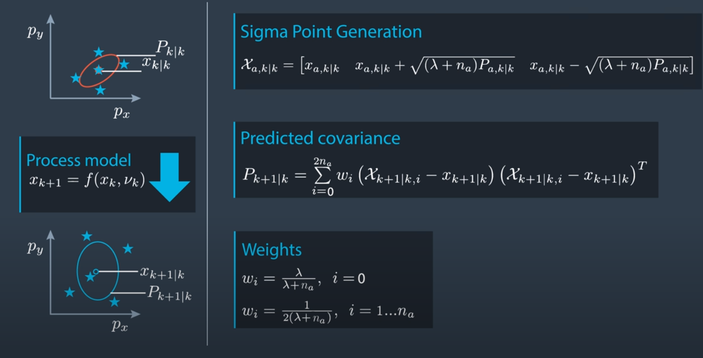

#### Note Regarding Sigma Point Generation and Prediction Steps

- **Sigma Point Generation:** Sigma points are generated using `Calligraphic-X(k)`, followed by a nonlinear transformation `f(x_k,nu_k)`.
- **Sigma Point Prediction:** The generated Sigma points are propagated to obtain the state of the system at time k+1. These predicted points are denoted `Calligraphic-X(k+1)`.


**Weights**
$\Large w_i =\frac{\lambda}{\lambda+n_{a}}, i =1$

$\Large w_i =\frac{1}{2(\lambda+n_{a})}, i =2...n_{a}$

**Predicted Mean**

$\Large x_{k+1|k} = \sum_{i=1}^{n_\sigma} w_i X_{k+1|k,i}$

**Predicted Covariance**

$\Large P_{k+1|k} = \sum_{i=1}^{n_\sigma} w_i( X_{k+1|k,i} - x_{k+1|k})(X_{k+1|k,i} - x_{k+1|k})^T$

#### Code

##### main.cpp
```c++
#include "Dense"
#include "ukf.h"

using Eigen::MatrixXd;
using Eigen::VectorXd;

int main() {

  // Create a UKF instance
  UKF ukf;

  /**
   * Programming assignment calls
   */
  VectorXd x_pred = VectorXd(5);
  MatrixXd P_pred = MatrixXd(5, 5);
  ukf.PredictMeanAndCovariance(&x_pred, &P_pred);

  return 0;
}
```


##### ukf.cpp
```c++
#include <iostream>
#include "ukf.h"

using Eigen::MatrixXd;
using Eigen::VectorXd;

UKF::UKF() {
  Init();
}

UKF::~UKF() {

}

void UKF::Init() {

}


/**
 * Programming assignment functions: 
 */

void UKF::PredictMeanAndCovariance(VectorXd* x_out, MatrixXd* P_out) {

  // set state dimension
  int n_x = 5;

  // set augmented dimension
  int n_aug = 7;

  // define spreading parameter
  double lambda = 3 - n_aug;

  // create example matrix with predicted sigma points
  MatrixXd Xsig_pred = MatrixXd(n_x, 2 * n_aug + 1);
  Xsig_pred <<
         5.9374,  6.0640,   5.925,  5.9436,  5.9266,  5.9374,  5.9389,  5.9374,  5.8106,  5.9457,  5.9310,  5.9465,  5.9374,  5.9359,  5.93744,
           1.48,  1.4436,   1.660,  1.4934,  1.5036,    1.48,  1.4868,    1.48,  1.5271,  1.3104,  1.4787,  1.4674,    1.48,  1.4851,    1.486,
          2.204,  2.2841,  2.2455,  2.2958,   2.204,   2.204,  2.2395,   2.204,  2.1256,  2.1642,  2.1139,   2.204,   2.204,  2.1702,   2.2049,
         0.5367, 0.47338, 0.67809, 0.55455, 0.64364, 0.54337,  0.5367, 0.53851, 0.60017, 0.39546, 0.51900, 0.42991, 0.530188,  0.5367, 0.535048,
          0.352, 0.29997, 0.46212, 0.37633,  0.4841, 0.41872,   0.352, 0.38744, 0.40562, 0.24347, 0.32926,  0.2214, 0.28687,   0.352, 0.318159;

  // create vector for weights
  VectorXd weights = VectorXd(2*n_aug+1);
  
  // create vector for predicted state
  VectorXd x = VectorXd(n_x);

  // create covariance matrix for prediction
  MatrixXd P = MatrixXd(n_x, n_x);


  /**
   * Student part begin
   */

  // set weights
  double weight_0 = lambda/(lambda+n_aug);
  weights(0) = weight_0;
  for (int i=1; i<2*n_aug+1; ++i) {  // 2n+1 weights
    double weight = 0.5/(n_aug+lambda);
    weights(i) = weight;
  }

  // predicted state mean
  x.fill(0.0);
  for (int i = 0; i < 2 * n_aug + 1; ++i) {  // iterate over sigma points
    x = x + weights(i) * Xsig_pred.col(i);
  }

  // predicted state covariance matrix
  P.fill(0.0);
  for (int i = 0; i < 2 * n_aug + 1; ++i) {  // iterate over sigma points
    // state difference
    VectorXd x_diff = Xsig_pred.col(i) - x;
    // angle normalization
    while (x_diff(3)> M_PI) x_diff(3)-=2.*M_PI;
    while (x_diff(3)<-M_PI) x_diff(3)+=2.*M_PI;

    P = P + weights(i) * x_diff * x_diff.transpose() ;
  }

  /**
   * Student part end
   */

  // print result
  std::cout << "Predicted state" << std::endl;
  std::cout << x << std::endl;
  std::cout << "Predicted covariance matrix" << std::endl;
  std::cout << P << std::endl;

  // write result
  *x_out = x;
  *P_out = P;
}

/*
expected result x:
x =
5.93637
1.49035
2.20528
0.536853
0.353577

expected result p:
P =
0.00543425 -0.0024053 0.00341576 -0.00348196 -0.00299378
-0.0024053 0.010845 0.0014923 0.00980182 0.00791091
0.00341576 0.0014923 0.00580129 0.000778632 0.000792973
-0.00348196 0.00980182 0.000778632 0.0119238 0.0112491
-0.00299378 0.00791091 0.000792973 0.0112491 0.0126972
*/
```


##### ukf.h
```c++
#ifndef UKF_H
#define UKF_H

#include "Dense"

class UKF {
 public:
  /**
   * Constructor
   */
  UKF();

  /**
   * Destructor
   */
  virtual ~UKF();

  /**
   * Init Initializes Unscented Kalman filter
   */
  void Init();

  /**
   * Student assignment functions
   */
  void GenerateSigmaPoints(Eigen::MatrixXd* Xsig_out);
  void AugmentedSigmaPoints(Eigen::MatrixXd* Xsig_out);
  void SigmaPointPrediction(Eigen::MatrixXd* Xsig_out);
  void PredictMeanAndCovariance(Eigen::VectorXd* x_pred, 
                                Eigen::MatrixXd* P_pred);
  void PredictRadarMeasurement(Eigen::VectorXd* z_out, 
                               Eigen::MatrixXd* S_out);
  void UpdateState(Eigen::VectorXd* x_out, 
                   Eigen::MatrixXd* P_out);
};

#endif  // UKF_H
```

### Update #1: Predict Measurement

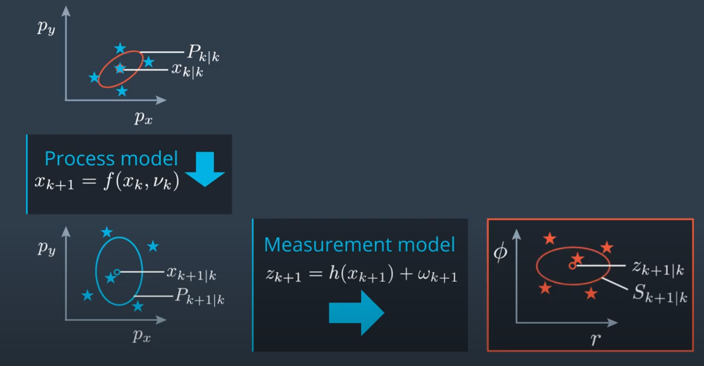

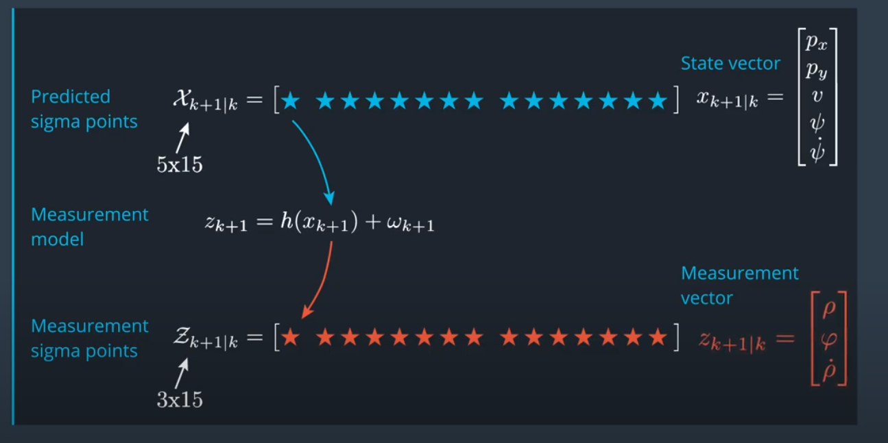


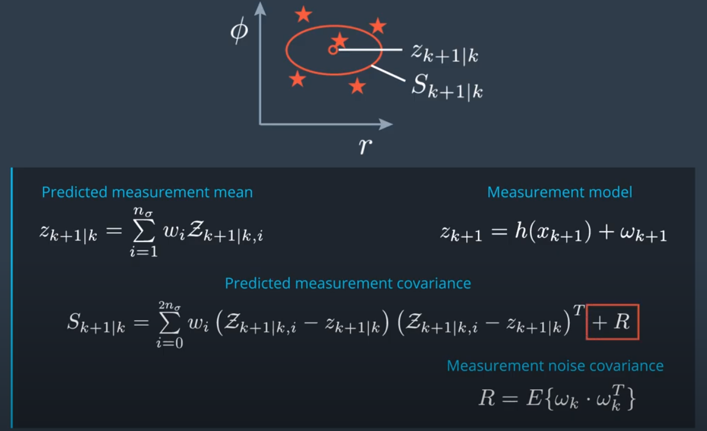


#### Predict Radar Measurements - Code

**State Vector**

$x_{k+1|k}=\begin{bmatrix} p_x\\ p_y\\ v\\ \psi\\ \dot{\psi} \end{bmatrix}$

Measurement Vector

$z_{k+1|k}=\begin{bmatrix} \rho\\ \varphi\\ \dot{\rho} \end{bmatrix}$

**Measurement Model**

$z_{k+1|k}=h(x_{k+1}) + w_{k+1}$

$\rho = \sqrt{p_x^2+p_y^2}$

$\varphi =arctan(\frac{p_y}{p_x})$

$\dot{\rho}=\frac{p_xcos(\psi)v+p_ysin(\psi)v}{\sqrt{p_x^2+p_y^2}}$

**Predicted Measurement Mean**

$\large z_{k+1|k} = \sum_{i=1}^{n_\sigma} w_i Z_{k+1|k,i}$

**Predicted Covariance**

$\large S_{k+1|k} = \sum_{i=1}^{n_\sigma} w_i( Z_{k+1|k,i} - z_{k+1|k})(Z_{k+1|k,i} - z_{k+1|k})^T + R$

$\large R = E(w_k\cdot w_k^T) = \begin{bmatrix} \sigma_{\rho}^2 \qquad 0\qquad0\\ 0\qquad\sigma_{\varphi}^2 \qquad 0\\ 0\qquad0\qquad\sigma_{\dot{\rho}}^2 \end{bmatrix}$

##### main.cpp
```c++
#include "Dense"
#include "ukf.h"

using Eigen::MatrixXd;
using Eigen::VectorXd;

int main() {

  // Create a UKF instance
  UKF ukf;

  /**
   * Programming assignment calls
   */  
  VectorXd z_out = VectorXd(3);
  MatrixXd S_out = MatrixXd(3, 3);
  ukf.PredictRadarMeasurement(&z_out, &S_out);

  return 0;
}
```

##### ukf.cpp
```c++
#include <iostream>
#include "ukf.h"

using Eigen::MatrixXd;
using Eigen::VectorXd;

UKF::UKF() {
  Init();
}

UKF::~UKF() {

}

void UKF::Init() {

}

/**
 * Programming assignment functions: 
 */

void UKF::PredictRadarMeasurement(VectorXd* z_out, MatrixXd* S_out) {

  // set state dimension
  int n_x = 5;

  // set augmented dimension
  int n_aug = 7;

  // set measurement dimension, radar can measure r, phi, and r_dot
  int n_z = 3;

  // define spreading parameter
  double lambda = 3 - n_aug;

  // set vector for weights
  VectorXd weights = VectorXd(2*n_aug+1);
  double weight_0 = lambda/(lambda+n_aug);
  double weight = 0.5/(lambda+n_aug);
  weights(0) = weight_0;

  for (int i=1; i<2*n_aug+1; ++i) {  
    weights(i) = weight;
  }

  // radar measurement noise standard deviation radius in m
  double std_radr = 0.3;

  // radar measurement noise standard deviation angle in rad
  double std_radphi = 0.0175;

  // radar measurement noise standard deviation radius change in m/s
  double std_radrd = 0.1;

  // create example matrix with predicted sigma points
  MatrixXd Xsig_pred = MatrixXd(n_x, 2 * n_aug + 1);
  Xsig_pred <<
         5.9374,  6.0640,   5.925,  5.9436,  5.9266,  5.9374,  5.9389,  5.9374,  5.8106,  5.9457,  5.9310,  5.9465,  5.9374,  5.9359,  5.93744,
           1.48,  1.4436,   1.660,  1.4934,  1.5036,    1.48,  1.4868,    1.48,  1.5271,  1.3104,  1.4787,  1.4674,    1.48,  1.4851,    1.486,
          2.204,  2.2841,  2.2455,  2.2958,   2.204,   2.204,  2.2395,   2.204,  2.1256,  2.1642,  2.1139,   2.204,   2.204,  2.1702,   2.2049,
         0.5367, 0.47338, 0.67809, 0.55455, 0.64364, 0.54337,  0.5367, 0.53851, 0.60017, 0.39546, 0.51900, 0.42991, 0.530188,  0.5367, 0.535048,
          0.352, 0.29997, 0.46212, 0.37633,  0.4841, 0.41872,   0.352, 0.38744, 0.40562, 0.24347, 0.32926,  0.2214, 0.28687,   0.352, 0.318159;

  // create matrix for sigma points in measurement space
  MatrixXd Zsig = MatrixXd(n_z, 2 * n_aug + 1);

  // mean predicted measurement
  VectorXd z_pred = VectorXd(n_z);
  
  // measurement covariance matrix S
  MatrixXd S = MatrixXd(n_z,n_z);

  /**
   * Student part begin
   */

  // transform sigma points into measurement space
  for (int i = 0; i < 2 * n_aug + 1; ++i) {  // 2n+1 simga points
    // extract values for better readability
    double p_x = Xsig_pred(0,i);
    double p_y = Xsig_pred(1,i);
    double v  = Xsig_pred(2,i);
    double yaw = Xsig_pred(3,i);

    double v1 = cos(yaw)*v;
    double v2 = sin(yaw)*v;

    // measurement model
    Zsig(0,i) = sqrt(p_x*p_x + p_y*p_y);                       // r
    Zsig(1,i) = atan2(p_y,p_x);                                // phi
    Zsig(2,i) = (p_x*v1 + p_y*v2) / sqrt(p_x*p_x + p_y*p_y);   // r_dot
  }

  // mean predicted measurement
  z_pred.fill(0.0);
  for (int i=0; i < 2*n_aug+1; ++i) {
    z_pred = z_pred + weights(i) * Zsig.col(i);
  }

  // innovation covariance matrix S
  S.fill(0.0);
  for (int i = 0; i < 2 * n_aug + 1; ++i) {  // 2n+1 simga points
    // residual
    VectorXd z_diff = Zsig.col(i) - z_pred;

    // angle normalization
    while (z_diff(1)> M_PI) z_diff(1)-=2.*M_PI;
    while (z_diff(1)<-M_PI) z_diff(1)+=2.*M_PI;

    S = S + weights(i) * z_diff * z_diff.transpose();
  }

  // add measurement noise covariance matrix
  MatrixXd R = MatrixXd(n_z,n_z);
  R <<  std_radr*std_radr, 0, 0,
        0, std_radphi*std_radphi, 0,
        0, 0,std_radrd*std_radrd;
  S = S + R;

  /**
   * Student part end
   */

  // print result
  std::cout << "z_pred: " << std::endl << z_pred << std::endl;
  std::cout << "S: " << std::endl << S << std::endl;

  // write result
  *z_out = z_pred;
  *S_out = S;
}

/*
* Expected result

z_pred =
6.12155
0.245993
2.10313

S =
0.0946171 		-0.000139448 	0.00407016
-0.000139448 	0.000617548 	-0.000770652
0.00407016 		-0.000770652 	0.0180917
*/
```

##### ukf.h
```c++
#ifndef UKF_H
#define UKF_H

#include "Dense"

class UKF {
 public:
  /**
   * Constructor
   */
  UKF();

  /**
   * Destructor
   */
  virtual ~UKF();

  /**
   * Init Initializes Unscented Kalman filter
   */
  void Init();

  /**
   * Student assignment functions
   */
  void GenerateSigmaPoints(Eigen::MatrixXd* Xsig_out);
  void AugmentedSigmaPoints(Eigen::MatrixXd* Xsig_out);
  void SigmaPointPrediction(Eigen::MatrixXd* Xsig_out);
  void PredictMeanAndCovariance(Eigen::VectorXd* x_pred, 
                                Eigen::MatrixXd* P_pred);
  void PredictRadarMeasurement(Eigen::VectorXd* z_out, 
                               Eigen::MatrixXd* S_out);
  void UpdateState(Eigen::VectorXd* x_out, 
                   Eigen::MatrixXd* P_out);
};

#endif  // UKF_H
```


### Update #2: Update State

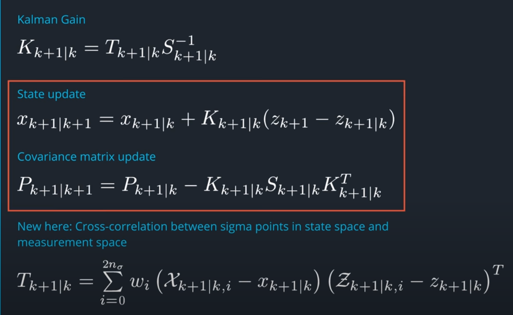

The Update state is the same as in the standard KF. The only difference in the UKF is how we calculate Kalman Gain $K$. Here we need a cross-correlation matrix between the predicted sigma points in the state space and the predicted sigma points in the measurement space.

**Cross-correlation Matrix**

$T_{k+1|k} = \sum_{i=1}^{n_\sigma} w_i (X_{k+1|k,i} - x_{k+1|k})\ (Z_{k+1|k,i} - z_{k+1|k})^T$

**Kalman gain K**

$K_{k+1|k} = T_{k+1|k}S^{-1}_{k+1|k}$

**Update State**

$x_{k+1|k+1} = x_{k+1|k}+K_{k+1|k}(z_{k+1}-z_{k+1|k})$

**Covariance Matrix Update**

$P_{k+1|k+1} = P_{k+1|k}-K_{k+1|k}S_{k+1|k}K^T_{k+1|k}$

#### Update State, based on Radar Measurement
##### main.cpp 
```c++
#include "Dense"
#include "ukf.h"

using Eigen::MatrixXd;
using Eigen::VectorXd;

int main() {

  // Create a UKF instance
  UKF ukf;

  /**
   * Programming assignment calls
   */
  VectorXd x_out = VectorXd(5);
  MatrixXd P_out = MatrixXd(5, 5);
  ukf.UpdateState(&x_out, &P_out);

  return 0;
}
```
##### ukf.cpp 
```c++
#include <iostream>
#include "ukf.h"

using Eigen::MatrixXd;
using Eigen::VectorXd;

UKF::UKF() {
  Init();
}

UKF::~UKF() {
}

void UKF::Init() {

}

/**
 * Programming assignment functions: 
 */

void UKF::UpdateState(VectorXd* x_out, MatrixXd* P_out) {

  // set state dimension
  int n_x = 5;

  // set augmented dimension
  int n_aug = 7;

  // set measurement dimension, radar can measure r, phi, and r_dot
  int n_z = 3;

  // define spreading parameter
  double lambda = 3 - n_aug;

  // set vector for weights
  VectorXd weights = VectorXd(2*n_aug+1);
  double weight_0 = lambda/(lambda+n_aug);
  double weight = 0.5/(lambda+n_aug);
  weights(0) = weight_0;

  for (int i=1; i<2*n_aug+1; ++i) {  
    weights(i) = weight;
  }

  // create example matrix with predicted sigma points in state space
  MatrixXd Xsig_pred = MatrixXd(n_x, 2 * n_aug + 1);
  Xsig_pred <<
     5.9374,  6.0640,   5.925,  5.9436,  5.9266,  5.9374,  5.9389,  5.9374,  5.8106,  5.9457,  5.9310,  5.9465,  5.9374,  5.9359,  5.93744,
       1.48,  1.4436,   1.660,  1.4934,  1.5036,    1.48,  1.4868,    1.48,  1.5271,  1.3104,  1.4787,  1.4674,    1.48,  1.4851,    1.486,
      2.204,  2.2841,  2.2455,  2.2958,   2.204,   2.204,  2.2395,   2.204,  2.1256,  2.1642,  2.1139,   2.204,   2.204,  2.1702,   2.2049,
     0.5367, 0.47338, 0.67809, 0.55455, 0.64364, 0.54337,  0.5367, 0.53851, 0.60017, 0.39546, 0.51900, 0.42991, 0.530188,  0.5367, 0.535048,
      0.352, 0.29997, 0.46212, 0.37633,  0.4841, 0.41872,   0.352, 0.38744, 0.40562, 0.24347, 0.32926,  0.2214, 0.28687,   0.352, 0.318159;

  // create example vector for predicted state mean
  VectorXd x = VectorXd(n_x);
  x <<
     5.93637,
     1.49035,
     2.20528,
    0.536853,
    0.353577;

  // create example matrix for predicted state covariance
  MatrixXd P = MatrixXd(n_x,n_x);
  P <<
    0.0054342,  -0.002405,  0.0034157, -0.0034819, -0.00299378,
    -0.002405,    0.01084,   0.001492,  0.0098018,  0.00791091,
    0.0034157,   0.001492,  0.0058012, 0.00077863, 0.000792973,
   -0.0034819,  0.0098018, 0.00077863,   0.011923,   0.0112491,
   -0.0029937,  0.0079109, 0.00079297,   0.011249,   0.0126972;

  // create example matrix with sigma points in measurement space
  MatrixXd Zsig = MatrixXd(n_z, 2 * n_aug + 1);
  Zsig <<
    6.1190,  6.2334,  6.1531,  6.1283,  6.1143,  6.1190,  6.1221,  6.1190,  6.0079,  6.0883,  6.1125,  6.1248,  6.1190,  6.1188,  6.12057,
   0.24428,  0.2337, 0.27316, 0.24616, 0.24846, 0.24428, 0.24530, 0.24428, 0.25700, 0.21692, 0.24433, 0.24193, 0.24428, 0.24515, 0.245239,
    2.1104,  2.2188,  2.0639,   2.187,  2.0341,  2.1061,  2.1450,  2.1092,  2.0016,   2.129,  2.0346,  2.1651,  2.1145,  2.0786,  2.11295;

  // create example vector for mean predicted measurement
  VectorXd z_pred = VectorXd(n_z);
  z_pred <<
      6.12155,
     0.245993,
      2.10313;

  // create example matrix for predicted measurement covariance
  MatrixXd S = MatrixXd(n_z,n_z);
  S <<
      0.0946171, -0.000139448,   0.00407016,
   -0.000139448,  0.000617548, -0.000770652,
     0.00407016, -0.000770652,    0.0180917;

  // create example vector for incoming radar measurement
  VectorXd z = VectorXd(n_z);
  z <<
     5.9214,   // rho in m
     0.2187,   // phi in rad
     2.0062;   // rho_dot in m/s

  // create matrix for cross correlation Tc
  MatrixXd Tc = MatrixXd(n_x, n_z);

  /**
   * Student part begin
   */

  // calculate cross correlation matrix
  Tc.fill(0.0);
  for (int i = 0; i < 2 * n_aug + 1; ++i) {  // 2n+1 simga points
    // residual
    VectorXd z_diff = Zsig.col(i) - z_pred;
    // angle normalization
    while (z_diff(1)> M_PI) z_diff(1)-=2.*M_PI;
    while (z_diff(1)<-M_PI) z_diff(1)+=2.*M_PI;

    // state difference
    VectorXd x_diff = Xsig_pred.col(i) - x;
    // angle normalization
    while (x_diff(3)> M_PI) x_diff(3)-=2.*M_PI;
    while (x_diff(3)<-M_PI) x_diff(3)+=2.*M_PI;

    Tc = Tc + weights(i) * x_diff * z_diff.transpose();
  }

  // Kalman gain K;
  MatrixXd K = Tc * S.inverse();

  // residual
  VectorXd z_diff = z - z_pred;

  // angle normalization
  while (z_diff(1)> M_PI) z_diff(1)-=2.*M_PI;
  while (z_diff(1)<-M_PI) z_diff(1)+=2.*M_PI;

  // update state mean and covariance matrix
  x = x + K * z_diff;
  P = P - K*S*K.transpose();

  /**
   * Student part end
   */

  // print result
  std::cout << "Updated state x: " << std::endl << x << std::endl;
  std::cout << "Updated state covariance P: " << std::endl << P << std::endl;

  // write result
  *x_out = x;
  *P_out = P;
}

/**
 * expected result x:
 * x =
 *  5.92276
 *  1.41823
 *  2.15593
 * 0.489274
 * 0.321338
 */

/**
 * expected result P:
 * P =
 *   0.00361579 -0.000357881   0.00208316 -0.000937196  -0.00071727
 * -0.000357881   0.00539867   0.00156846   0.00455342   0.00358885
 *   0.00208316   0.00156846   0.00410651   0.00160333   0.00171811
 * -0.000937196   0.00455342   0.00160333   0.00652634   0.00669436
 *  -0.00071719   0.00358884   0.00171811   0.00669426   0.00881797
 */
```
##### ukf.h
```c++
#ifndef UKF_H
#define UKF_H

#include "Dense"

class UKF {
 public:
  /**
   * Constructor
   */
  UKF();

  /**
   * Destructor
   */
  virtual ~UKF();

  /**
   * Init Initializes Unscented Kalman filter
   */
  void Init();

  /**
   * Student assignment functions
   */
  void GenerateSigmaPoints(Eigen::MatrixXd* Xsig_out);
  void AugmentedSigmaPoints(Eigen::MatrixXd* Xsig_out);
  void SigmaPointPrediction(Eigen::MatrixXd* Xsig_out);
  void PredictMeanAndCovariance(Eigen::VectorXd* x_pred, 
                                Eigen::MatrixXd* P_pred);
  void PredictRadarMeasurement(Eigen::VectorXd* z_out, 
                               Eigen::MatrixXd* S_out);
  void UpdateState(Eigen::VectorXd* x_out, 
                   Eigen::MatrixXd* P_out);
};

#endif  // UKF_H
```


## Parameters and Consistency

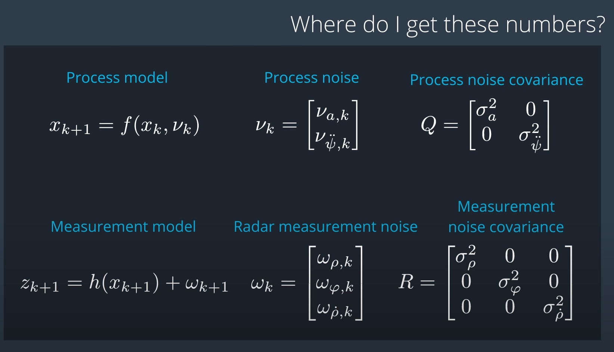


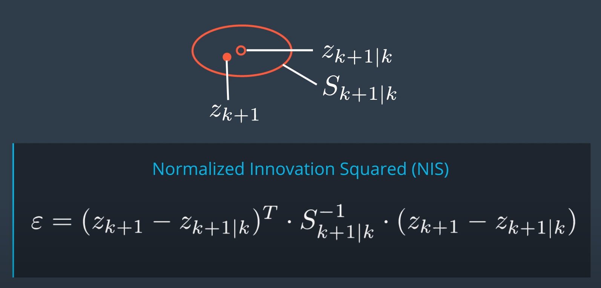


## What values to exepct

$df$ means degrees of freedom. We have 3 of those.

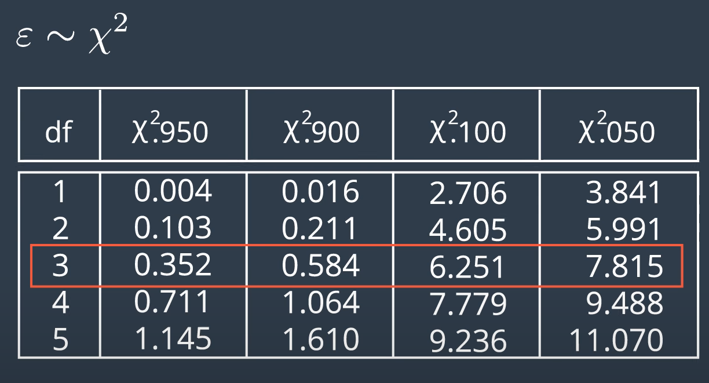

Explanation:
e.g. the column on the right says, that in 5% of all cases the NIS will be higher, than 7.815. This is the number we need.


If you plot the values and see a plot like below, than everything is great:

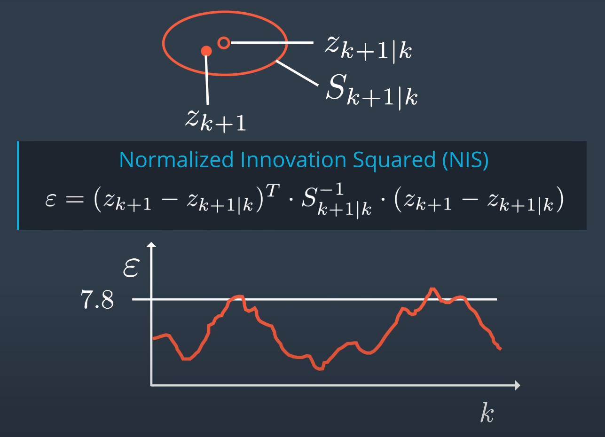 


### Underestimated uncertainty in the system

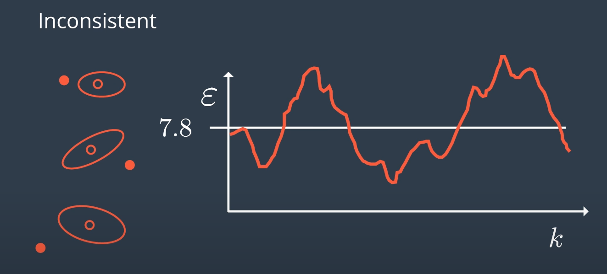

### Overestimated uncertainty in the system

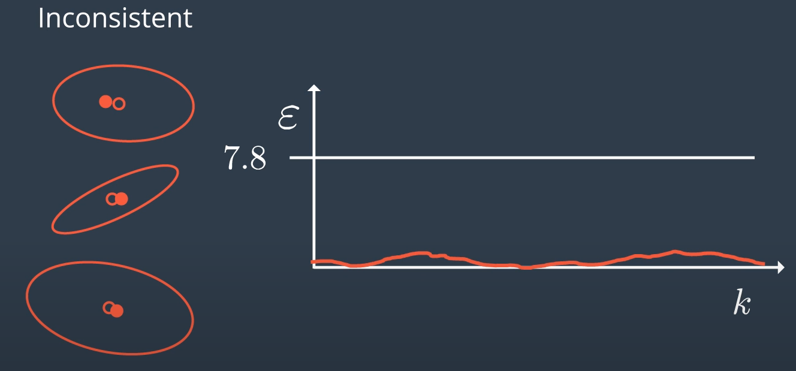


### Process Noise and the UKF Project

For the CTRV model, two parameters define the process noise:

- \large \sigma^2_a*σ**a*2 representing longitudinal acceleration noise (you might see this referred to as linear acceleration)
- \large \sigma^2_{\ddot\psi}*σ**ψ*¨2 representing yaw acceleration noise (this is also called angular acceleration)

In the project, both of these values will need to be tuned. You will have to test different values in order to get a working solution. In the video, Dominik mentions using \large \sigma^2_a = 9 \frac{m^2}{s^4}*σ**a*2=9*s*4*m*2 as a starting point when tracking a vehicle. In the UKF project, you will be tracking a bicycle rather than a vehicle. So 9 might not be an appropriate acceleration noise parameter. Tuning will involve:

- guessing appropriate parameter values
- running the UKF filter
- deciding if the results are good enough
- tweaking the parameters and repeating the process


### Linear Acceleration Noise Parameter Intuition

Let's get some intuition for these noise parameters. The units for the acceleration noise parameter \large \sigma^2_a*σ**a*2 are \Large\frac{m^2}{s^4}*s*4*m*2. Taking the square root, we get \large \sigma_a*σ**a* with units \large \frac{m}{s^2}*s*2*m*. So the square root of the acceleration noise parameter has the same units as acceleration: \large \frac{m}{s^2}*s*2*m*

The parameter \large \sigma_a*σ**a* is the standard deviation of linear acceleration! Remember from the "CTRV Process Noise Vector" lecture that the linear acceleration is being modeled as a Gaussian distribution with mean zero and standard deviation \large \sigma_a*σ**a*. In a Gaussian distribution, about 95% of your values are within 2\large \sigma_a*σ**a*.

So if you choose \large \sigma^2_a = 9 \frac{m^2}{s^4}*σ**a*2=9*s*4*m*2, then you expect the acceleration to be between \large -6 \frac{m}{s^2}−6*s*2*m* and \large +6 \frac{m}{s^2}+6*s*2*m* about 95% of the time.

Tuning parameters involves some trial and error. Using your intuition can help you find reasonable initial values.


### Yaw Acceleration Noise Parameter Intuition

Let's think about what values might be reasonable for the yaw acceleration noise parameter.

Imagine the bicycle is traveling in a circle with a constant yaw rate (angular velocity) of \Large \frac{\pi}{8} \frac{rad}{s}8*π**s**r**a**d*. That means the bicycle would complete a full circle in 16 seconds: \Large\frac{\pi}{8} \frac{rad}{s} \cdot8*π**s**r**a**d*⋅ 16 s = 2\pi16*s*=2*π*.

That seems reasonable for an average bike rider traveling in a circle with a radius of maybe 16 meters.

The bike rider would have also have a tangential velocity of 6.28 meters per second because \Large\frac{\pi}{8} \frac{rad}{s} \cdot8*π**s**r**a**d*⋅ 16 \text{ meters}16 meters = 6.28 \text{ meters per second}=6.28 meters per second.

What if the angular acceleration were now \large -2\pi \frac{rad}{s^2}−2*π**s*2*r**a**d* instead of zero? In just one second, the angular velocity would go from \Large \frac{\pi}{8} \frac{rad}{s}8*π**s**r**a**d* to \Large -\frac{15\pi}{8} \frac{rad}{s}−815*π**s**r**a**d*. This comes from \Large \frac{\pi}{8} \frac{rad}{s}8*π**s**r**a**d*- 2\pi−2*π* \Large \frac{rad}{s^2} \cdot*s*2*r**a**d*⋅1 s = -1*s*=−\Large \frac{15\pi}{8} \frac{rad}{s}815*π**s**r**a**d*.

The bicycle has been completing a complete circle in 16 seconds. But with such a high angular acceleration, then all of a sudden the bicycle is going around the circle in the opposite direction and only takes about 1.1 second to complete the circle.

From a bicycle, a setting in the range of \large \sigma_{\ddot\psi} = 2\pi \frac{rad}{s^2}*σ**ψ*¨=2*π**s*2*r**a**d* seems too high. In the project, you'll have to experiment with different values to see what works well.


### Measurement Noise Parameters

Measurement noise parameters represent uncertainty in sensor measurements. In general, the manufacturer will provide these values in the sensor manual. In the UKF project, you will not need to tune these parameters.


No V, yaw: 

RMSE: 0,122	0,0496	2,33	0,61

7, 0.12, 0.03;