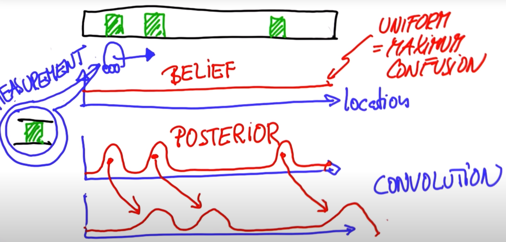
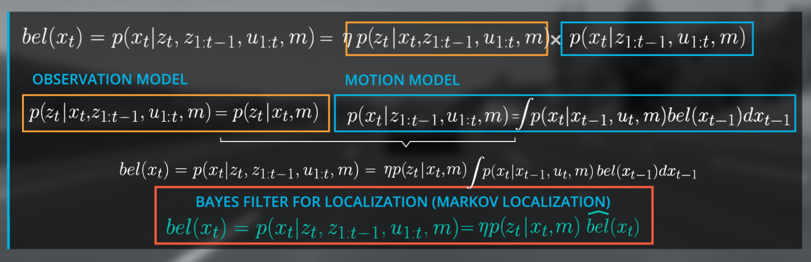
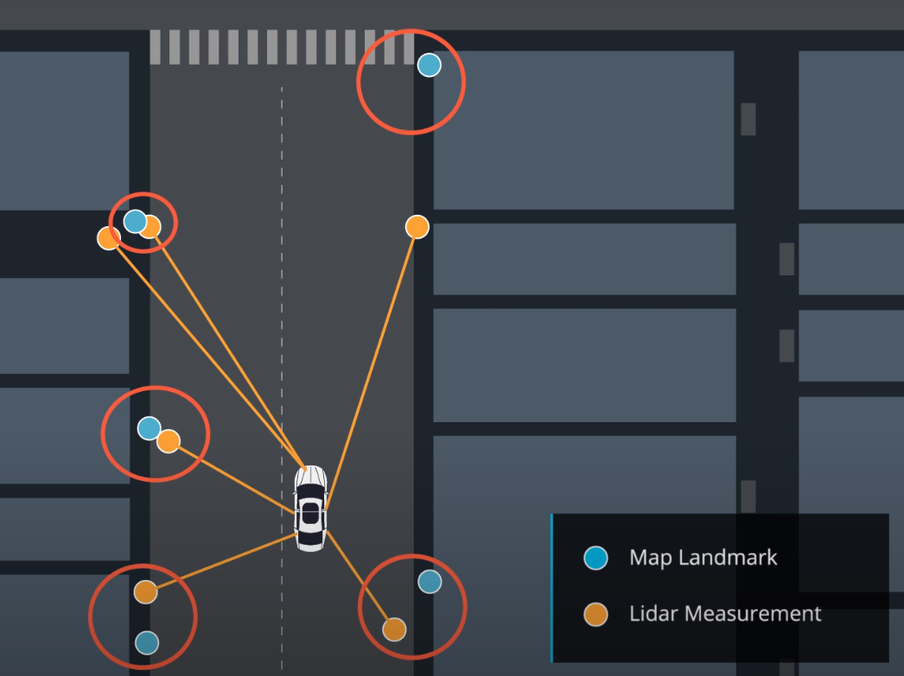

# Kidnapped Vehicle Project

## Total probability


## Convolution

means the process of moving of beliefs.
Shift of the beliefs according to the motion.

In case of (perfect) motion, we just **shift the probabilities together with the robot motion** (as arrows below show it).



## Prior vs. Posterior


Once we see the measurement, we multiply our belief (Prior) with the 2nd. measurement. 

Posterior = probability, after a measurement has been taken (same as a step has been done). So the probability is simply convoluted.


## Inexact motion


## Entropy

Entropy will decrease after the measurement update (sense) step and that entropy will increase after the movement step (move).

Entropy represents the amount of uncertainty in a system. Since the measurement update step decreases uncertainty, entropy will decrease. The movement step increases uncertainty, so entropy will increase after this step.

$Entropy = \Sigma (-p \times log(p))$

## Localization 


## Normalization

1. Sum up all probabilities
2. Divide each probability by the sum.

## Bayes Rule

The most fundamental consideration in probabilistic inference.

It is a belief of my location after seeing a measurement. 

Technically it is a probability of seeing a measurement devoid of any location information.


where p(X | Z ) - belief of my location after seeing a measurement


Or put it differently:


,where:

* $\overline{p}$  is a non-normalized probability
* $\alpha$ is a normalizer, which is a sum of all the probabilities
* $p$ is a resulting probability

## Motion Total Probability (a.k.a) theorem of total probability


,where: 

* $P(X_i)$  is the chance of being in the $i$-th grid cell 
* $j$ is all the grid cells that we could come from one time step earlier 
* $P(X_j^{t-1})$ is a prior probability  of those grid cells at time $t-1$ 
* $P(X_i | X_j)$ is the probability, that our motion commands would carry us from $X_j$ to $X_i$.
* and the operation of the weighted sum $\Sigma_j$is called **convolution**.


## Posterior Distribution


$z_{1:t}$​ represents the observation vector from time 0 to t (range measurements, bearing, images, etc.).

$u_{1:t}$ represents the control vector from time 0 to t (yaw/pitch/roll rates and velocities).

$m$ represents the map (grid maps, feature maps, landmarks)

$x_t$ represents the pose (position (x,y) + orientation $\theta$)

posterior distribution for the state x at time t:

$bel(x_t) = p(x_t|z_{1:t}, u_{1:t}, m)$


## Bayes Filter for Localization

Remember the general form for Bayes' Rule:

$P(a|b) = \frac{P(b|a) \, P(a)}{P(b)}$

With respect to localization, these terms are:

1. $P(location|observation)$: This is P(a|b), the **normalized** probability of a position given an observation (posterior).
2. $P(observation|location)$: This is P(b|a), the probability of an observation given a position (likelihood)
3. $P(location)$: This is P(a), the prior probability of a position
4. $P(observation)$: This is P(b), the total probability of an observation

Without going into detail yet, be aware that $P(location)$ is determined by the motion model. The probability returned by the motion model is the product of the transition model probability (the probability of moving from $x_{t-1}$ --> $x_t$ and the probability of the state $x_{t-1}$.


## Initialize Priors Function

### Code

```c++
#include <iostream>
#include <vector>

using std::vector;

// initialize priors assuming vehicle at landmark +/- 1.0 meters position stdev
vector<float> initialize_priors(int map_size, vector<float> landmark_positions,
                                float position_stdev);

int main() {
  // set standard deviation of position
  float position_stdev = 1.0f;

  // set map horizon distance in meters 
  int map_size = 25;

  // initialize landmarks
  vector<float> landmark_positions {5, 10, 20};

  // initialize priors
  vector<float> priors = initialize_priors(map_size, landmark_positions,
                                           position_stdev);

  // print values to stdout 
  for (int p = 0; p < priors.size(); ++p) {
    std::cout << priors[p] << std::endl;
  }

  return 0;
}

// TODO: Complete the initialize_priors function
vector<float> initialize_priors(int map_size, vector<float> landmark_positions,
                                float position_stdev) {

  // initialize priors assuming vehicle at landmark +/-1.0 meters position stdev

  // set all priors to 0.0
  vector<float> priors(map_size, 0.0);
    
  // TODO: YOUR CODE HERE
  // set each landmark positon +/-1 to 1.0/9.0 (9 possible postions)
  float norm_term = landmark_positions.size() * (position_stdev * 2 + 1);
  for (int i=0; i < landmark_positions.size(); ++i) {
    for (float j=1; j <= position_stdev; ++j) {
      priors.at(int(j+landmark_positions[i]+map_size)%map_size) += 1.0/norm_term;
      priors.at(int(-j+landmark_positions[i]+map_size)%map_size) += 1.0/norm_term;
    }
    priors.at(landmark_positions[i]) += 1.0/norm_term;
  }

  return priors;
}
```


## Bayes Localization filter / Markov Localization


### Bayes Rule

$P(a \mid b) = \frac{P(b \mid a) \, P(a)}{P(b)}$

Determining the right side of Bayes rule, where the posterior, $P(a|b)$, is $p(x_t|z_t,z_{1:t-1},u_{1:t},m)$:

$\large\frac{p(z_t|x_t,z_{1:t-1},u_{1:t},m)p(x_t|z_{1:t-1},u_{1:t},m)}{p(z_t|z_{1:t-1},u_{1:t},m)}$

#### Observation Model

$p(z_t|x_t,z_{1:t-1},u_{1:t},m)$


#### Motion Model


$p(x_t|z_{1:t-1},u_{1:t},m)$


```c++ 
#include <iostream>
#include <vector>

#include "helpers.h"

using std::vector;

vector<float> initialize_priors(int map_size, vector<float> landmark_positions,
                                float position_stdev);

float motion_model(float pseudo_position, float movement, vector<float> priors,
                   int map_size, int control_stdev);

int main() {
  // set standard deviation of control:
  float control_stdev = 1.0f;

  // set standard deviation of position:
  float position_stdev = 1.0f;

  // meters vehicle moves per time step
  float movement_per_timestep = 1.0f;

  // number of x positions on map
  int map_size = 25;

  // initialize landmarks
  vector<float> landmark_positions {5, 10, 20};
    
  // initialize priors
  vector<float> priors = initialize_priors(map_size, landmark_positions,
                                           position_stdev);
    
  // step through each pseudo position x (i)    
  for (float i = 0; i < map_size; ++i) {
    float pseudo_position = i;

    // get the motion model probability for each x position
    float motion_prob = motion_model(pseudo_position, movement_per_timestep,
                                     priors, map_size, control_stdev);
        
    // print to stdout
    std::cout << pseudo_position << "\t" << motion_prob << std::endl;
  }    

  return 0;
}

// TODO: implement the motion model: calculates prob of being at 
// an estimated position at time t
float motion_model(float pseudo_position, float movement, vector<float> priors,
                   int map_size, int control_stdev) {
  // initialize probability
  float position_prob = 0.0f;
  
  // YOUR CODE HERE
  // loop over state space for all possible positions x (convolution):
  for (float j=0; j< map_size; ++j) {
    float next_pseudo_position = j;
    // distance from i to j
    float distance_ij = pseudo_position-next_pseudo_position;

    // transition probabilities:
    float transition_prob = Helpers::normpdf(distance_ij, movement, 
                                             control_stdev);
    // estimate probability for the motion model, this is our prior
    position_prob += transition_prob*priors[j];
  }

  return position_prob;
}

// initialize priors assuming vehicle at landmark +/- 1.0 meters position stdev
vector<float> initialize_priors(int map_size, vector<float> landmark_positions,
                                     float position_stdev) {

  // set all priors to 0.0
  vector<float> priors(map_size, 0.0);

  // set each landmark positon +/-1 to 1.0/9.0 (9 possible postions)
  float norm_term = landmark_positions.size() * (position_stdev * 2 + 1);
  for (int i=0; i < landmark_positions.size(); ++i) {
    for (float j=1; j <= position_stdev; ++j) {
      priors.at(int(j+landmark_positions[i]+map_size)%map_size) += 1.0/norm_term;
      priors.at(int(-j+landmark_positions[i]+map_size)%map_size) += 1.0/norm_term;
    }
    priors.at(landmark_positions[i]) += 1.0/norm_term;
  }

  return priors;
}
```


#### Extracting normalization parameter


### 1st & 2nd Order Markov Assumptions


1 Since we (hypothetically) know in which state the system is at time step t-1, the past observations $z_{1:t-1}$ and controls $u_{1:t-1}$ would not provide us additional information to estimate the posterior for $x_t$, because they were already used to estimate $x_{t-1}$his means, we can simplify $p(x_t|x_{t-1}, z_{1:t-1}, u_{1:t},m)$ to $p(x_t|x_{t-1}, u_t, m)$.

(b) Since $u_t$ is “in the future” with reference to $x_{t-1}, u_t$ does not tell us much about $x_{t-1}$. This means the term $p(x_{t-1}|z_{1:t-1}, u_{1:t}, m)$ can be simplified to $p(x_{t-1}|z_{1:t-1}, u_{1:t-1}, m)$. 


The **summation** above is calculating the probability that the vehicle is now at a given location, $x_t$.

It's looking at each prior location where the vehicle could have been, $x_{t-1}$. Then the summation iterates over every possible prior location, $x_{t-1}^{(1)}...x_{t-1}^{(n)}$. For each possible prior location in that list, $x_{t-1}^{(i)}$, the summation yields the **total probability** that the vehicle really did start at that prior location **and** that it wound up at $x_t$.

That now raises the question, how do we calculate the individual probability that the vehicle really did start at that prior location **and** that it wound up at $x_t$, for each possible starting position $x_{t-1}$?

That's where each individual element of the summation contributes. The likelihood of starting at $x_{t-1}$ and arriving at $x_{t}$ is simply $p(x_t|x_{t-1}) * p(x_{t-1})$.

We can say the same thing, using different notation and incorporating all of our knowledge about the world, by writing: $p(x_t|x_{t-1}^{(i)}, u_t, m) * bel(x_{t-1}^{(i)})$


### Finalize the Bayes Localization Filter



$bel(x_t) = p(x_t|z_t,z_{1:t-1},\mu_{1:t},m) = \eta *p(z_t|x_t,m) \hat{bel}(x_t)$


## Get Pseudo Ranges

```c++
#include <algorithm>
#include <iostream>
#include <vector>

#include "helpers.h"

using std::vector;

// set standard deviation of control:
float control_stdev = 1.0f;

// meters vehicle moves per time step
float movement_per_timestep = 1.0f;

// number of x positions on map
int map_size = 25;

// define landmarks
vector<float> landmark_positions {5, 10, 12, 20};

// declare pseudo_range_estimator function
vector<float> pseudo_range_estimator(vector<float> landmark_positions, 
                                     float pseudo_position);


int main() {    
  // step through each pseudo position x (i)
  for (int i = 0; i < map_size; ++i) {
    float pseudo_position = float(i);
    // get pseudo ranges
    vector<float> pseudo_ranges = pseudo_range_estimator(landmark_positions, 
                                                         pseudo_position);
    // print to stdout
    if (pseudo_ranges.size() > 0) {
      for (int s = 0; s < pseudo_ranges.size(); ++s) {
        std::cout << "x: " << i << "\t" << pseudo_ranges[s] << std::endl;
      }
      std::cout << "-----------------------" << std::endl;
    }   
  } 

  return 0;
}

// TODO: Complete pseudo range estimator function
vector<float> pseudo_range_estimator(vector<float> landmark_positions, 
                                     float pseudo_position) {
  // define pseudo observation vector
  vector<float> pseudo_ranges;
            
  // loop over number of landmarks and estimate pseudo ranges
  // YOUR CODE HERE
  for (int l=0; l< landmark_positions.size(); ++l) {
    // estimate pseudo range for each single landmark 
    // and the current state position pose_i:
    float range_l = landmark_positions[l] - pseudo_position;

    // check if distances are positive: 
    if (range_l > 0.0f) {
      pseudo_ranges.push_back(range_l);
    }
  }

  // sort pseudo range vector
  // YOUR CODE HERE
  sort(pseudo_ranges.begin(), pseudo_ranges.end());

  return pseudo_ranges;
}
```

## Get Observation Model

```c++
#include <algorithm>
#include <iostream>
#include <vector>

#include "helpers.h"

using std::vector;

// function to get pseudo ranges
vector<float> pseudo_range_estimator(vector<float> landmark_positions, 
                                     float pseudo_position);

// observation model: calculate likelihood prob term based on landmark proximity
float observation_model(vector<float> landmark_positions, 
                        vector<float> observations, vector<float> pseudo_ranges,
                        float distance_max, float observation_stdev);

int main() {  
  // set observation standard deviation:
  float observation_stdev = 1.0f;

  // number of x positions on map
  int map_size = 25;

  // set distance max
  float distance_max = map_size;

  // define landmarks
  vector<float> landmark_positions {5, 10, 12, 20};

  // define observations
  vector<float> observations {5.5, 13, 15};

  // step through each pseudo position x (i)
  for (int i = 0; i < map_size; ++i) {
    float pseudo_position = float(i);

    // get pseudo ranges
    vector<float> pseudo_ranges = pseudo_range_estimator(landmark_positions, 
                                                         pseudo_position);

    //get observation probability
    float observation_prob = observation_model(landmark_positions, observations, 
                                               pseudo_ranges, distance_max, 
                                               observation_stdev);
    //print to stdout
    std::cout << observation_prob << std::endl; 
  }      

  return 0;
}

// TODO: Complete the observation model function
// calculates likelihood prob term based on landmark proximity
float observation_model(vector<float> landmark_positions, 
                        vector<float> observations, vector<float> pseudo_ranges, 
                        float distance_max, float observation_stdev) {
  // initialize observation probability
  float distance_prob = 1.0f;

  // run over current observation vector
  for (int z=0; z< observations.size(); ++z) {
    // define min distance
    float pseudo_range_min;
        
    // check, if distance vector exists
    if (pseudo_ranges.size() > 0) {
      // set min distance
      pseudo_range_min = pseudo_ranges[0];
      // remove this entry from pseudo_ranges-vector
      pseudo_ranges.erase(pseudo_ranges.begin());
    } else {  // no or negative distances: set min distance to a large number
        pseudo_range_min = std::numeric_limits<const float>::infinity();
    }

    // estimate the probability for observation model, this is our likelihood 
    distance_prob *= Helpers::normpdf(observations[z], pseudo_range_min,
                                      observation_stdev);
  }

  return distance_prob;
}

vector<float> pseudo_range_estimator(vector<float> landmark_positions, 
                                     float pseudo_position) {
  // define pseudo observation vector
  vector<float> pseudo_ranges;
            
  // loop over number of landmarks and estimate pseudo ranges
  for (int l=0; l< landmark_positions.size(); ++l) {
    // estimate pseudo range for each single landmark 
    // and the current state position pose_i:
    float range_l = landmark_positions[l] - pseudo_position;

    // check if distances are positive: 
    if (range_l > 0.0f) {
      pseudo_ranges.push_back(range_l);
    }
  }

  // sort pseudo range vector
  sort(pseudo_ranges.begin(), pseudo_ranges.end());

  return pseudo_ranges;
}
```


## Full Filter

### main.cpp

```c++
#include <algorithm>
#include <iostream>
#include <vector>

#include "helpers.h"

using std::vector;
using std::cout;
using std::endl;


vector<float> initialize_priors(int map_size, vector<float> landmark_positions,
                                float position_stdev);

float motion_model(float pseudo_position, float movement, vector<float> priors,
                   int map_size, int control_stdev);

// function to get pseudo ranges
vector<float> pseudo_range_estimator(vector<float> landmark_positions, 
                                     float pseudo_position);

// observation model: calculate likelihood prob term based on landmark proximity
float observation_model(vector<float> landmark_positions, 
                        vector<float> observations, vector<float> pseudo_ranges,
                        float distance_max, float observation_stdev);


int main() {  
  // set standard deviation of control
  float control_stdev = 1.0f;

  // set standard deviation of position
  float position_stdev = 1.0f;

  // meters vehicle moves per time step
  float movement_per_timestep = 1.0f;

  // set observation standard deviation
  float observation_stdev = 1.0f;

  // number of x positions on map
  int map_size = 25;

  // set distance max
  float distance_max = map_size;

  // define landmarks
  vector<float> landmark_positions {3, 9, 14, 23};

  // define observations vector, each inner vector represents a set 
  //   of observations for a time step
  vector<vector<float> > sensor_obs {{1,7,12,21}, {0,6,11,20}, {5,10,19},
                                     {4,9,18}, {3,8,17}, {2,7,16}, {1,6,15}, 
                                     {0,5,14}, {4,13}, {3,12}, {2,11}, {1,10},
                                     {0,9}, {8}, {7}, {6}, {5}, {4}, {3}, {2},
                                     {1}, {0}, {}, {}, {}};

  // initialize priors
  vector<float> priors = initialize_priors(map_size, landmark_positions,
                                           position_stdev);
  // UNCOMMENT TO SEE THIS STEP OF THE FILTER
  //cout << "-----------PRIORS INIT--------------" << endl;
  //for (int p = 0; p < priors.size(); ++p){
  //  cout << priors[p] << endl;
  //}  
    
  /**
   * TODO: initialize posteriors
   */
  vector<float> posteriors(map_size, 0.0);

  // specify time steps
  int time_steps = sensor_obs.size();
    
  // declare observations vector
  vector<float> observations;
    
  // cycle through time steps
  for (int t = 0; t < time_steps; ++t) {
    // UNCOMMENT TO SEE THIS STEP OF THE FILTER
    //cout << "---------------TIME STEP---------------" << endl;
    //cout << "t = " << t << endl;
    //cout << "-----Motion----------OBS----------------PRODUCT--" << endl;

    if (!sensor_obs[t].empty()) {
      observations = sensor_obs[t]; 
    } else {
      observations = {float(distance_max)};
    }

    // step through each pseudo position x (i)
    for (unsigned int i = 0; i < map_size; ++i) {
      float pseudo_position = float(i);

      /**
       * TODO: get the motion model probability for each x position
       */
      float motion_prob = motion_model(pseudo_position, movement_per_timestep,
                                       priors, map_size, control_stdev);
      /**
       * TODO: get pseudo ranges
       */
      vector<float> pseudo_ranges = pseudo_range_estimator(landmark_positions, 
                                                           pseudo_position);

      /**
       * TODO: get observation probability
       */
      float observation_prob = observation_model(landmark_positions, observations, 
                                                 pseudo_ranges, distance_max, 
                                                 observation_stdev);

      /**
       * TODO: calculate the ith posterior
       */
      posteriors[i] = motion_prob * observation_prob;

      // UNCOMMENT TO SEE THIS STEP OF THE FILTER
      //cout << motion_prob << "\t" << observation_prob << "\t" 
      //     << "\t"  << motion_prob * observation_prob << endl;   
    } 
        
    // UNCOMMENT TO SEE THIS STEP OF THE FILTER
    //cout << "----------RAW---------------" << endl;
    //for (int p = 0; p < posteriors.size(); ++p) {
    //  cout << posteriors[p] << endl;
    //}

    /**
     * TODO: normalize
     */
    posteriors = Helpers::normalize_vector(posteriors);

    // print to stdout
    //cout << posteriors[t] <<  "\t" << priors[t] << endl;

    // UNCOMMENT TO SEE THIS STEP OF THE FILTER
    //cout << "----------NORMALIZED---------------" << endl;

    /**
     * TODO: update
     */
    priors = posteriors;

    // UNCOMMENT TO SEE THIS STEP OF THE FILTER
    //for (int p = 0; p < posteriors.size(); ++p) {
    //  cout << posteriors[p] << endl;
    //}

    // print posteriors vectors to stdout
    for (int p = 0; p < posteriors.size(); ++p) {
            cout << posteriors[p] << endl;  
    } 
  }

  return 0;
}

// observation model: calculate likelihood prob term based on landmark proximity
float observation_model(vector<float> landmark_positions, 
                        vector<float> observations, vector<float> pseudo_ranges, 
                        float distance_max, float observation_stdev) {
  // initialize observation probability
  float distance_prob = 1.0f;

  // run over current observation vector
  for (int z=0; z< observations.size(); ++z) {
    // define min distance
    float pseudo_range_min;
        
    // check, if distance vector exists
    if (pseudo_ranges.size() > 0) {
      // set min distance
      pseudo_range_min = pseudo_ranges[0];
      // remove this entry from pseudo_ranges-vector
      pseudo_ranges.erase(pseudo_ranges.begin());
    } else {  // no or negative distances: set min distance to a large number
        pseudo_range_min = std::numeric_limits<const float>::infinity();
    }

    // estimate the probability for observation model, this is our likelihood 
    distance_prob *= Helpers::normpdf(observations[z], pseudo_range_min,
                                      observation_stdev);
  }

  return distance_prob;
}

vector<float> pseudo_range_estimator(vector<float> landmark_positions, 
                                     float pseudo_position) {
  // define pseudo observation vector
  vector<float> pseudo_ranges;
            
  // loop over number of landmarks and estimate pseudo ranges
  for (int l=0; l< landmark_positions.size(); ++l) {
    // estimate pseudo range for each single landmark 
    // and the current state position pose_i:
    float range_l = landmark_positions[l] - pseudo_position;

    // check if distances are positive: 
    if (range_l > 0.0f) {
      pseudo_ranges.push_back(range_l);
    }
  }

  // sort pseudo range vector
  sort(pseudo_ranges.begin(), pseudo_ranges.end());

  return pseudo_ranges;
}

// motion model: calculates prob of being at an estimated position at time t
float motion_model(float pseudo_position, float movement, vector<float> priors,
                   int map_size, int control_stdev) {
  // initialize probability
  float position_prob = 0.0f;

  // loop over state space for all possible positions x (convolution):
  for (float j=0; j< map_size; ++j) {
    float next_pseudo_position = j;
    // distance from i to j
    float distance_ij = pseudo_position-next_pseudo_position;

    // transition probabilities:
    float transition_prob = Helpers::normpdf(distance_ij, movement, 
                                             control_stdev);
    // estimate probability for the motion model, this is our prior
    position_prob += transition_prob*priors[j];
  }

  return position_prob;
}

// initialize priors assuming vehicle at landmark +/- 1.0 meters position stdev
vector<float> initialize_priors(int map_size, vector<float> landmark_positions,
                                     float position_stdev) {
  // set all priors to 0.0
  vector<float> priors(map_size, 0.0);

  // set each landmark positon +/-1 to 1.0/9.0 (9 possible postions)
  float norm_term = landmark_positions.size() * (position_stdev * 2 + 1);
  for (int i=0; i < landmark_positions.size(); ++i) {
    for (float j=1; j <= position_stdev; ++j) {
      priors.at(int(j+landmark_positions[i]+map_size)%map_size) += 1.0/norm_term;
      priors.at(int(-j+landmark_positions[i]+map_size)%map_size) += 1.0/norm_term;
    }
    priors.at(landmark_positions[i]) += 1.0/norm_term;
  }

  return priors;
}
```


### helpers.h

```c++
#ifndef HELP_FUNCTIONS_H
#define HELP_FUNCTIONS_H

#include <math.h>
#include <vector>

class Helpers {
 public:
  // definition of one over square root of 2*pi:
  constexpr static float STATIC_ONE_OVER_SQRT_2PI = 1/sqrt(2*M_PI);

  /**
   * normpdf(X,mu,sigma) computes the probability function at values x using the
   * normal distribution with mean mu and standard deviation std. x, mu and 
   * sigma must be scalar! The parameter std must be positive. 
   * The normal pdf is y=f(x,mu,std)= 1/(std*sqrt(2pi)) e[ -(x−mu)^2 / 2*std^2 ]
   */
  static float normpdf(float x, float mu, float std) {
    return (STATIC_ONE_OVER_SQRT_2PI/std)*exp(-0.5*pow((x-mu)/std,2));
  }

  // static function to normalize a vector
  static std::vector<float> normalize_vector(std::vector<float> inputVector) {

    // declare sum 
    float sum = 0.0f;

    // declare and resize output vector
    std::vector<float> outputVector;
    outputVector.resize(inputVector.size());

    // estimate the sum
    for (int i = 0; i < inputVector.size(); ++i) {
      sum += inputVector[i];
    }

    // normalize with sum
    for (int i = 0; i < inputVector.size(); ++i) {
      outputVector[i] = inputVector[i]/sum;
    }

    // return normalized vector:
    return outputVector;
  }
};

#endif  // HELP_FUNCTIONS_H
```


# Motion Model


## Yaw


# Frames of Reference: Localization versus Sensor Fusion


# Odometry


# Filters in comparison


# Particle Filter

## Flowchart


## Pseudocode


### Initialization

Corresponds to **1** in Pseudocode.

At the initialization step we estimate our position from GPS input. The subsequent steps in the process will refine this estimate to localize our vehicle.

### Prediction

Corresponds to **3** in Pseudocode.

During the prediction step we add the control input (yaw rate & velocity) for all particles

### Update

Corresponds to **4 & 5** in Pseudocode.

During the update step, we update our particle weights using map landmark positions and feature measurements.

### Resampling

Corresponds to **7-10** in Pseudocode.

During resampling we will resample M times (M is range of 0 to length_of_particleArray) drawing a particle i (i is the particle index) proportional to its weight . Sebastian covered one implementation of this in his [discussion and implementation of a resampling wheel](https://classroom.udacity.com/nanodegrees/nd013-ent/parts/19cde2ed-0642-4174-8109-b9fdd3f0a85e/modules/8accbb9f-5a4c-49cf-861e-665625ff760e/lessons/3c30a8ad-0efa-434f-afc7-eaf2aafb9ee3/concepts/487480820923).

### New Particle Set

Corresponds to **11** in Pseudocode.

The new set of particles represents the Bayes filter posterior probability. We now have a refined estimate of the vehicles position based on input evidence.


## Gaussian Sampling

```c++
/**
 * print_samples_sol.cpp
 *
 * SOLUTION CODE
 * 
 * Print out to the terminal 3 samples from a normal distribution with
 * mean equal to the GPS position and IMU heading measurements and
 * standard deviation of 2 m for the x and y position and 0.05 radians
 * for the heading of the car. 
 *
 * Author: Tiffany Huang
 */

#include <iostream>
#include <random> // Need this for sampling from distributions

using std::normal_distribution;

/**
 * Prints samples of x, y and theta from a normal distribution
 * @param gps_x   GPS provided x position
 * @param gps_y   GPS provided y position
 * @param theta   GPS provided yaw
 */
void printSamples(double gps_x, double gps_y, double theta);


int main() {
  
  // Set GPS provided state of the car.
  double gps_x = 4983;
  double gps_y = 5029;
  double theta = 1.201;
  
  // Sample from the GPS provided position.
  printSamples(gps_x, gps_y, theta);
  
  return 0;
}


void printSamples(double gps_x, double gps_y, double theta) {
  std::default_random_engine gen;
  double std_x, std_y, std_theta;  // Standard deviations for x, y, and theta

  // TODO: Set standard deviations for x, y, and theta
  std_x = 2;
  std_y = 2;
  std_theta = 0.05; 

  // This line creates a normal (Gaussian) distribution for x
  normal_distribution<double> dist_x(gps_x, std_x);
  
  // TODO: Create normal distributions for y and theta
  normal_distribution<double> dist_y(gps_y, std_y);
  normal_distribution<double> dist_theta(theta, std_theta);

  for (int i = 0; i < 3; ++i) {
    double sample_x, sample_y, sample_theta;
    
    // TODO: Sample from these normal distributions like this: 
    //   sample_x = dist_x(gen);
    //   where "gen" is the random engine initialized earlier.
    sample_x = dist_x(gen);
    sample_y = dist_y(gen);
    sample_theta = dist_theta(gen);   
     
    // Print your samples to the terminal.
    std::cout << "Sample " << i + 1 << " " << sample_x << " " << sample_y << " " 
              << sample_theta << std::endl;
  }

  return;
}

/*
Output:
Sample 1 4982.76 5030.37 1.20266
Sample 2 4980.83 5026.85 1.23824
Sample 3 4983.07 5029.93 1.30723
*/
```


## Prediction 

### Equations

The equations for updating x, y and the yaw angle when the yaw rate is not equal to zero:

$x_f = x_0 + \dfrac{v}{ \dot{\theta}}[sin(\theta_0 + \dot{\theta}(dt)) - sin(\theta_0)]$

$y_f = y_0 + \dfrac{v}{ \dot{\theta}}[cos(\theta_0) - cos(\theta_0 + \dot{\theta}(dt))]$

$\theta_f = \theta_0 + \dot{\theta}(dt)$

### Results

Plugging in all the numbers should give:

$102+\frac{110}{\frac{\pi}{8}}[sin(\frac{5\pi}{8}+\frac{\pi}{8}(0.1))-sin(\frac{5\pi}{8})] = 97.59$

$65+\frac{110}{\frac{\pi}{8}}[cos(\frac{5\pi}{8})-cos(\frac{5\pi}{8}+\frac{\pi}{8}(0.1))] = 75.08$

$\frac{5\pi}{8}+ \frac{\pi}{8}(0.1)= \frac{51\pi}{80}$


## Update step

### Data association problem




### Multi-variant Gaussian probability-density function


Covariance: 

Diagonal: xx & yy are uncertainty of the measurement in that direction and xy & yx represent correlation between the variables

#### Lidar case


## Calculating Error

- **Position RMSE** = $\sqrt{(x_p - x_g)^2 + (y_p - y_g)^2}$
- **Theta RMSE** = $\sqrt{(\theta_p - \theta_g)^2}$

## Transformations and Associations


In the project you will need to correctly perform observation measurement transformations, along with identifying measurement landmark associations in order to correctly calculate each particle's weight. Remember, our ultimate goal is to find a weight parameter for each particle that represents how well that particle fits to being in the same location as the actual car.

In the quizzes that follow we will be given a single particle with its position and heading along with the car's observation measurements. We will first need to transform the car's measurements from its local car coordinate system to the map's coordinate system. Next, each measurement will need to be [associated with a landmark identifier](https://classroom.udacity.com/nanodegrees/nd013/parts/40f38239-66b6-46ec-ae68-03afd8a601c8/modules/2c318113-724b-4f9f-860c-cb334e6e4ad7/lessons/5c50790c-5370-4c80-aff6-334659d5c0d9/concepts/44dc964a-7cff-4b31-b0b2-94b90d68b96b), for this part we will take the closest landmark to each transformed observation. Finally, we will use this information to calculate the weight value of the particle.


In the graph above we have a car (**ground truth position**) that observes three nearby landmarks, each one labeled OBS1, OBS2, OBS3. Each observation measurement has x, and y values in the car's coordinate system. We have a particle "P" (**estimated position of the car**) above with position (4, 5) on the map with heading -90 degrees. The first task is to transform each observation marker from the vehicle's coordinates to the map's coordinates, with respect to our particle.

### Homogenious transformation

$\left[ \begin{array}{c} \text{x}_m \\ \text{y}_m \\ 1 \end{array} \right] = \begin{bmatrix} \cos\theta & -\sin\theta & \text{x}_p \\ \sin\theta & \cos\theta & \text{y}_p \\ 0 & 0 & 1 \end{bmatrix} \times \left[ \begin{array}{c} \text{x}_c \\ \text{y}_c \\ 1 \end{array} \right]$

[Matrix multiplication](https://www.mathsisfun.com/algebra/matrix-multiplying.html) results in:

$\text{x}_m= \text{x}_p + (\cos\theta \times \text{x}_c) - (\sin\theta \times \text{y}_c)$

$\text{y}_m= \text{y}_p + (\sin\theta \times \text{x}_c) + (\cos\theta \times \text{y}_c)$

#### Observation 1 Solution

```cpp
#include <cmath>
#include <iostream>

int main() {
  // define coordinates and theta
  double x_part, y_part, x_obs, y_obs, theta;
  x_part = 4;
  y_part = 5;
  x_obs = 2;
  y_obs = 2;
  theta = -M_PI/2; // -90 degrees

  // transform to map x coordinate
  double x_map;
  x_map = x_part + (cos(theta) * x_obs) - (sin(theta) * y_obs);

  // transform to map y coordinate
  double y_map;
  y_map = y_part + (sin(theta) * x_obs) + (cos(theta) * y_obs);

  // (6,3)
  std::cout << int(round(x_map)) << ", " << int(round((y_map)) << std::endl;

  return 0;
}
```


#### Observation 2 Solution

```cpp
#include <cmath>
#include <iostream>

int main() {
  // define coordinates and theta
  double x_part, y_part, x_obs, y_obs, theta;
  x_part = 4;
  y_part = 5;
  x_obs = 3;
  y_obs = -2;
  theta = -M_PI/2; // -90 degrees

  // transform to map x coordinate
  double x_map;
  x_map = x_part + (cos(theta) * x_obs) - (sin(theta) * y_obs);

  // transform to map y coordinate
  double y_map;
  y_map = y_part + (sin(theta) * x_obs) + (cos(theta) * y_obs);

  // (2,2)
  std::cout << int(round(x_map)) << ", " << int(round(y_map)) << std::endl;

  return 0;
}
```


#### Observation 3 Solution

```cpp
#include <cmath>
#include <iostream>

int main() {
  // define coordinates and theta
  double x_part, y_part, x_obs, y_obs, theta;
  x_part = 4;
  y_part = 5;
  x_obs = 0;
  y_obs = -4;
  theta = -M_PI/2; // -90 degrees

  // transform to map x coordinate
  double x_map;
  x_map = x_part + (cos(theta) * x_obs) - (sin(theta) * y_obs);

  // transform to map y coordinate
  double y_map;
  y_map = y_part + (sin(theta) * x_obs) + (cos(theta) * y_obs);

  // (0,5)
  std::cout << int(round(x_map)) << ", " << int(round(y_map)) << std::endl;

  return 0;
}
```


## Particle Weights 

#### main.cpp

```c++
#include <iostream>
#include "multiv_gauss.h"

int main() {
  // define inputs
  double sig_x, sig_y, x_obs, y_obs, mu_x, mu_y;
  // define outputs for observations
  double weight1, weight2, weight3;
  // final weight
  double final_weight;
    
  // OBS1 values
  sig_x = 0.3;
  sig_y = 0.3;
  x_obs = 6;
  y_obs = 3;
  mu_x = 5;
  mu_y = 3;
  // Calculate OBS1 weight
  weight1 = multiv_prob(sig_x, sig_y, x_obs, y_obs, mu_x, mu_y);
  // should be around 0.00683644777551 rounding to 6.84E-3
  std::cout << "Weight1: " << weight1 << std::endl;
    
  // OBS2 values
  sig_x = 0.3;
  sig_y = 0.3;
  x_obs = 2;
  y_obs = 2;
  mu_x = 2;
  mu_y = 1;
  // Calculate OBS2 weight
  weight2 = multiv_prob(sig_x, sig_y, x_obs, y_obs, mu_x, mu_y);
  // should be around 0.00683644777551 rounding to 6.84E-3
  std::cout << "Weight2: " << weight2 << std::endl;
    
  // OBS3 values
  sig_x = 0.3;
  sig_y = 0.3;
  x_obs = 0;
  y_obs = 5;
  mu_x = 2;
  mu_y = 1;
  // Calculate OBS3 weight
  weight3 = multiv_prob(sig_x, sig_y, x_obs, y_obs, mu_x, mu_y);
  // should be around 9.83184874151e-49 rounding to 9.83E-49
  std::cout << "Weight3: " << weight3 << std::endl;
    
  // Output final weight
  final_weight = weight1 * weight2 * weight3;
  // 4.60E-53
  std::cout << "Final weight: " << final_weight << std::endl;
    
  return 0;
}

/*
OBS1 weight should be around 0.00683644777551 rounding to 6.84E-3.
OBS2 weight should be around 0.00683644777551, rounding to 6.84E-3.
OBS3 weight should be around 9.83184874151e-49, rounding to 9.83E-49.
The final weight should be around 4.59112934464959e-53, rounding to 4.60E-53 (the above three multiplied together).
*/
```


#### mutiv_gauss.cpp

```c++ 
#include "multiv_gauss.h"
#include <cmath>

double multiv_prob(double sig_x, double sig_y, double x_obs, double y_obs,
                   double mu_x, double mu_y) {
  // calculate normalization term
  double gauss_norm;
  gauss_norm = 1 / (2 * M_PI * sig_x * sig_y);

  // calculate exponent
  double exponent;
  exponent = (pow(x_obs - mu_x, 2) / (2 * pow(sig_x, 2)))
               + (pow(y_obs - mu_y, 2) / (2 * pow(sig_y, 2)));
    
  // calculate weight using normalization terms and exponent
  double weight;
  weight = gauss_norm * exp(-exponent);
    
  return weight;
}
```


# Measurement example

```bash
["telemetry",
    {"previous_velocity":"8.1919",
    "previous_yawrate":"-0.2689",
    "sense_observations_x":"6.1198 -22.9473 -5.2121 -31.4742 -29.4921 -21.8713 -33.7691 ",
    "sense_observations_y":"-2.6575 -12.1616 -27.4737 -8.1329 -16.7415 -29.7002 -26.5021",
    "sense_theta":"4.0420",
    "sense_x":"273.1303",
    "sense_y":"-11.7039"}
]
```

