# Model Predictive Control

One approach to writing a good controller is to first model the vehicle's dynamics and constraints. That way we can analyze and tune the controller more efficiently. 

## Kinematic Models

Kinematic models are simplifications of dynamic models that ignore tire forces, gravity, and mass.

This simplification reduces the accuracy of the models, but it also makes them more tractable.

At low and moderate speeds, kinematic models often approximate the actual vehicle dynamics.

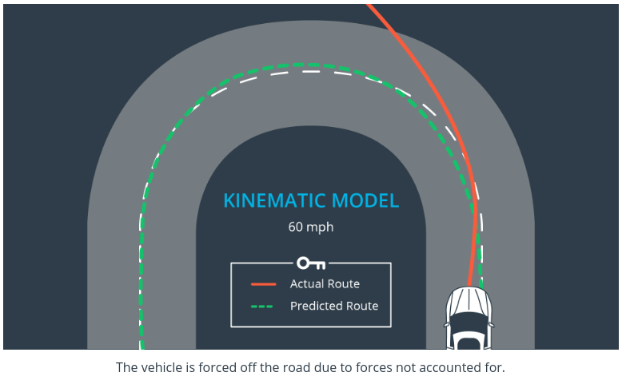

## Dynamic Models

Dynamic models aim to embody the actual vehicle dynamics as closely as possible.

They might encompass tire forces, longitudinal and lateral forces, inertia, gravity, air resistance, drag, mass, and the geometry of the vehicle.

Not all dynamic models are created equal! Some may consider more of these factors than others.

Advanced dynamic models even take internal vehicle forces into account - for example, how responsive the chassis suspension is.

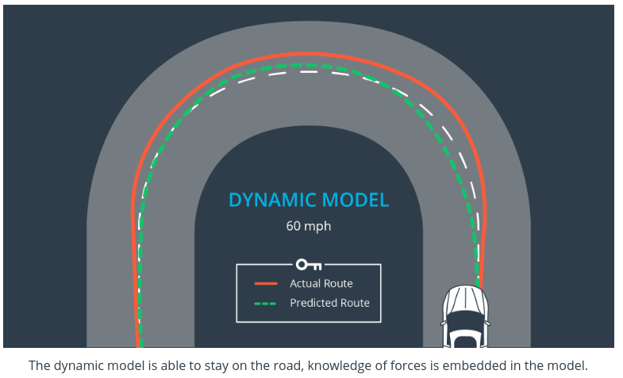

# Building a kinematic model

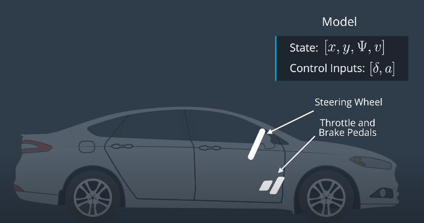

where $\Psi$ is an angle

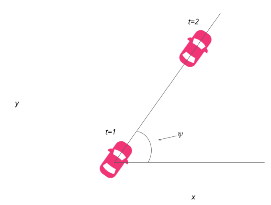

Equation for modeling **x**:

$x_{t+1} = x_t + v_t * cos(\psi_t) * dt$

Equation for modeling **y**:

$y_{t+1} = y_t + v_t * sin(\psi_t) * dt$

Equation for modeling **ψ**:

$\psi_{t+1} = \psi_{t} + \frac{v} { L_f} * \delta * dt$

we add a multiplicative factor of the steering angle, $\delta$ to $\psi$.

$L_f$ measures the distance between the center of mass of the vehicle and it's front axle. The larger the vehicle, the slower the turn rate.

velocity, *v* is modeled:

$v_{t+1} = v_t + a_t*dt$

where *a* can take value between and including -1 and 1.

## How L_f was chosen for this project:

On the topic of running a vehicle around in a circle, this is actually a good way to test the validity of a model! If the radius of the circle generated from driving the test vehicle around in a circle with a constant velocity and steering angle is similar to that of your model in the simulation, then you're on the right track. This type of approach was used to tune $L_f$.


## Global kinematic model code

```c++
// In this quiz you'll implement the global kinematic model.
#include <math.h>
#include <iostream>
#include "Dense"

using Eigen::VectorXd;

//
// Helper functions
//
constexpr double pi() { return M_PI; }
double deg2rad(double x) { return x * pi() / 180; }
double rad2deg(double x) { return x * 180 / pi(); }

const double Lf = 2;

// Return the next state.
VectorXd globalKinematic(const VectorXd &state, 
                         const VectorXd &actuators, double dt);

int main() {
  // [x, y, psi, v]
  VectorXd state(4);
  // [delta, v]
  VectorXd actuators(2);

  state << 0, 0, deg2rad(45), 1;
  actuators << deg2rad(5), 1;

  // should be [0.212132, 0.212132, 0.798488, 1.3]
  auto next_state = globalKinematic(state, actuators, 0.3);

  std::cout << next_state << std::endl;
}

VectorXd globalKinematic(const VectorXd &state, 
                         const VectorXd &actuators, double dt) {
  // Create a new vector for the next state.
  VectorXd next_state(state.size());

  // NOTE: state is [x, y, psi, v]
  auto x = state(0);
  auto y = state(1);
  auto psi = state(2);
  auto v = state(3);

  // NOTE: actuators is [delta, a]
  auto delta = actuators(0);
  auto a = actuators(1);

  // Recall the equations for the model:
  // x_[t+1] = x[t] + v[t] * cos(psi[t]) * dt
  // y_[t+1] = y[t] + v[t] * sin(psi[t]) * dt
  // psi_[t+1] = psi[t] + v[t] / Lf * delta[t] * dt
  // v_[t+1] = v[t] + a[t] * dt
  next_state(0) = x + v * cos(psi) * dt;
  next_state(1) = y + v * sin(psi) * dt;
  next_state(2) = psi + v / Lf * delta * dt;
  next_state(3) = v + a * dt;

  return next_state;
}
```


## Fitting Polynomials 

Typically we get the trajectory from the path planning block:
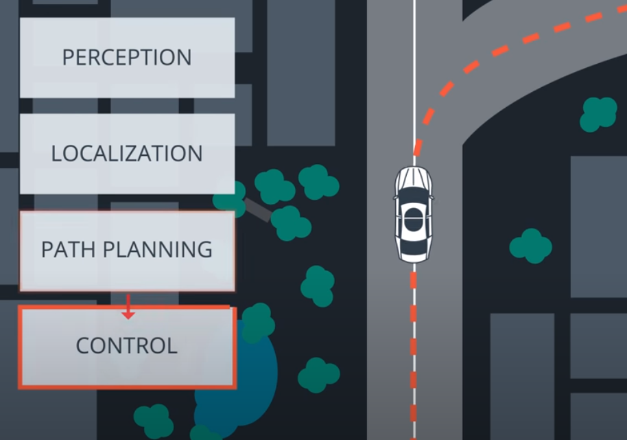

Reference trajectory is typically passed to the control block as a polynomial. This polynomial is usually 3rd order, since third order polynomials will fit trajectories for most roads. 


We use `polyfit` to fit a 3rd order polynomial to the given x and y coordinates representing waypoints.

We use `polyeval` to evaluate y values of given x coordinates.

### Code

```c++
// In this quiz you'll fit a polynomial to waypoints.

#include <iostream>
#include "Dense"

using Eigen::VectorXd;

// Evaluate a polynomial.
double polyeval(const VectorXd &coeffs, double x);
// Fit a polynomial.
VectorXd (const VectorXd &xvals, const VectorXd &yvals, int order);

int main() {
  VectorXd xvals(6);
  VectorXd yvals(6);
  // x waypoint coordinates
  xvals << 9.261977, -2.06803, -19.6663, -36.868, -51.6263, -66.3482;
  // y waypoint coordinates
  yvals << 5.17, -2.25, -15.306, -29.46, -42.85, -57.6116;

  // Pass the x and y waypoint coordinates along the order of the polynomial.
  //   In this case, 3.
  auto coeffs = polyfit(xvals, yvals, 3);

  for (double x = 0; x <= 20; ++x) {
    // We can evaluate the polynomial at a x coordinate by calling `polyeval`.
    //   The first argument being the coefficients, `coeffs`.
    //   The second being the x coordinate, `x`.
    std::cout << polyeval(coeffs, x) << std::endl;
  }

  // Expected output
  // -0.905562
  // -0.226606
  // 0.447594
  // 1.11706
  // 1.7818
  // 2.44185
  // 3.09723
  // 3.74794
  // 4.39402
  // 5.03548
  // 5.67235
  // 6.30463
  // 6.93236
  // 7.55555
  // 8.17423
  // 8.7884
  // 9.3981
  // 10.0033
  // 10.6041
  // 11.2005
  // 11.7925
}

double polyeval(const VectorXd &coeffs, double x) {
  double result = 0.0;
  for (int i = 0; i < coeffs.size(); ++i) {
    result += coeffs[i] * pow(x, i);
  }
  return result;
}

// Adapted from:
// https://github.com/JuliaMath/Polynomials.jl/blob/master/src/Polynomials.jl#L676-L716
VectorXd polyfit(const VectorXd &xvals, const VectorXd &yvals, int order) {
  assert(xvals.size() == yvals.size());
  assert(order >= 1 && order <= xvals.size() - 1);

  Eigen::MatrixXd A(xvals.size(), order + 1);

  for (int i = 0; i < xvals.size(); ++i) {
    A(i, 0) = 1.0;
  }

  for (int j = 0; j < xvals.size(); ++j) {
    for (int i = 0; i < order; ++i) {
      A(j, i + 1) = A(j, i) * xvals(j);
    }
  }

  auto Q = A.householderQr();
  auto result = Q.solve(yvals);

  return result;
}
```


## Cross Track Error

We can express the error between the center of the road and the vehicle's position as the cross track error (CTE). The CTE of the successor state after time t is the state at t + 1, and is defined as:

$cte_{t+1} = cte_t + v_t* sin(e\psi_t) * dt$

In this case $cte_t$ can be expressed as the difference between the line and the current vehicle position *y*. Assuming the reference line is a 1st order polynomial *f*, $f(x_t)$ is our reference line and our CTE at the current state is defined as:

$cte_t = f(x_t) - y_t$

If we substitute $cte_t$ back into the original equation the result is:

$cte_{t+1} = f(x_t) - y_t + (v_t * sin(e\psi_t) * dt)$

This can be broken up into two parts:

1. $f(x_t) - y_t$ being current cross track error.
2. $v_t * sin(e\psi_t) * dt$ being the change in error caused by the vehicle's movement.

### Orientation Error

now let’s take a look at the orientation error:

$e\psi_{t+1} = e\psi_t + \frac{v_t} { L_f} * \delta_t * dt$

The update rule is essentially the same as $\psi$.

$e\psi_t$ is the desired orientation subtracted from the current orientation:

$e\psi_t = \psi_t - \psi{des}_t$

We already know $\psi_t$, because it’s part of our state. We don’t yet know $\psi{des}_t$ (desired psi) - all we have so far is a polynomial to follow. $\psi{des}_t$ can be calculated as the [tangential angle](https://en.wikipedia.org/wiki/Tangential_angle) of the polynomial *f* evaluated at $x_t$, $arctan(f'(x_t))$. $f'$ is the derivative of the polynomial.

$e\psi_{t+1} = \psi_t - \psi{des}_t + (\frac{v_t} { L_f} * \delta_t * dt)$

Similarly to the cross track error this can be interpreted as two parts:

1. $\psi_t - \psi{des}_t$ being current orientation error.
2. $\frac{v_t} { L_f} * \delta_t * dt$ being the change in error caused by the vehicle's movement.

# Dynamic models

Dynamic models and the elements which comprise them are rigorous and could be modules or courses unto themselves.

Here we cover:

- Dynamic Model Forces

  - lateral and longitudinal

- Tire Slip Angle

  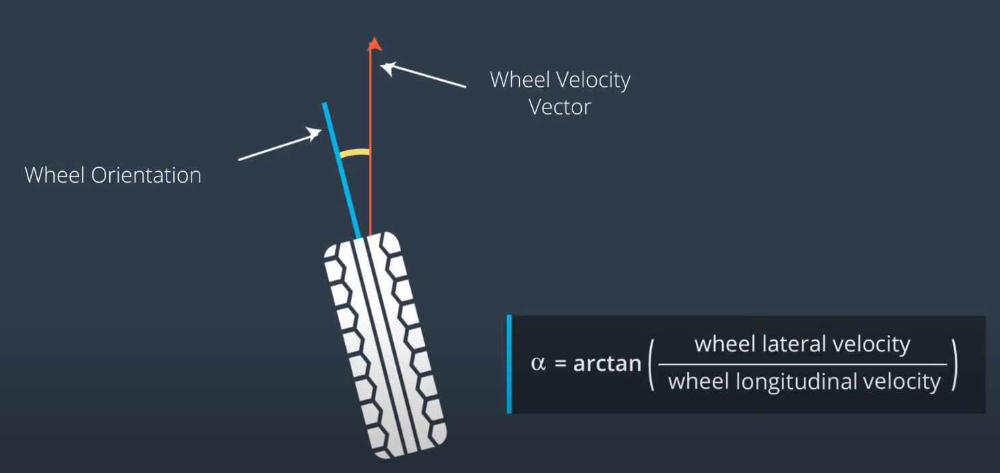

- Tire Slip Ratio

  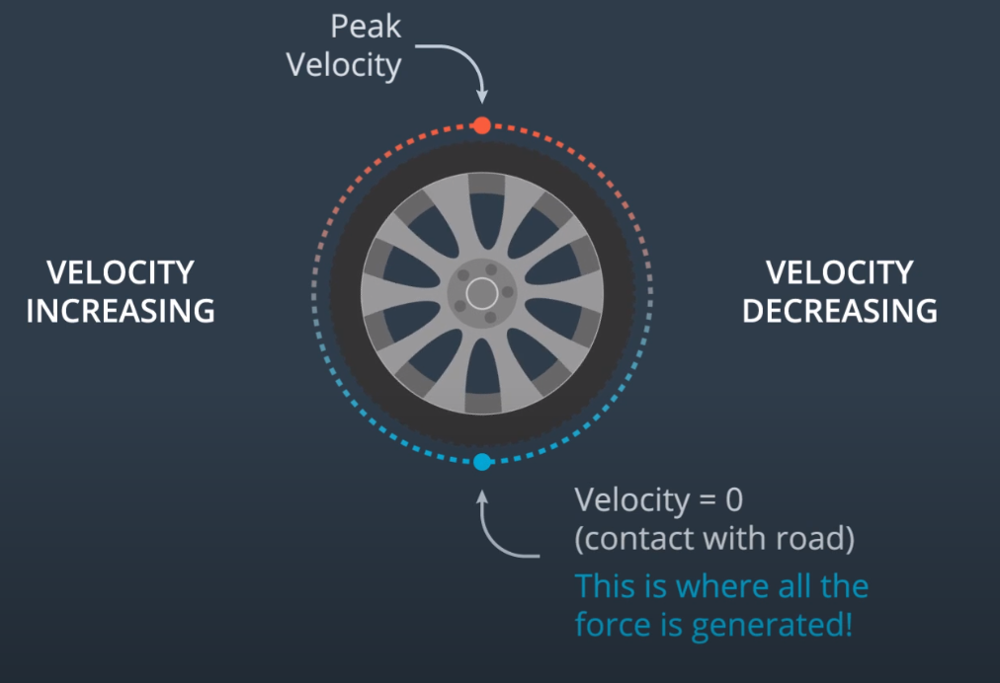

- Tire Models
  
  - [Pacejka Tire Model](http://www.theoryinpracticeengineering.com/resources/tires/pacejka87.pdf)

# Model Predictive Control

It reframes the task of following a trajectory as an optimization problem.

The solution of the optimization problem is the **optimal trajectory**. 

Think of the the cost function as the error that you would like to minimize. For example, measuring the offset from the center of the lane, where the center of the lane can be called the reference, or desired, state.

We previously captured two errors in our state vector: $cte$ and $e\psi.$

Ideally, both of these errors would be 0 - there would be no difference from the actual vehicle position and heading to the desired position and heading.

Our cost should be a function of how far these errors are from 0.

Here’s one such example of how to increment our cost at each timestep, $t$, over our desired time horizon (represented by total number of desired timesteps, $N$, below) - we want to minimize the total error accumulated over this time horizon:

```cpp
double cost = 0;
for (int t = 0; t < N; ++t) {
  cost += pow(cte[t], 2);
  cost += pow(epsi[t], 2);
}
```

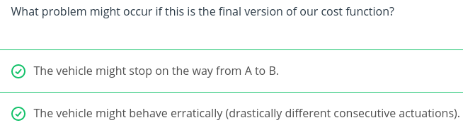

## Idea for dealing with stopping

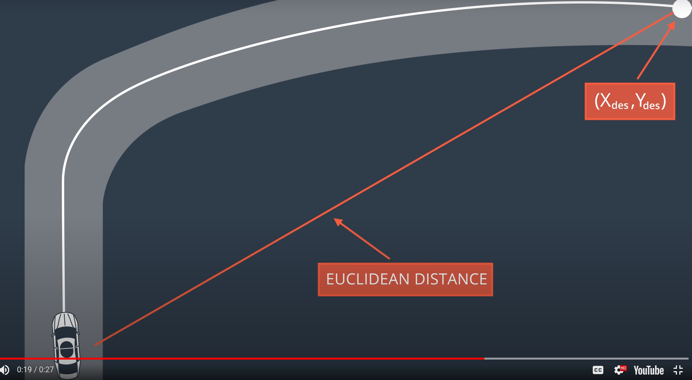

Measure the Eucledian distance between the vehicle and the destination and add that distance to the cost.

## Smooth CTE reduction

The cost function is not limited to a state, but we also should include the control input. This allows us to cumulize the magnitude of the input & the change rate. 

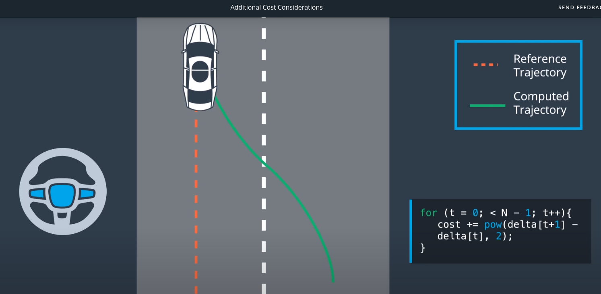


## Length and duration

The prediction horizon is the duration over which future predictions are made. We’ll refer to this as *T*.

*T* is the product of two other variables, *N* and *dt*.

*N* is the number of timesteps in the horizon. *dt* is how much time elapses between actuations. For example, if *N* were 20 and *dt* were 0.5, then *T* would be 10 seconds.

*N*, *dt*, and *T* are hyperparameters you will need to tune for each model predictive controller you build. However, there are some general guidelines. *T* should be as large as possible, while *dt* should be as small as possible.

These guidelines create tradeoffs.

### Horizon

In the case of driving a car, *T* should be a few seconds, at most. Beyond that horizon, the environment will change enough that it won't make sense to predict any further into the future.

### Number of Timesteps

The goal of Model Predictive Control is to optimize the control inputs: $[\delta, a]$. An optimizer will tune these inputs until a low cost vector of control inputs is found. The length of this vector is determined by *N*:

$[\delta_1, a_1, \delta_2, a_2 , ..., \delta_{N-1}, a_{N-1}]$

Thus *N* determines the number of variables optimized by the MPC. This is also the major driver of computational cost.

### Timestep Duration

MPC attempts to approximate a continuous reference trajectory by means of discrete paths between actuations. Larger values of *dt* result in less frequent actuations, which makes it harder to accurately approximate a continuous reference trajectory. This is sometimes called "discretization error".

A good approach to setting *N*, *dt*, and *T* is to first determine a reasonable range for *T* and then tune *dt* and *N* appropriately, keeping the effect of each in mind.


The blue line is the reference trajectory and the red line the trajectory computed by *Model Predictive Control*. In this example the horizon has 7 steps, *N*, and the space in between white pebbles signifies the time elapsed, *dt*.

## Algorithm

Constraints based on the vehicle model:

$x_{t+1} = x_t + v_t cos(\psi_t) * dt$
$y_{t+1} = y_t + v_t sin(\psi_t) * dt$
$\psi_{t+1} = \psi_t + \frac {v_t} { L_f} \delta_t$
$v_{t+1} = v_t + a_t * dt$
$cte_{t+1} = f(x_t) - y_t + (v_t sin(e\psi_t) dt)$
$e\psi_{t+1} = \psi_t - \psi{des}_t + (\frac{v_t} { L_f} \delta_t dt)$

Let's look how to model $\psi$. Based on the above equations, we need to constrain the value of $\psi$ at time t+1:

$\psi_{t+1} = \psi_t + \frac {v_t} { L_f} \delta_t * dt$

We do that by setting a value within `fg` to the difference of `ps1` and the above formula.

Previously, we have set the corresponding `constraints_lowerbound` and the `constraints_upperbound` values to 0. That means the solver will force this value of `fg` to always be 0.

```cpp
for (int t = 1; t < N ; ++t) {
  // psi, v, delta at time t
  AD<double> psi0 = vars[psi_start + t - 1];
  AD<double> v0 = vars[v_start + t - 1];
  AD<double> delta0 = vars[delta_start + t - 1];

  // psi at time t+1
  AD<double> psi1 = vars[psi_start + t];

  // how psi changes
  fg[1 + psi_start + t] = psi1 - (psi0 + v0 * delta0 / Lf * dt);
}
```

The oddest line above is probably `fg[1 + psi_start + t]`.

`fg[0]` stores the cost value, so there's always an offset of 1. So `fg[1 + psi_start]` is where we store the initial value of $\psi$. Finally, `fg[1 + psi_start + t]` is reserved for the $t$th of $N$ values of $\psi$ that the solver computes.

### Setup

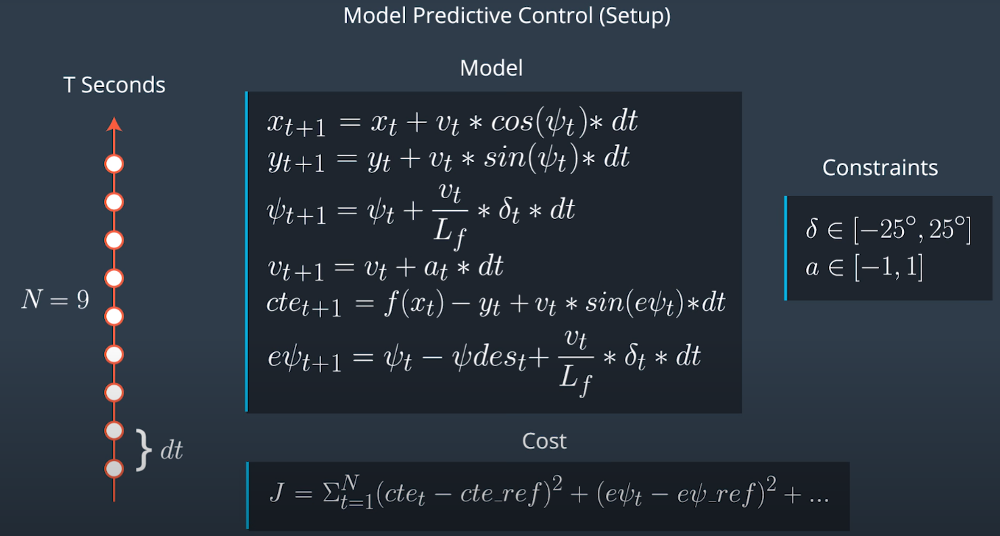

### Feedback loop

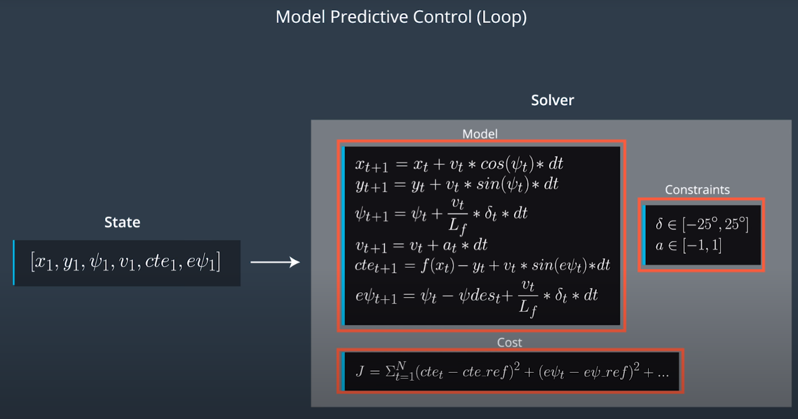 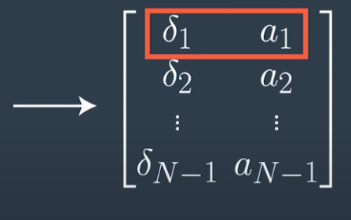

The solver returns the vector of control inputs, that minimizes the cost function.

## Latency

In a real car, an actuation command won't execute instantly - there will be a delay as the command propagates through the system. A realistic delay might be on the order of 100 milliseconds.

This is a problem called "latency", and it's a difficult challenge for some controllers - like a PID controller - to overcome. But a Model Predictive Controller can adapt quite well because we can model this latency in the system.


## Proportional-Integral-Differential Controller

PID controllers will calculate the error with respect to the present state, but the actuation will be performed when the vehicle is in a future (and likely different) state. This can sometimes lead to instability.

The PID controller could try to compute a control input based on a future error, but without a vehicle model it's unlikely this will be accurate.


## Model Predictive Control

A contributing factor to latency is actuator dynamics. For example the time elapsed between when you command a steering angle to when that angle is actually achieved. This could easily be modeled by a simple dynamic system and incorporated into the vehicle model. One approach would be running a simulation using the vehicle model starting from the current state for the duration of the latency. The resulting state from the simulation is the new initial state for MPC.

Thus, MPC can deal with latency much more effectively, by explicitly taking it into account, than a PID controller.

## Mind The Line

### Source code

https://github.com/udacity/CarND-MPC-Quizzes

Steps:

1. Set *N* and *dt*.
2. Fit the polynomial to the waypoints.
3. Calculate initial cross track error and orientation error values.
4. Define the components of the cost function (state, actuators, etc). You may use the methods previously discussed or make up something, up to you!
5. Define the model constraints. These are the state update equations defined in the *Vehicle Models* module.

If we were to set `N` to 100, the simulation would run much slower. This is because the solver would have to optimize 4 times as many control inputs. Ipopt, the solver, permutes the control input values until it finds the lowest cost. If you were to open up Ipopt and plot the x and y values as the solver mutates them, the plot would look like a worm moving around trying to fit the shape of the reference trajectory.

### [Ipopt](https://projects.coin-or.org/Ipopt/)

Ipopt is the tool we'll be using to optimize the control inputs $[\delta_1, a_1, ..., \delta_{N-1}, a_{N-1}]$. It's able to find locally optimal values (non-linear problem!) while keeping the constraints set directly to the actuators and the constraints defined by the vehicle model. Ipopt requires we give it the jacobians and hessians directly - it does not compute them for us. Hence, we need to either manually compute them or have a library do this for us. Luckily, there is a library called CppAD which does exactly this.

### [CppAD](https://www.coin-or.org/CppAD/)

CppAD is a library we'll use for automatic differentiation. By using CppAD we don't have to manually compute derivatives, which is tedious and prone to error.

In order to use CppAD effectively, we have to use its types instead of regular `double` or `std::vector` types.

Additionally math functions must be called from CppAD. Here's an example of calling `pow`:

```cpp
CppAD::pow(x, 2);
// instead of 
pow(x, 2);
```

Luckily most elementary math operations are overloaded. So calling `*`, `+`, `-`, `/` will work as intended as long as it's called on `CppAD<double>` instead of `double`. Most of this is done for you and there are examples to draw from in the code we provide.


### Code Structure

There are two main components in [`MPC.cpp`](https://github.com/udacity/CarND-MPC-Quizzes/blob/master/mpc_to_line/src/MPC.cpp):

1. `vector<double> MPC::Solve(Eigen::VectorXd x0, Eigen::VectorXd coeffs)` method
2. `FG_eval` class

There are also a few small `TODO`s in `main.cpp` which are mostly self-explanatory, so we won't cover them here.


#### MPC::Solve

`x0` is the initial state $[x ,y , \psi, v, cte, e\psi]$, `coeff` are the coefficients of the fitting polynomial. The bulk of this method is setting up the vehicle model constraints (`constraints`) and variables (`vars`) for Ipopt.

#### Variables

```cpp
double x = x0[0];
double y = x0[1];
double psi = x0[2];
double v = x0[3];
double cte = x0[4];
double epsi = x0[5];
...
// Set the initial variable values
vars[x_start] = x;
vars[y_start] = y;
vars[psi_start] = psi;
vars[v_start] = v;
vars[cte_start] = cte;
vars[epsi_start] = epsi;
```

Note Ipopt expects all the constraints and variables as vectors. For example, suppose `N` is 5, then the structure of `vars` a 38-element vector:

vars[0],...,vars[4] -> $[x_1, ...., x_5]$

vars[5],...,vars[9] -> $[y_1, ...., y_5]$

vars[10],...,vars[14] -> $[\psi_1, ...., \psi_5]$

vars[15],...,vars[19] -> $[v_1, ...., v_5]$

vars[20],...,vars[24] -> $[cte_1, ...., cte_5]$

vars[25],...,vars[29] -> $[e\psi_1, ...., e\psi_5]$

vars[30],...,vars[33] -> $[\delta_1, ...., \delta_4]$

vars[34],...,vars[37] -> $[a_1, ...., a_4]$

We then set lower and upper bounds on the variables. Here we set the range of values $\delta$ to [-25, 25] in radians:

```cpp
for (int i = delta_start; i < a_start; ++i) {
    vars_lowerbound[i] = -0.436332;
    vars_upperbound[i] = 0.436332;
  }
```


#### Constraints

Next we set the lower and upper bounds on the constraints.

Consider, for example:

$x_{t+1} = x_t + v_t * cos(\psi_t) * dt$

This expresses that $x_{t+1}$ **MUST** be equal to $x_t + v_t * cos(\psi_t) * dt$. Put differently:

$x_{t+1} - (x_t + v_t * cos(\psi_t) * dt) = 0$

The equation above simplifies the upper and lower bounds of the constraint: both must be 0.

This can be generalized to the other equations as well:

```cpp
for (int i = 0; i < n_constraints; ++i) {
  constraints_lowerbound[i] = 0;
  constraints_upperbound[i] = 0;
}
```


#### FG_eval

The `FG_eval` class has the constructor:

```cpp
FG_eval(Eigen::VectorXd coeffs) { this->coeffs = coeffs; }
```

where `coeffs` are the coefficients of the fitted polynomial. `coeffs` will be used by the cross track error and heading error equations.

The `FG_eval` class has only one method:

```cpp
void operator()(ADvector& fg, const ADvector& vars)
```


`vars` is the vector of variables (from the section "Variables"). This vector contains all variables used by the cost function and model:

$[x, y, \psi, v, cte, e\psi]$

$[\delta, a]$

This is all one long vector, so if `N` is 25 then the indices are assigned as follows:

vars[0], ..., vars[24] -> $x_1, ..., x_{25}$

vars[25], ..., vars[49] -> $y_1, ..., y_{25}$

vars[50], ..., vars[74] -> $\psi_1, ..., \psi_{25}$

vars[75], ..., vars[99] -> $v_1, ..., v_{25}$

vars[100], ..., vars[124] -> $cte_1, ..., cte_{25}$

vars[125], ..., vars[149] -> $e\psi_1, ..., e\psi_{25}$

vars[150], ..., vars[173] -> $\delta_1, ..., \delta_{24}$

vars[174], ..., vars[197] -> $a_1, ..., a_{24}$


`fg` is the vector of constraints. It is where the cost function and vehicle model/constraints is defined.

One complication: `fg[0]` stores the cost value, so the `fg` vector is 1 element larger than it was in `MPC::Solve`.

Note that we start the loop at `t=1`, because the values at `t=0` are set to our initial state - those values are not calculated by the solver.

An `FG_eval` object is created in `MPC::Solve`:

```cpp
FG_eval fg_eval(coeffs);
```

This is then used by Ipopt to find the lowest cost trajectory:

```c++
// place to return solution
CppAD::ipopt::solve_result<Dvector> solution;

// solve the problem
CppAD::ipopt::solve<Dvector, FG_eval>(
    options, vars, vars_lowerbound, vars_upperbound, constraints_lowerbound,
    constraints_upperbound, fg_eval, solution);
```

The filled in `vars` vector is stored as `solution.x` and the cost as `solution.obj_value`.


### MathWorks MPC Toolbox

MathWorks also has a few videos on MPC and around a toolbox they have created for it, which allows you to try out tuning various constraints. While the toolbox itself does require a license, you might consider checking out their videos [here](https://www.mathworks.com/videos/series/understanding-model-predictive-control.html).